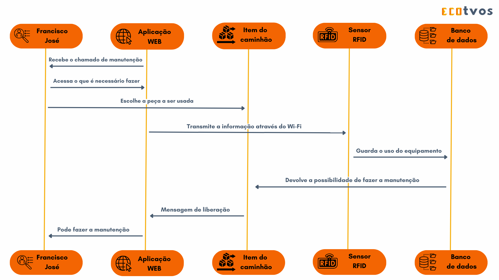

# Documentação IoTDoc - Módulo 4 - Inteli

## ECOTVOS

#### Bianca Borges, Breno Santana, Filipe Calabro, Gabrielle Mitoso, Hugo Noyma, Lucas Nunes e Pedro Auler

## Sumário

- [1. Introdução](#c1)

    - [1.1. Parceiro de negócio](#c11)
    - [1.2. Problema](#c12)
    - [1.3. Objetivos](#c13)
    - [1.4. Proposta de solução](#c14)
    - [1.5. Justificativa](#c15)

- [2. Metodologia](#c2)

- [3. Desenvolvimento e Resultados](#c3)

    - [3.1. Domínio de Fundamentos de Negócio](#c31)
    - [3.2. Domínio de Fundamentos de Experiência de Usuário](#c32)
    - [3.3. Solução Técnica](#c33)
    - [3.4. Resultados](#c34)

- [4. Possibilidades de Descarte](#c4)

- [5. Conclusões e Recomendações](#c5)

- [6. Referências](#c6)

- [Anexos](#attachments)

 

# 1. Introdução

&nbsp;&nbsp;&nbsp;&nbsp;O presente documento se refere ao projeto de solução tecnológica em modelo IoT ("Internet of Things", ou "internet das coisas") desenvolvido pelo grupo ECOTVOS de acordo com a problemática apresentada pela empresa Atvos, parceira de negócios da turma de estudantes do Instituto de Tecnologia e Liderança (Inteli) da qual fazem parte os estudantes do grupo. Essa temática IoT diz respeito a dispositivos de integração entre objetos físicos de tecnologia com funcionalidades específicas, conhecidos como "hardwares", e sistemas programados por desenvolvedores para explorar as possibilidades propiciadas pelos *hardwares*, denominados "softwares", por meio de protocolos de comunicação conectados à internet (por isso o nome "internet das coisas").

&nbsp;&nbsp;&nbsp;&nbsp;Nas subseções seguintes, são apresentados em detalhes o parceiro de negócio, a problemática e os objetivos do projeto, a proposta de solução e sua respectiva justificativa.

## 1.1. Parceiro de negócio

&nbsp;&nbsp;&nbsp;&nbsp;A Atvos é um forte player da agroindústria brasileira, atuante no setor sucroalcooleiro. Sediada em São Paulo, começou suas atividades em meados de 2007 como um braço do Grupo Odebrecht (grupo societário integrado pela Odebrecht S.A.) e conquistou espaço e reconhecimento no mercado nacional ao longo dos anos, sendo atualmente a segunda maior produtora de biocombustível no Brasil e um dos principais emissores de Créditos de Descarbonização (CBIOs)[1](#foot1) do país [**[01]**](#ref01). Possui unidades ativas em São Paulo, Goiás, Mato Grosso e Mato Grosso do Sul, somando três polos industriais e mais de nove mil colaboradores.

&nbsp;&nbsp;&nbsp;&nbsp;Em termos de produção, a empresa se destaca no ramo da energia renovável e limpa através da utilização da biomassa proveniente da cana-de-açúcar, gerando alternativas, como o etanol hidratado e anidro, aos combustíveis fósseis (petróleo, carvão mineral, diesel, querosene e derivados). Além desses, são produzidos e comercializados também o açúcar VHP (“Very High Polarization”, matéria-prima do açúcar refinado) e a energia elétrica, subprodutos dos processos operacionais da Atvos referentes ao biocombustível.

&nbsp;&nbsp;&nbsp;&nbsp;A fim de atingir suas metas de crescimento e inovação, a Atvos é caracterizada pelo emprego e investimento em tecnologia de ponta nos seus campos agrícolas e fábricas, com a mecanização do plantio e da colheita e a modernização dos seus processos fabris. Dessa forma, a empresa é capaz de potencializar a produtividade e a rentabilidade de maneira concomitante à minimização do desperdício e da perda de matéria-prima ou produção. Um exemplo dessa adoção de aparato tecnológico inovador é o monitoramento das plantações por meio de veículos aéreos não tripulados (VANTs) e drones, que sobrevoam e fotografam a lavoura, permitindo análise do estado do cultivo.

&nbsp;&nbsp;&nbsp;&nbsp;No que tange questões ambientais e sociais, a empresa possui uma forte política de sustentabilidade e fomento às populações locais das proximidades de suas unidades, estendendo seu impacto à sociedade brasileira como um todo. Durante seu período de atuação, ela construiu diversos projetos de apoio e contribuição social e arquitetou programas de gestão de resíduos, efluentes e emissões na atmosfera, como a disponibilização de cursos profissionalizantes gratuitos em várias regiões do país, o “Programa Energia Social”, que visa gerar investimentos socioambientais direcionados ao desenvolvimento sustentável das comunidades onde a empresa está inserida, e o programa de inovação digital com foco no setor sucroenergético “Inov@tvos”.

&nbsp;&nbsp;&nbsp;&nbsp;Ademais, é válida a menção do alinhamento dos negócios da Atvos em relação aos Objetivos de Desenvolvimento Sustentável (ODS)[2](#foot2) da Organização das Nações Unidas (ONU) [**[05]**](#ref05), demonstrando a busca pelo equilíbrio entre as responsabilidades econômico-financeira, social e ambiental da empresa, principalmente por meio de iniciativas estruturadas e de ações que geram valor e reduzem riscos ao negócio e à sociedade. Afinal, ela contribui ativamente para a criação de uma matriz energética diversificada e sustentável para o Brasil, diminuindo a utilização de recursos cujos efeitos podem ser nocivos ao meio ambiente, em virtude da emissão de gás carbônico, responsável pelo efeito estufa e agravante do fenômeno de aquecimento global.

&nbsp;&nbsp;&nbsp;&nbsp;Por fim, é importante salientar a maximização do aproveitamento da matéria-prima utilizada pela Atvos em seus processos produtivos. A cana-de-açúcar, segundo a própria empresa, é cem por cento aproveitada durante as operações de produção: os subprodutos resultantes são cruciais para a manutenção do solo e a geração de energia elétrica e açúcar VHP, etapas nas quais são totalmente reaproveitados, minimizando o desperdício, o impacto ambiental negativo e o consequente prejuízo financeiro.

## 1.2. Problema

&nbsp;&nbsp;&nbsp;&nbsp;Para nortear o desenvolvimento do projeto, a Atvos comunicou que a problemática principal a ser resolvida é a falta de controle de estoque no transporte de peças e insumos entre as áreas de almoxarifado e da lavoura, além do registro manual de saída e entrada de materiais do estoque e dos caminhões oficina, veículos que circulam pelas unidades para atender a necessidades de consertos e reparos dos equipamentos rodantes (tratores, colhedores de cana, caminhões, entre outros). Ademais, a empresa relatou ocorrências de desvio e roubo desses ativos, facilitadas pelo sistema arcaico empregado na administração dos mesmos.

&nbsp;&nbsp;&nbsp;&nbsp;Dessa forma, observa-se os prejuízos produtivos e econômicos decorrentes da ausência de otimização de processos e de implementação de tecnologia tanto para segurança da empresa quanto para automatização ou agilização de tarefas dispendiosas. Logo, faz-se necessária uma solução que agregue funcionalidades dedicadas à prevenção, ao aprimoramento da segurança e da eficiência operacional da Atvos, permitindo um melhor gerenciamento de seus ativos. 

## 1.3. Objetivos

&nbsp;&nbsp;&nbsp;&nbsp;Consoante à problemática apresentada pelo parceiro de negócios, os objetivos gerais do projeto em questão são definidos por: automatização e otimização de processos operacionais no que tange a administração do estoque de ativos da empresa, aprimoramento da segurança nos processos internos da Atvos e o desenvolvimento de um sistema robusto para aquisição, monitoramento e processamento das informações condizentes, a fim de maximizar a qualidade, a aplicabilidade e a viabilidade do produto final e reduzir o risco de roubos ou desvios de materiais relatado.

&nbsp;&nbsp;&nbsp;&nbsp;Tendo como finalidade abordar de forma mais minuciosa, técnica e detalhada as metas relativas à estruturação e à construção da solução tecnológica em discussão, é importante citar os objetivos específicos, que são: implementação de sistema IoT para gerenciamento, monitoramento e rastreio em tempo real dos ativos da Atvos; implantação de tecnologias como sensores de detecção de eventos e condições; geração de alertas e notificações para operadores do sistema em casos de atividades incomuns ou não autorizadas; registro eletrônico das movimentações de insumos e peças do estoque; implementação de verificações de segurança e autenticação de usuário no funcionamento do sistema.

## 1.4. Proposta da solução

&nbsp;&nbsp;&nbsp;&nbsp;Visando atender aos requisitos e cumprir com os objetivos do projeto de maneira satisfatória, o grupo ECOTVOS arquitetou a solução com foco na entrega de um sistema funcional, robusto e seguro para gerenciamento completo dos ativos da Atvos e no barateamento da implantação do produto final, mantendo ou até incrementando sua qualidade no processo. Para isso, prototipou-se a proposta de acordo com as limitações materiais do equipamento possuído no Inteli, utilizando-se, pois: a placa microcontroladora "ESP 32", *hardware* com função de leitura e envio dos dados recebidos pelos sensores para o *software*; leitores de identificação por radiofrequência (RFIDs), tecnologia de comunicação sem fio por ondas de rádio que permite a atribuição de identificadores únicos a objetos e pessoas por meio de *tags* ou etiquetas com RFID; módulo de GPS ("Global Positioning System", sistema de navegação por satélite difundido pelo mundo todo) tecnologia acoplada à placa microcontroladora para possibilitar o rastreio de sua própria localização (envia dados de sua posição para a placa).

&nbsp;&nbsp;&nbsp;&nbsp;Estruturando o uso desses equipamentos de forma a aproveitar ao máximo seu potencial de resolução dos problemas apresentados pela Atvos, e também considerando o desenvolvimento de dispositivos integrados pela comunicação via rede de internet para sanar as mesmas dores, a solução proposta se define da seguinte maneira: pretende-se aplicar os aparelhos citados em pontos-chave para estabelecimento de conexão e possibilidade de troca de sinais ou mensagens significativas entre eles, proporcionando um sistema seguro de monitoramento e rastreio através da interação tecnológica ponto a ponto. Essa proposição acompanha também um sistema virtual que permite a visibilidade intuitiva dos dados transmitidos entre dispositivos, garantindo o monitoramento dos processos por parte dos colaboradores da empresa, assim como possibilitando a análise das informações para favorecer a tomada de decisão.

&nbsp;&nbsp;&nbsp;&nbsp;Logo, planeja-se especificamente distribuir estrategicamente os dispositivos mencionados por quatro estações principais: o almoxarifado, que funcionará como a central de comunicação entre os aparelhos (todos conversam com o almoxarifado e vice-versa), recebendo e encaminhando informações importantes sobre cada uma das outras estações e realizando as verificações necessárias nas atividades de movimentação de ativos; os caminhões oficinas, buscando automatizar, modernizar e tornar seguro o registro de entrada e saída de peças; os equipamentos rodantes, visando o monitoramento das peças e o controle das trocas em casos de mal funcionamento; por fim, as *bags* (objetos de armazenamento de uma tonelada) de insumos e materiais, que serão equipadas com dispositivos especialmente acoplados a módulos de GPS para rastreio e monitoramento efetivo desses bens. Todas as estações são equipadas com leitores de RFID para automatização do registro de movimentações.

## 1.5. Justificativa

&nbsp;&nbsp;&nbsp;&nbsp;A fim de sustentar e defender a solução proposta, é válido explicitar o valor agregado a ela para a Atvos, tanto pelos benefícios gerados quanto pela resolução dos problemas apresentados. Logo, elenca-se:

- Aprimoramento da produtividade e lucratividade: com a automatização do registro das movimentações de ativos da Atvos, a modernização do sistema atual de funcionamento das trocas de peças (registro feito manualmente no papel) e a comunicação de informações e alertas importantes feita de maneira automática entre dispositivos, sem espaço para erro humano, a produtividade sofre um aumento expressivo, consequentemente reduzindo também perdas e prejuízos e maximizando lucros. Os colaboradores podem focar em tarefas com mais valor agregado e seu ciclo de trabalho se torna mais eficiente.

- Melhoria de segurança: diminuindo a possibilidade de erro humano nos processos de gerenciamento de ativos do estoque da Atvos e prevenindo desvios e roubos de materiais através do constante monitoramento e rastreio, a segurança é ampliada significativamente, com informações precisas em tempo real.

- Valor agregado à tomada de decisão: de acordo com a plataforma que disponibiliza a visualização dos dados relativos aos processos de gerenciamento de forma intuitiva e alinhada às necessidades da gestão, é possível observar padrões e até utilizar inteligência artificial para otimizar processos, além de perceber características do estoque e dos ativos no geral para tomada de decisão eficaz em tempo real. Por exemplo, a partir das movimentações e a respectiva visualização das informações, pode-se observar com mais facilidade e antecedência que algum insumo do estoque está próximo de acabar e precisa ser reposto, minimizando também perdas e riscos.

- Maximização da colaboração da cadeia de produção: com a integração da logística automatizada e os processos de comunicação e gerenciamento otimizados, a colaboração entre diferentes áreas, como almoxarifado, oficina e lavoura, é não só facilitada como também ampliada. Explorando as capacidades da solução ainda mais, é possível inclusive automatizar a comunicação com fornecedores parceiros de acordo com os níveis de estoque explicitados pelos dispositivos IoT.

---

1 Recurso de mercado de compensação de carbono no Brasil para incentivo à adoção de práticas mais sustentáveis em relação à emissão de gás carbônico na atmosfera [**[06]**](#ref06).[↩️](#return1)

2 Série de metas estabelecidas na Agenda 2030 da ONU que visam apelar globalmente pela erradicação da pobreza, proteção ao meio ambiente e ao clima e garantia de qualidade de vida e paz para as populações ao redor do planeta [**[05]**](#ref05).[↩️](#return3)

---

# 2. Metodologia 

&nbsp;&nbsp;&nbsp;&nbsp;O crescimento do processamento distribuído motivou a busca por um framework de padronização, resultando no surgimento do Modelo de Referência para Processamento Distribuído (RM-ODP). Este modelo, composto por fundamentos e arquitetura, oferece padrões para sistemas distribuídos abertos, abrangendo aspectos de distribuição, rede e portabilidade.

&nbsp;&nbsp;&nbsp;&nbsp;O ponto de vista computacional do ODP descreve a funcionalidade do sistema e seu ambiente, incorporando contratos de Qualidade de Serviço (QoS). Apesar de ser uma meta-norma, fornecendo um framework para novos padrões ODP, o RM-ODP não aborda formalmente todos os aspectos de sistemas ODP, especialmente propriedades não comportamentais como QoS.

&nbsp;&nbsp;&nbsp;&nbsp;Para superar essas limitações, considera-se a adoção do Meta-Modelo (UML) como uma abordagem promissora. Utilizando o UML como notação sintática para a linguagem de ponto de vista do ODP, o meta-modelo UML oferece precisão e integração com ferramentas de desenvolvimento. A linguagem Object Constraint Language (OCL) é empregada para expressar regras de conformidade.

&nbsp;&nbsp;&nbsp;&nbsp;O RM-ODP divide a especificação de sistemas distribuídos em cinco pontos de vista especializados: empresa, informação, computação, engenharia e tecnologia. Cada ponto de vista possui uma linguagem otimizada para sua área específica, mantendo a consistência entre eles por meio de regras básicas, regras do modelo de objetos, regras de estrutura e especificação.

&nbsp;&nbsp;&nbsp;&nbsp;A visão da empresa, o foco nos aspectos organizacionais e de negócios do sistema distribuído, identifica os objetivos de negócios e funcionalidades do sistema. Ela tem o papel de desenvolver o contexto onde o sistema distribuído opera, destacando as entidades envolvidas e seus respectivos papéis.

&nbsp;&nbsp;&nbsp;&nbsp;A Visão de Informação especifica as informações que o sistema precisa lidar, abrangendo dados e informações, sua organização, compartilhamento e compreensão entre os diversos componentes.

&nbsp;&nbsp;&nbsp;&nbsp;A Visão de Computação descreve as funções e serviços oferecidos pelos componentes de software distribuídos, delineando as operações e interações entre eles. Essa visão é crucial para definir as responsabilidades de cada parte no sistema distribuído.

&nbsp;&nbsp;&nbsp;&nbsp;A Visão de Engenharia detalha interfaces e protocolos de comunicação entre os componentes distribuídos, concentrando-se na implementação técnica. Considera aspectos como desempenho, confiabilidade e segurança, garantindo a integração eficiente dos componentes distribuídos.

&nbsp;&nbsp;&nbsp;&nbsp;A Visão de Tecnologia especifica as tecnologias de implementação e as plataformas de hardware necessárias para suportar o sistema distribuído. Isso inclui hardware, software de sistema e tecnologias de comunicação, definindo o ambiente técnico no qual o sistema será executado.

&nbsp;&nbsp;&nbsp;&nbsp;Em conclusão, essas cinco visões proporcionam uma estrutura abrangente, abordando desde os objetivos de negócios até a implementação técnica e as tecnologias subjacentes, garantindo uma compreensão holística e uma especificação completa de sistemas distribuídos. A integração dessas abordagens pode contribuir para o desenvolvimento de sistemas distribuídos abertos mais robustos e interoperáveis.

# 3. Desenvolvimento e Resultados 

&nbsp;&nbsp;&nbsp;&nbsp;As seguintes subseções têm como finalidade apresentar de forma detalhada todos os processos relativos ao desenvolvimento do produto final e os resultados obtidos, abordando as etapas iniciais de entendimento e fundamentos do projeto, dos negócios da empresa parceira e do mercado geral, a ideação e construção da solução tecnológica em si e os respectivos testes realizados.

## 3.1. Domínio de Fundamentos de Negócio

&nbsp;&nbsp;&nbsp;&nbsp;Em relação ao entendimento do negócio da empresa parceira e do mercado geral na qual ela está inserida, são descritos nas subseções a seguir as ferramentas utilizadas e as análises realizadas, processos de fundamental importância para estudo e definição do projeto.

### 3.1.1. Contexto da Indústria

&nbsp;&nbsp;&nbsp;&nbsp;A Atvos está inserida na agroindústria sucroalcooleira brasileira, um dos grandes setores da economia do país, principalmente no escopo agrícola. É um mercado com tendência ao crescimento, haja vista as leis e metas ambientais relativas à diminuição da emissão de gás carbônico na atmosfera e consequente minimização do uso de combustíveis fósseis, e também o projeto governamental brasileiro conhecido por "Combustível do Futuro", que busca, além de outros objetivos, aumentar a utilização do etanol como combustível [**[11]**](#ref11).

&nbsp;&nbsp;&nbsp;&nbsp;Contudo, produtos substitutos como o carro elétrico estão ganhando espaço no mercado internacional [**[16]**](#ref16), o que representa uma forte ameaça a longo prazo para a Atvos e suas concorrentes, considerando seu caráter exportador. Inclusive, alguns de seus principais compradores, como Estados Unidos e Índia, estão comprando e fabricando cada vez mais carros movidos à eletricidade, que dispensam o uso de combustíveis fósseis ou biocombustíveis e possuem um potencial poluente menor (apesar de seu ciclo de produção e o descarte de sua bateria serem, muitas vezes, mais danosos ao meio ambiente hoje em dia).

&nbsp;&nbsp;&nbsp;&nbsp;Ademais, com a tendência de crescimento em breve do setor [**[19]**](#ref19), algumas empresas estão com iniciativas agressivas de entrada, firmando alianças comerciais para se beneficiar de um largo volume de recursos compartilhados, como é o caso da Vibra Energia, maior distribuidora de combustíveis brasileira, e da Copersucar, grande *player* do setor sucroenergético [**[15]**](#ref15). Esses novos entrantes podem representar uma grave ameaça aos negócios da Atvos, dada a presença de forte concorrência já consolidada que se soma a essa problemática.

&nbsp;&nbsp;&nbsp;&nbsp;Sobre as concorrentes já estabelecidas, a que compete mais diretamente com a Atvos é a Raízen, maior produtora exportadora de etanol brasileira, influente internacionalmente e com números significativamente maiores que os da empresa parceira de negócios deste projeto [**[02]**](#ref02). Entretanto, considerando o enfoque na exportação presente em seu *business*, a Atvos está inserida em um cenário global de concorrência, disputando espaço de mercado com grandes *players* como as estadunidenses Poet e Archer Daniels Midland. Em suma, ao se analisar o porte, a influência e os ganhos líquidos dessas empresas, a Atvos está em considerável desvantagem.

&nbsp;&nbsp;&nbsp;&nbsp;Em contrapartida, é importante ressaltar que a conjuntura atual de intensa presença de carros com motores bicombustíveis (alimentados tanto por combustíveis fósseis quanto por biocombustíveis), especialmente no Brasil [**[13]**](#ref13), e a busca por eficiência na produção de energias renováveis e limpas colocam a Atvos em uma posição privilegiada de mercado, mesmo em comparação com as concorrentes, haja vista seu caráter inovador no ciclo produtivo e atrelado intimamente a valores sociais e ambientais em voga, além de seu acelerado crescimento na indústria.

&nbsp;&nbsp;&nbsp;&nbsp;Outro aspecto positivo da Atvos é o modelo de negócios que emprega, altamente adaptado e coerente com o cenário agrícola brasileiro e difundido entre os *players* do setor [**[04, 08, 09]**](#ref04): ela cuida da gestão completa da cadeia de produção, desde o plantio da cana-de-açúcar em grandes propriedades até a comercialização dos produtos finais, investindo em tecnologia de ponta em seus processos, em infraestrutura das suas instalações industriais e agrícolas e em uma política de zero desperdício, gerando também subprodutos como o açúcar e a energia elétrica que podem e são vendidos pela empresa. Dessa forma, há uma diversificação da matriz econômica na qual a Atvos atua, proporcionando diferentes fontes de lucro e garantias em casos de instabilidade de mercado.

&nbsp;&nbsp;&nbsp;&nbsp;Portanto, observa-se como diferenciais da empresa, seu modelo de negócios e o cenário no qual está inserida: o vantajoso solo brasileiro, adequado para o cultivo de cana-de-açúcar; o investimento constante em inovação e em aspectos socioambientais; a sustentabilidade, a eficiência e o máximo aproveitamento da matéria-prima na produção; o investimento intensivo de capital brasileiro no setor sucroalcooleiro.

### 3.1.2. Análise SWOT

&nbsp;&nbsp;&nbsp;&nbsp;A análise SWOT avalia a empresa em relação ao mercado de maneira geral. Para isso, são analisados fatores referentes aos ambientes interno e externo do negócio, ou seja, o que está dentro da esfera de controle da empresa e o que não está. Portanto, são avaliadas no ambiente interno “Strengths” (“Forças”; características que trazem um diferencial em relação aos concorrentes e podem influenciar positivamente) e “Weaknesses” (“Fraquezas”; elementos que, por não serem pontos fortes da empresa, fornecem algum tipo de vantagem aos competidores e podem influenciar negativamente), enquanto no ambiente externo são analisadas “Opportunities” (“Oportunidades”; dizem respeito a possibilidades de obter melhores resultados, maior lucratividade ou crescer por causa de conjunturas externas favoráveis) e “Threats” (“Ameaças”; referem-se aos cenários externos desfavoráveis que colocam em risco o desenvolvimento ou a permanência da empresa no mercado).

&nbsp;&nbsp;&nbsp;&nbsp;A seguir, na figura 01, demonstra-se a matriz SWOT desenvolvida pelo grupo *nome do grupo* para ilustrar a análise feita sobre a Atvos, relacionando seus pontos fortes e fracos, as ameaças e as oportunidades.

Figura 01 - Matriz SWOT

Fonte: Material produzido pelos autores (2023)

&nbsp;&nbsp;&nbsp;&nbsp;Na sequência, são justificados e detalhados os pontos supracitados na imagem, a fim de explanar a análise feita pelo grupo acerca da Atvos.

#### Forças

&nbsp;&nbsp;&nbsp;&nbsp;Porte e impacto: reconhecida como a segunda maior produtora de etanol do Brasil e um dos principais emissores de CBIOs do país, a Atvos se tornou um dos players mais relevantes do setor no qual está inserida e usa seu tamanho e influência para fomentar e desenvolver a sociedade brasileira com seus projetos e programas socioambientais. Foi também premiada diversas vezes por suas iniciativas estruturadas e seu relacionamento transparente com a imprensa e com a população, além de possuir importantes certificações, inclusive internacionais, para o setor de energia renovável. Logo, construiu uma respeitável reputação, apresenta um impacto positivo nos quesitos sociais e ambientais e mantém um forte aspecto econômico-financeiro.

&nbsp;&nbsp;&nbsp;&nbsp;Aproveitamento máximo da matéria-prima: como citado anteriormente, a cana-de-açúcar é completamente aproveitada no processo produtivo da Atvos, gerando subprodutos que são comercializados, servem de insumo para novos cultivos ou abastecem a própria empresa, como a energia elétrica produzida, que tanto é consumida pelas unidades quanto é comercializada para cidades próximas. Dessa forma, maximiza-se a rentabilidade da produção, impacta-se positivamente o meio ambiente e se reduz o desperdício e os custos, minimizando o prejuízo financeiro.

&nbsp;&nbsp;&nbsp;&nbsp;Cuidados com o solo: a Atvos, além de fazer uso de insumos agrícolas para manter a qualidade do solo e da plantação, reduzir a aplicação de fertilizantes químicos com a substituição por subprodutos que são gerados na cadeia de produção do etanol e utilizar defensivos biológicos para controlar pragas, também realiza a rotação[3](#foot3) de culturas no período entressafra (período pós-colheita de recuperação do solo) com o cultivo de soja e milho, visando minimizar o desgaste do solo, renovar seus nutrientes e maximizar o lucro da próxima plantação de cana. Ao realizar a rotação de culturas, estima-se um aumento significativo na produtividade no plantio, com ganho em média de trinta e seis toneladas de cana por hectare de área colhida a mais que o produtor que não adota esse processo em seu ciclo de cultivo [**[10, 14]**](#ref10).

&nbsp;&nbsp;&nbsp;&nbsp;Investimento em tecnologia: o caráter inovador da Atvos, como supramencionado, permite elevação significativa da produtividade e da rentabilidade e minimização do desperdício, a exemplo da mecanização do plantio e da colheita e do monitoramento das plantações por meio de VANTs e drones para correção de falhas de plantio e tratamento de pragas com antecedência, reduzindo a perda de produção e aumentando a lucratividade da safra.

&nbsp;&nbsp;&nbsp;&nbsp;Participação em eventos expositivos: a empresa se promove e se faz conhecida, além de pelo seu desempenho e porte, pela sua participação em eventos expositivos, como feiras de carreiras para universitários, rallies (corridas de veículos modificados ou convencionais em vias públicas ou privadas) e rodeios. Eles agregam à visibilidade da empresa por possíveis novos colaboradores, investidores, patrocinadores e parceiros de negócios. Como exemplos, é possível citar sua presença no “Teodoro Fest Rodeio Show” e suas parcerias com a Mitsubishi Motors e com o maior rally da América, o “Sertões BRB”, com o objetivo de tornar essas competições mais sustentáveis através do emprego de biocombustíveis nos automóveis.

&nbsp;&nbsp;&nbsp;&nbsp;Geração de empregos e valor social: são características marcantes da Atvos sua cultura de valorização das comunidades locais das proximidades de suas unidades e seu afinco pelo desenvolvimento sustentável da sociedade. Segundo dados da empresa, mais de cento e sessenta mil pessoas foram beneficiadas pelos oitenta e um projetos realizados pelo “Programa Energia Social” por exemplo, que visa gerar investimentos socioambientais direcionados ao desenvolvimento sustentável das comunidades onde a empresa está inserida. Além disso, a disponibilização de cursos de capacitação de profissionais gratuitos para ampliação de mão de obra qualificada e os milhares de empregos gerados diretamente pela Atvos reforçam esse aspecto positivo para sua reputação e capacidade produtiva.

&nbsp;&nbsp;&nbsp;&nbsp;Sustentabilidade e viabilidade: uma proeminente qualidade da Atvos é o alinhamento do seu modelo de negócios à causa de desenvolvimento sustentável no Brasil e no mundo, observadas, por exemplo, nos ODS da ONU [**[05]**](#ref05), principalmente no que tange a produção de energia renovável e limpa. Essa é uma característica positiva considerando a necessidade legal e ambiental das empresas se adaptarem às demandas por sustentabilidade do mundo moderno e também tendo em vista a maior preocupação do governo atual brasileiro para com o meio ambiente em comparação com o anterior. Ademais, a viabilidade operacional e financeira da Atvos foi confirmada por uma instituição independente consultada recentemente para esse fim, a saber, a Canaplan, uma empresa de consultoria voltada principalmente ao setor agroindustrial da cana-de-açúcar, com mais de 30 anos de atuação no mercado.

&nbsp;&nbsp;&nbsp;&nbsp;Esses fatores reforçam a potência do modelo de negócios da empresa e sua adequação aos aspectos econômico e ambiental brasileiro, pois o país apresenta qualidades bastante positivas para o desenvolvimento da agricultura, como solos apropriados para diversos cultivos (incluindo a cana-de-açúcar), recursos naturais abundantes, vastas áreas adequadas para plantio, ampla visibilidade e investimento no setor agrícola e relações comerciais internacionais consolidadas, dado que o Brasil é o segundo maior produtor mundial de etanol e o maior de cana-de-açúcar segundo o Instituto de Economia Agrícola. Todos esses compõem uma conjuntura propícia ao crescimento de uma integrante da agroindústria como a Atvos. Apesar de serem externos à empresa, é mérito de seus colaboradores terem adaptado o modelo de negócios para aproveitar esse cenário e suas peculiaridades e potencializar seu impacto.

#### Fraquezas

&nbsp;&nbsp;&nbsp;&nbsp;Vulnerabilidade a condições climáticas: sendo uma empresa do setor agrícola, a sujeição às vicissitudes climáticas é praticamente inevitável, o que pode prejudicar bastante a produção e o planejamento geral da Atvos. Por exemplo, em ocorrências de chuva, as atividades no campo precisam ser suspensas, pois o maquinário não consegue operar de forma correta com o solo úmido ou alagado, atrasando, assim, o ciclo produtivo. É importante citar também o processo de estiagem que ocorre no Brasil, principalmente na região Centro-Oeste, fenômenos pontuais, como o El Niño, que podem impactar negativamente a agricultura, e o aquecimento global, realidade climática atual agravante dos problemas supramencionados.

&nbsp;&nbsp;&nbsp;&nbsp;Falta de monitoramento automático: a Atvos, devido à falta de conectividade via internet no campo e por parte da extensão de suas terras, carece de um sistema integrado de monitoramento automático do estado da plantação, do seu almoxarifado e das cargas transportadas entre suas unidades, que empregaria tecnologias no modelo IoT para solução dessa problemática e, consequentemente, geraria economia de recursos, automatização de processos, maior segurança e lucratividade. Por isso, inclusive, a empresa buscou realizar o projeto em questão com o Inteli, visando o desenvolvimento de uma solução nessa perspectiva descrita.

&nbsp;&nbsp;&nbsp;&nbsp;Rodantes movidos a diesel: apesar da produção de biocombustíveis em larga escala, a Atvos ainda não conseguiu renovar sua frota de equipamentos rodantes para que esses deixem de usar o combustível fóssil e sua queima como fonte de energia. Isso impede que a empresa emita mais CBIOs, limpe completamente seu processo de produção de energia renovável e não dependa de fornecedores de combustível para seus processos. Dessa forma, perde-se oportunidades de aumento de lucratividade, diminuição de riscos por autoabastecimento e gestão de recursos (independência dos fornecedores) e potencialização das ações relativas à sustentabilidade e à redução da emissão de gás carbônico na atmosfera.

&nbsp;&nbsp;&nbsp;&nbsp;Localização das unidades: embora o local de implantação das unidades produtivas da Atvos seja estratégico em relação à qualidade das terras para plantio, condições climáticas e desenvolvimento das comunidades interioranas brasileiras, a distância que os colaboradores da empresa que trabalham presencialmente no campo ou nas unidades fabris precisam percorrer para chegar aos seus respectivos locais de atuação pode ser um fator negativo, considerando a falta de infraestrutura nos sistemas de transporte em extensa parte do país, com ênfase nas regiões do interior e afastadas de grandes metrópoles, e o desgaste pessoal do trabalhador devido à rotina de trabalho, na qual podem ser adicionadas horas dedicadas ao transporte. Assim, reduz-se o necessário tempo de descanso, lazer e cuidados pessoais, possivelmente acarretando em prejuízos à saúde e ao bem-estar e, consequentemente, à evasão de funcionários.

#### Oportunidades
	
&nbsp;&nbsp;&nbsp;&nbsp;Alto volume de motores “flex” atualmente: hoje em dia, os motores para alimentação dos automóveis mais vendidos em território nacional são bicombustíveis, conhecidos como flex (utilizam tanto gasolina quanto etanol). Segundo a Anfavea, associação das fabricantes de veículos automotores, oitenta e três por cento dos carros vendidos atualmente no Brasil possuem alimentação flex [**[07, 13]**](#ref07). Logo, há um cenário favorável para a Atvos em relação a público consumidor no país, principalmente também considerando a questão econômica em voga referente aos combustíveis, com o alto preço da gasolina [**[12]**](#ref12) e o custo menor do etanol para o consumidor final.

&nbsp;&nbsp;&nbsp;&nbsp;Aumento do etanol na composição da gasolina: o uso da gasolina no Brasil e no mundo, apesar de suas consequências ao meio ambiente, ainda é enorme. Embora a Atvos não a produza, o etanol é parte integrante da composição da gasolina, representando atualmente cerca de vinte e sete por cento do composto químico segundo a Petrobras. A oportunidade para a empresa nesse cenário é a perspectiva de aumento dessa porcentagem: o projeto de lei conhecido como “Combustível do Futuro” [**[11]**](#ref11), em processo no governo atual, visa ampliar o uso do etanol na fabricação de gasolina para 30% do total, além de ações fortalecedoras da sustentabilidade nas áreas de automóveis individuais, transporte de carga e aviação, gerando mais valor de mercado a produtoras de biocombustíveis.

&nbsp;&nbsp;&nbsp;&nbsp;Situação dos combustíveis fósseis a longo prazo: apesar de dominarem o mercado, os combustíveis fósseis são recursos finitos e que apresentam um aumento gradativo na dificuldade de exploração ao longo dos anos, justamente pelo seu caráter não renovável. Por isso, eles não representam uma opção viável de geração de energia a longo prazo, haja vista o esgotamento futuro desses recursos, o impacto ambiental resultante de seu uso e os preços de produção e compra. Dessa forma, há uma oportunidade de substituição pelos biocombustíveis e a valorização de seus produtores.

&nbsp;&nbsp;&nbsp;&nbsp;Qualidades favoráveis do cenário agrícola brasileiro: como citado anteriormente, o Brasil apresenta características muito positivas para o desenvolvimento da agricultura, como os solos apropriados para diversos cultivos, recursos naturais abundantes, vastas áreas adequadas para plantio, condições climáticas gerais favoráveis, ampla visibilidade e investimento no setor agrícola e relações comerciais internacionais consolidadas. Além disso, a perspectiva de modernização da agroindústria brasileira e de valorização da geração de valor à sociedade e ao meio ambiente, com a sustentabilidade em destaque, colocam a Atvos na vanguarda do direcionamento futuro desse setor no país.

&nbsp;&nbsp;&nbsp;&nbsp;Ampliação dos cultivos e dos produtos finais: a Atvos pode se beneficiar da diversificação de suas matérias-primas e da produção final, com alvos como o cultivo de milho e soja, já presentes em seus processos de rotação de culturas e viáveis para a produção de etanol, e a geração de biogás metano nas unidades da empresa, um possível subproduto do ciclo produtivo da cana-de-açúcar com diversas aplicações comerciais e que também pode ser utilizado como biocombustível, até mesmo pelos veículos da própria empresa. Essa perspectiva de ampliação possibilita uma maior presença e segurança de mercado, novas parcerias, valorização e investimentos sobre a Atvos.

#### Ameaças

&nbsp;&nbsp;&nbsp;&nbsp;Emergência dos carros elétricos: os carros movidos à energia elétrica estão crescendo gradativamente no mercado, por enquanto, principalmente de forma concentrada, majoritariamente nos Estados Unidos, na Europa e na China, segundo o *Global Electric Vehicle Outlook* da Agência Internacional de Energia. As vendas desses modelos de automóveis e os investimentos nesse mercado atingem números maiores a cada semestre, com registros de aumento de compra e fabricação de veículos e componentes, com destaque para países asiáticos. Por causa desse crescimento exponencial acelerado da presença de mercado dos veículos elétricos, o etanol como biocombustível para automóveis é ameaçado por um substituto, que inclusive não emite diretamente gás carbônico para a atmosfera devido a sua fonte diferenciada de alimentação. Essa ameaça é potencializada pela coincidência do elevado crescimento desse setor dos carros elétricos nas regiões que mais importam etanol do Brasil, como Estados Unidos e alguns países asiáticos.

&nbsp;&nbsp;&nbsp;&nbsp;Fontes de energia gravitacionais e por hidrogênio: as pesquisas por novas fontes de energia renováveis estão em alta atualmente devido às metas de sustentabilidade de redução de emissões de gás carbônico na atmosfera. Com isso, estão em processo de consolidação projetos de baterias que funcionam através do armazenamento de energia elétrica advinda da conversão da energia potencial gravitacional em potencial elétrico [**[17]**](#ref17), que podem servir de alimentação para automóveis, e motores veiculares com funcionamento por combustão de hidrogênio [**[18]**](#ref18). Ambos representam possíveis substitutos de energia limpa e sem emissões diretas de poluentes para o etanol no uso veicular.

&nbsp;&nbsp;&nbsp;&nbsp;Condições climáticas e aquecimento global: como explicitado anteriormente, o processo produtivo da Atvos é suscetível a prejuízos e atrasos em função das oscilações climáticas, agravadas pelo aquecimento global. Logo, esses fatores representam ameaças constantes e difíceis de se contornar para a empresa. Como exemplo de impactos negativos, é possível citar as perdas no volume de cana-de-açúcar disponível na safra de 2017/2018 e no desenvolvimento dos canaviais para a safra de 2018/2019 da Atvos por conta da forte geada que afetou a região do Mato Grosso do Sul e São Paulo no ano de 2017, onde se localizam as usinas com maior volume de moagem da empresa.

---

3 Consiste na conservação e renovação da qualidade do solo através dos efeitos residuais de diferentes espécies vegetais cultivadas em determinada sequência na mesma área agrícola, gerando benefícios para uma cultura principal.[↩️](#return3)

---

### 3.1.3. Análise de 5 Forças de Porter

&nbsp;&nbsp;&nbsp;&nbsp;A análise das 5 Forças de Porter permite mapear o mercado de forma setorial e específica para fortalecer o planejamento e a tomada de decisão de uma empresa para entrar no mercado, realizar um projeto estrategicamente ou avaliar suas condições atuais em relação ao setor como um todo. Ela é baseada em fatos e análises sistemáticas do mercado, com ênfase nos fatores referentes à competitividade. Todas as 5 Forças de Porter são capazes de afetar a lucratividade de um negócio de acordo com o nível de poder que possuem no setor. Elas são: Concorrentes, Fornecedores, Clientes, Novos Entrantes e Substitutos.

&nbsp;&nbsp;&nbsp;&nbsp;Abaixo, na figura 02, ilustra-se os pontos principais levantados durante a análise realizada sobre a Atvos e suas características de mercado.

Figura 02 - Análise das 5 Forças de Porter

Fonte: Material produzido pelos autores (2023)

&nbsp;&nbsp;&nbsp;&nbsp;A seguir, são detalhados e explicados os fatores destacados na imagem acima, a fim de justificar as conclusões obtidas através da análise feita.

#### Rivalidade entre os concorrentes

&nbsp;&nbsp;&nbsp;&nbsp;Esse fator representa um ponto de atenção para a Atvos: sendo a segunda maior produtora exportadora do Brasil em seu setor, compete diretamente com a Raízen, que ocupa o primeiro lugar na disputa. Porém, essa é uma empresa referência no mercado mundial, com grande destaque na América Latina e que apresenta números expressivos em seus negócios, consideravelmente maiores que os da Atvos em questão de produtividade e receita. Além disso, há também a Copersucar, que ocupa a posição de maior distribuidora de biocombustível para o mercado interno brasileiro [**[03]**](#ref03), dificultando a conquista de espaço nesse âmbito, e as grandes empresas internacionais, como a exportadora estadunidense Poet. Logo, a intensa rivalidade entre os concorrentes e sua presença de mercado consolidada prejudicam a força de atuação e a possibilidade de crescimento da Atvos.

&nbsp;&nbsp;&nbsp;&nbsp;Tendo isso em vista, para a empresa se manter e crescer no mercado é necessário que ela se diferencie, como tem feito com o investimento em tecnologia no ciclo produtivo, o máximo aproveitamento da matéria-prima, a diversificação da produção e a automação e mecanização de processos. Ademais, é importante criar e solidificar relações exteriores, visto que é uma exportadora e fornecedora de biocombustível, que corre o risco de ser substituída por outra com preços melhores facilmente se não tiver laços consolidados.

#### Poder de barganha dos fornecedores

&nbsp;&nbsp;&nbsp;&nbsp;Naturalmente, as empresas possuem relações de interdependência referentes a fornecimento de produtos e serviços, e a Atvos não é exceção: ela depende de fornecedores como Fendt e Grunner para o maquinário de operações da produção na usina e no campo, empresas como Oracle, Microsoft e Google para sistemas utilizados internamente e Bayer e Syngenta para aquisição de insumos e cultivos agrícolas secundários para rotação de culturas. Além desses, é possível citar muitos outros fornecedores necessários, como de colmos de cana-de-açúcar usados para o plantio, operadoras de internet, de água, transportadoras, entre outros. A grande questão é manter uma relação construtiva com os fornecedores, mostrando o valor que a empresa pode agregar com uma parceria e também valorizando de forma justa os produtos e serviços fornecidos, a fim de solidificar colaborações e não sujeitar os negócios à influência da barganha de agentes externos.

&nbsp;&nbsp;&nbsp;&nbsp;Logo, considerando o reconhecimento e reputação da Atvos, as certificações, o porte, os valores e as ações transformadoras da empresa, fatores explicitados nas seções anteriores, é possível concluir que a demonstração de valor agregado em uma parceria não é um desafio grave, um problema maior provavelmente seria a força da concorrência e a consequente priorização da mesma por fornecedores comuns. Por isso e pelo poder de barganha intrínseco aos fornecedores, é importante buscar uma menor dependência de produtos e serviços contratados, como a empresa já tem feito com o abastecimento de energia elétrica das suas unidades com subprodutos da própria produção e a realização deste projeto em questão.

#### Poder de barganha dos clientes

&nbsp;&nbsp;&nbsp;&nbsp;Devido à forte concorrência no setor sucroalcooleiro e de produção de biocombustíveis, tanto no mercado de exportação quanto no interno brasileiro, os clientes da Atvos, os quais são outras empresas (modelo B2B, “Business to Business”), possuem diferentes opções de fornecedores nesse sentido, sugerindo uma escolha baseada, primordialmente, em valor financeiro, mas também possivelmente alinhada a valores e influência. Dessa forma, tendo em vista que a empresa não é a mais influente nem possui o maior volume ou capacidade de produção dentre as concorrentes do mercado, o que não colabora para o barateamento do produto final, o poder de barganha dos clientes é um importante ponto de atenção para a Atvos.

&nbsp;&nbsp;&nbsp;&nbsp;Portanto, é essencial que a Atvos busque manter presença no mercado com custos equiparados aos de suas concorrentes e demonstre valor no produto comercializado e na empresa como parceira de negócios, explicitando seus princípios, ações e projetos importantes, a fim de não se sujeitar ao poder de barganha de seus compradores.

#### Ameaça de novos entrantes

&nbsp;&nbsp;&nbsp;&nbsp;Como o setor agroindustrial brasileiro e internacional é uma área bastante consolidada de mercado, com fortes players estáveis e com predominância do sistema monocultor de grande propriedade (um tipo principal de cultivo em extensas áreas de plantio), a ameaça de novos entrantes não é, a princípio, um fator de risco expressivo para a Atvos e outras empresas desse ecossistema, dada a dificuldade de inserção e diferenciação de novos competidores, potencializada pelo cenário desfavorável para produtores de menor porte.

&nbsp;&nbsp;&nbsp;&nbsp;Contudo, é fundamental se atentar e se preparar para a possibilidade de expansão de mercado de grandes empresas internacionais do setor, como as estadunidenses Poet e Archer Daniels Midland, que podem atuar como fortes “novos entrantes” em áreas nas quais seus produtos não haviam chegado ainda, possivelmente intensificando a concorrência e prejudicando os negócios da Atvos. Ademais, com o crescimento do mercado de etanol, sobretudo o brasileiro, decorrente das leis e objetivos ambientais de diminuição de emissão de gás carbônico, o surgimento de alianças comerciais agressivas de empresas consolidadas (conhecidas como "joint ventures") para exploração de um novo mercado ou expansão de domínio para outra parte de suas cadeias produtivas é uma realidade ameaçadora atualmente [**[15]**](#ref15).

#### Ameaça de substitutos

&nbsp;&nbsp;&nbsp;&nbsp;Como mencionado anteriormente, os produtos da Atvos já estão sob ameaças de substitutos, haja vista o crescimento exponencial do mercado e da produção de carros elétricos, sobretudo nos Estados Unidos, Europa e alguns países asiáticos. Isso implica a perda de volume de compradores da Atvos, dado que os maiores importadores de etanol do Brasil são justamente os Estados Unidos e a Ásia. Além desse fator, as demandas globais referentes à conservação do meio ambiente têm gerado intensos movimentos de busca por meios de produção de energia limpa renovável, inclusive na área de combustíveis.

&nbsp;&nbsp;&nbsp;&nbsp;Entretanto, ainda há tempo para atuação plena das empresas do setor de produção dos biocombustíveis, dado o custo elevado das alternativas como os carros elétricos e o estado mais experimental ou de estudo de outras fontes de energia em pesquisa, como as baterias que armazenam energia elétrica advinda da energia potencial gravitacional.

### 3.1.4. Descrição da Solução a ser Desenvolvida

&nbsp;&nbsp;&nbsp;&nbsp;As subseções que seguem têm como finalidade definir em detalhes a solução tecnológica desenvolvida pelo grupo ECOTVOS para a empresa parceira de negócios Atvos. Logo, são explicados o problema motivador do projeto, a solução em si e suas especificidades (aspecto técnico e descrição de utilização), além dos benefícios que gera e métricas para sua avaliação.

#### 3.1.4.1. Qual é o problema a ser resolvido

&nbsp;&nbsp;&nbsp;&nbsp;Como explicitado anteriormente neste documento, a Atvos apresentou como principais problemáticas as seguintes situações: falta de controle sobre o estoque nos processos de transporte de peças e insumos entre as áres de almoxarifado e da lavoura; sistema arcaico de contabilização de saída e entrada de materiais do estoque e dos caminhões oficina, com registro manual em papel ou cartões; desvio e roubo de ativos da empresa, propiciados pela falta de segurança decorrente do sistema arcaico de administração e gerenciamento dos mesmos. Todos esses problemas impactam direta e gravemente sobre a produtividade e a lucratividade da Atvos.

#### 3.1.4.2. Qual a solução proposta

&nbsp;&nbsp;&nbsp;&nbsp;Tendo em vista os problemas supramencionados, a solução proposta visa mitigar os prejuízos financeiros e operacionais da Atvos através da otimização de processos, do aprimoramento da segurança no ciclo produtivo e na resolução de problemas internos e da coleta, do gerenciamento e do uso eficiente dos dados e informações referentes às movimentações de ativos. Para isso, serão utilizados, em suma, dispositivos com tecnologia IoT conectados a componentes de GPS e leitores de etiquetas de identificação RFID.

&nbsp;&nbsp;&nbsp;&nbsp;No que tange o funcionamento da solução, a ideia se define por conectar, por meio dos dispositivos desenvolvidos, 5 fontes primárias de informações e gerenciamento: as *bags* de insumos agrícolas, os equipamentos rodantes, os caminhões oficina, o almoxarifado e a central administrativa das unidades da Atvos. Dessa forma, tem-se o controle automatizado sobre o ciclo completo de movimentações de ativos da empresa por pontos individuais interconectados, de maneira que cada um possui funções específicas que se complementam e se reúnem em uma unidade administrativa central.

&nbsp;&nbsp;&nbsp;&nbsp;A fim de detalhar o funcionamento da solução mencionada acima, é preciso explicar as operações realizadas por cada um dos cinco pontos da rede de conexão. Logo, são abordadas abaixo:

- ***Bags* de insumos agrícolas:** unidades mais básicas da conexão da solução, são responsáveis apenas por enviar dados constantemente à central relativos a sua localização, de forma a propiciar seu rastreio efetivo para verificação de seu uso devido (no lugar correto).

- **Equipamentos rodantes:** são responsáveis pelo monitoramento de suas peças (ativos) por meio do escaneamento constante das etiquetas RFID nelas presentes, garantindo que não são trocadas sem autorização ou por peças indevidas (com identificador diferente do apropriado) e gerando alertas à central nessas situações. Em caso de mau funcionamento em alguma das peças, este deve ser registrado para que ocorra a comunicação do problema à central e a algum caminhão oficina, a fim da realização da troca e seu registro automático no sistema.

- **Caminhões oficina:** possuem capacidade de receber comunicados referentes a mau funcionamento de equipamentos rodantes para realização de trocas de peças. Além disso, precisam realizar o registro de qual peça será utilizada na troca para envio à central e verificação futura dos sensores do equipamento rodante (após o recebimento de qual será o identificador da nova peça e a realização da troca) e também devem registrar a entrada da peça trocada (com defeito) no caminhão, de forma a efetuar a troca completamente.

- **Almoxarifado:** possui as funções básicas de registro de saída e entrada dos materiais do estoque, além do armazenamento da informação referente à destinação desses materiais em caso de retirada, a fim de que seja validada a chegada desse ativo no local de destino, seja o lugar final um caminhão oficina, um veículo rodante ou outro almoxarifado. Esses outros meios devem ser capazes de receber a informação de futura chegada do material e registrar a efetivação da movimentação como medida de segurança.

- **Central administrativa:** tem funcionalidade de centralização do gerenciamento de todos os processos que envolvem as movimentações de ativos por mais de um meio, ou seja, entre caminhões oficina e equipamentos rodantes, almoxarifado e veículos de transporte, entre outros, agindo como um canal por onde todas essas informações devem passar para que a comunicação ocorra de fato e para que os dados sejam processados de forma automatizada e centralizada, aprimorando a segurança e otimizando processos.

&nbsp;&nbsp;&nbsp;&nbsp;Por fim, é importante ressaltar como funciona a parte do *software* da solução. Utilizando uma plataforma de conexão via *web* para recebimento e processamento dos dados advindos do *hardware*, planeja-se oferecer uma visualização para os operadores do sistema das movimentações realizadas e em processo. Além disso, o armazenamento dos dados é feito, a nível do protótipo desenvolvido, em bancos de dados que simulam estruturas de dados reais da empresa.

&nbsp;&nbsp;&nbsp;&nbsp;Para essas implementações, são utilizados como tecnologia o "MongoDB" para gerenciamento de banco de dados, as linguagens de programação "C++", "C#" e "JavaScript" para desenvolvimento dos sistemas embarcado e plataforma web e o protocolo de comunicação via internet "HTTP", pois o protocolo "MQTT", bastante apropriado para soluções IoT, exige uma forte estabilidade de conexão que pode não ser realidade para regiões da lavoura da Atvos.

#### 3.1.4.3. Como a solução proposta deverá ser utilizada

&nbsp;&nbsp;&nbsp;&nbsp;Pelo seu caráter integrador e sua necessidade de comunicação de ponto a ponto, é de extrema importância que a solução seja de fato implantada em cada uma das estações de controle mencionadas acima. Além disso, para potencializar seu funcionamento, ela deve ser associada aos processos de gerenciamento e monitoramento já existentes na empresa, como o CUBO, sistema de controle e rastreamento interno da Atvos. Assim, os operadores que já cuidam dessa área administrativa terão mais uma valiosa ferramenta em mãos para otimização dos processos produtivos da empresa, principalmente considerando a interface de visualização das informações captadas disposta.

&nbsp;&nbsp;&nbsp;&nbsp;Ademais, é também relevante que haja operadores qualificados para a utilização e manutenção da tecnologia, tanto a nível dos *hardwares* aplicados quanto dos *softwares* desenvolvidos e a respectiva análise dos dados por eles trazidos. Logo, o treinamento dos colaboradores da Atvos para esses fins se faz essencial para a implantação efetiva do produto final e o aproveitamento máximo de suas capacidades. 

#### 3.1.4.4. Quais os benefícios trazidos pela solução proposta

&nbsp;&nbsp;&nbsp;&nbsp;A solução tecnológica proposta gera benefícios expressivos para a Atvos, principalmente nos aspectos produtividade e diminuição de perdas e riscos, além de representar uma opção viável, moderna e completamente capaz de resolver as problemáticas apresentadas pela empresa.

&nbsp;&nbsp;&nbsp;&nbsp;Dentre os benefícios centrais trazidos pelo projeto em questão, é importante citar: o aprimoramento da produtividade e lucratividade decorrente da otimização do ciclo produtivo e da minimização dos prejuízos, a melhoria de segurança nos processos internos, o valor agregado à tomada de decisão proveniente da visualização das operações de estoque na plataforma desenvolvida para integração da solução e dos operadores e, por fim, a maximização da colaboração da cadeia de produção decorrente da integração da logística automatizada e os processos de comunicação e gerenciamento otimizados. Todos esses foram previamente detalhados na seção de ["Justificativa" (1.5)](#c15) deste documento.

#### 3.1.4.5. Qual será o critério de sucesso e qual medida será utilizada para o avaliar

&nbsp;&nbsp;&nbsp;&nbsp;A fim de avaliar o sucesso ou falha da solução proposta como uma opção viável para resolução das problemáticas apresentadas pela Atvos e para cumprimento pleno dos objetivos do projeto, serão tomados como critérios: implementação completa dos requisitos funcionais e não funcionais referentes ao projeto (definidos na seção ["Solução técnica" (3.3)](#c33) deste documento); simulação efetiva e precisa (porém, em menor escala) dos processos operacionais que se encaixam no sistema de gerenciamento aplicado na solução proposta, maximizando, assim, a aplicabilidade da mesma; qualidade da experiência do usuário e usabilidade da interface administrativa disposta.

&nbsp;&nbsp;&nbsp;&nbsp;Para realizar a avaliação, as métricas utilizadas serão quantificações provenientes de modelos avaliativos de caráter qualitativo, como a realização de testes com usuários (principalmente para validação da interface), os *feedbacks* do parceiro de negócios e dos professores responsáveis acerca da qualidade e do andamento do projeto e o acompanhamento documentado da própria equipe ECOTVOS sobre o desenvolvimento do projeto. Dessa forma, procura-se avaliar a fidelidade da aplicação da tecnologia aos devidos parâmetros propostos pela solução constantemente durante o processo inteiro de desenvolvimento, de forma frequente e iterativa caso necessário.

 
### 3.1.5. *Value Proposition Canvas*

&nbsp;&nbsp;&nbsp;&nbsp;O "Value Proposition Canvas" é uma ferramenta que ajuda a analisar a proposta de valor de um produto ou serviço. Ele consiste em dois componentes principais: o perfil do cliente, que descreve os segmentos de clientes, suas necessidades e tarefas, e a proposta de valor, que detalha os benefícios oferecidos e como atendem às necessidades dos clientes. Essa abordagem técnica corrobora para a criação de produtos e serviços mais alinhados com as expectativas do mercado-alvo. 

Figura 03 - *Value Proposition Canvas*

Fonte: Material produzido pelos autores (2023)

&nbsp;&nbsp;&nbsp;&nbsp;O componente da proposta de valor consiste em "Ganhos criados", "Produtos e serviços" e "dores aliviadas". Os ganhos criados para a empresa com o sistema IoT incluem melhorias na logística, aumento da produtividade, rastreamento de insumos em constante movimento e acesso à mais recente tecnologia. Os produtos e serviços compreendem um sistema integrado de rastreamento e um software que exibe a localização exata dos materiais. Isso contribui para a eficiência da logística e permite um controle preciso sobre os insumos em movimento, proporcionando acesso às mais recentes tecnologias, enquanto alivia as dores com um maior controle de estoque, rastreamento de cargas e peças, e resposta imediata.

&nbsp;&nbsp;&nbsp;&nbsp;O componente do perfil do cliente compreende "Ganhos", "Tarefas do Cliente" e "Dores". Os "Ganhos" envolvem benefícios como rastreamento em tempo real, promoção da inovação na empresa, otimização da logística e localização em ambientes externos. A "Tarefa do Cliente" consiste em acessar o software que contém todas as informações necessárias. As "Dores" são representadas pela falta de rastreamento interno para as cargas, a ausência de um sistema que integre todas as informações e a perda permanente de peças e insumos.

### 3.1.6. Matriz de Riscos	  

&nbsp;&nbsp;&nbsp;&nbsp;A Matriz de Risco é uma ferramenta de análise de possíveis riscos que podem comprometer o desenvolvimento do projeto. Ela é útil para ajudar um time a pensar em soluções para ameaças ao produto desenvolvido,  mas também ela nos ajuda a identificar oportunidades que podem ser aproveitadas. Logo abaixo, está a matriz de risco aplicada ao nosso projeto:

Figura 04 - Matriz de Risco

Fonte: Material produzido pelos autores (2023)

&nbsp;&nbsp;&nbsp;&nbsp;Os seguintes tópicos abordam os riscos e também possíveis soluções:

- 1.&nbsp;&nbsp;&nbsp;&nbsp;A ausência de sinal e uma conexão deficiente entre o *hardware* e o servidor podem comprometer a transferência de informações coletadas pelo *hardware* para o servidor. Considerando que a Atvos não necessita de acesso imediato às notificações de incidentes, poderíamos considerar o desenvolvimento de um sistema que envie essas informações assim que uma conexão adequada seja estabelecida, incluindo também o horário em que o registro foi criado. Isso possibilitaria à empresa abrir investigações pertinentes quando apropriado.

- 2.&nbsp;&nbsp;&nbsp;&nbsp;A deterioração ou destruição de peças utilizadas para o rastreamento de peças e insumos pode resultar na interrupção da transmissão de informações para o sistema. Uma possível solução seria implementar uma regra de negócio no *software*, que acione um alerta sempre que o sistema tentar estabelecer uma conexão com o *hardware*, mas não obtiver sucesso. Essa situação poderia indicar a ocorrência de um roubo ou até mesmo um acidente, permitindo uma pronta resposta por parte da empresa.

- 3.&nbsp;&nbsp;&nbsp;&nbsp;A eventual falha de um dos componentes de *hardware* no sistema, o qual é composto por diversos *hardwares* dedicados ao rastreamento de peças e insumos, pode comprometer a eficácia da solução como um todo. Uma abordagem viável para lidar com essa situação seria implementar uma funcionalidade que, em caso de falha de um desses componentes, acione um alerta no sistema, indicando a necessidade de investigação imediata. Isso asseguraria que a empresa possa abordar prontamente qualquer anomalia que possa afetar a funcionalidade do sistema.

- 4.&nbsp;&nbsp;&nbsp;&nbsp;No caso de a solução desenvolvida pelo grupo não satisfazer todos os requisitos estipulados pelo cliente, sua utilidade pode ser comprometida. Para mitigar a possibilidade desse risco, planejamos realizar coleta de *feedback* do parceiro por meio de apresentações e conversas regulares em cada *sprint* do projeto, com o objetivo de validar o andamento do mesmo e assegurar que as expectativas do cliente estejam sendo atendidas.

- 5.&nbsp;&nbsp;&nbsp;&nbsp;No caso de a solução desenvolvida tornar-se onerosa demais para o cliente implementar em seu negócio, a viabilidade da aplicação poderia ser prejudicada. Para abordar essa preocupação, o projeto será executado com um constante foco na avaliação do custo para o cliente. Ao longo do desenvolvimento, estaremos atentos a garantir que o produto permaneça acessível e alinhado com as possibilidades financeiras do cliente.

- 6.&nbsp;&nbsp;&nbsp;&nbsp;A possibilidade de atrasos na transmissão de informações pelo equipamento de rastreamento é um desafio a ser considerado. Para mitigar esse atraso, uma estratégia consiste em registrar a data e a hora de criação de cada registro no banco de dados, permitindo uma análise mais precisa das informações mesmo diante de eventuais atrasos na entrega pelo *hardware*.

- 7.&nbsp;&nbsp;&nbsp;&nbsp;No cenário em que surgir uma significativa divergência de ideias entre os membros do grupo, o progresso do projeto pode ser prejudicado. Para mitigar esse risco, o grupo adotará uma abordagem que envolve a realização de reuniões regulares com o propósito de promover o alinhamento de ideias. Isso garantirá uma colaboração mais eficaz e a harmonia no desenvolvimento do projeto.

- 8.&nbsp;&nbsp;&nbsp;&nbsp;Um dos requisitos essenciais do cliente é que o sistema desenvolvido, tanto o *software* quanto o *hardware*, seja capaz de gerar dados em formato de arquivo "CSV", visando a análise e tomada de decisões informadas. Caso o produto final não inclua essa funcionalidade, o projeto não estará em conformidade com todos os requisitos do parceiro, o que pode comprometer sua eficácia e utilidade.

&nbsp;&nbsp;&nbsp;&nbsp;Nos seguintes tópicos serão descritos as oportunidades e como o grupo pode aproveitá-las:

- 9.&nbsp;&nbsp;&nbsp;&nbsp;Se a Atvos optar por implementar o produto desenvolvido pelo grupo em seu negócio, isso será um indicativo claro de que o projeto atingiu seus objetivos e proporcionou valor significativo ao parceiro.

- 10.&nbsp;&nbsp;&nbsp;&nbsp;O principal objetivo da Atvos com este projeto é a redução das perdas e roubos de insumos e peças em seu almoxarifado, buscando, consequentemente, a diminuição de custos operacionais. No caso do produto desenvolvido pelo grupo auxiliar a Atvos na efetiva rastreabilidade de seus equipamentos, resultando na redução de despesas, isso será uma clara indicação de que todos os requisitos do cliente foram atendidos de maneira satisfatória.

- 11.&nbsp;&nbsp;&nbsp;&nbsp;O fornecimento de uma solução de custo acessível para o cliente é fundamental, pois isso aumentará a probabilidade de sua adoção e implementação bem-sucedida em seu negócio.

- 12.&nbsp;&nbsp;&nbsp;&nbsp;Um projeto bem-executado pelo grupo, que atenda plenamente os requisitos do parceiro, tem o potencial de aumentar as oportunidades para os integrantes do grupo de conseguirem estágios na empresa. Isso demonstra o valor da colaboração e do desempenho excepcional da equipe.

- 13.&nbsp;&nbsp;&nbsp;&nbsp;Por meio de um sistema de rastreamento de seus ativos, a Atvos tem a capacidade de identificar potenciais esquemas de furto ou desvio de insumos em suas instalações de almoxarifados e áreas de plantio. Isso representa uma valiosa ferramenta para a prevenção e investigação de atividades ilícitas dentro da empresa.

### 3.1.7. Política de Privacidade de acordo com a LGPD

&nbsp;&nbsp;&nbsp;&nbsp;A seguir, nas subseções referentes à política de privacidade, busca-se definir todos os aspectos referentes à coleta, processamento e utilização de dados e informações relativas à empresa parceira de negócios pelo grupo ECOTVOS no desenvolvimento deste projeto em questão. Essa definição é essencial para reforçar a conformidade dos processos envolvidos na construção da solução para com a Lei Geral de Proteção de Dados Pessoais (LGPD).

#### 3.1.7.1. Informações gerais sobre a empresa / organização

&nbsp;&nbsp;&nbsp;&nbsp;O ECOTVOS é um grupo de alunos do primeiro ano do Inteli, que está colaborando com a Atvos, uma empresa brasileira dedicada à produção de etanol, açúcar VHP e energia elétrica a partir da cana-de-açúcar e sua biomassa. O objetivo do projeto desenvolvido com essa parceria é desenvolver um sistema de monitoramento baseado IoT para a localização de ativos, visando um gerenciamento eficiente de equipamentos e insumos agrícolas.

#### 3.1.7.2. Informações sobre o tratamento de dados

&nbsp;&nbsp;&nbsp;&nbsp;Tendo em vista que os dados recebidos pelos dispositivos IoT são de extrema importância para que o sistema de monitoramento dos insumos e outras peças escolhidas seja eficaz, os dados de localização e o status operacional desses equipamentos serão tratados em servidores locais seguros, com acesso restrito apenas aos membros do grupo, à Atvos e à Inteli, sem o compartilhamento de informações com terceiros, garantindo a confidencialidade das informações.

#### 3.1.7.3. Quais são os dados coletados

&nbsp;&nbsp;&nbsp;&nbsp;Os dados coletados que serão utilizados para a solução final incluirão informações sobre a localização, movimentação e status operacional de equipamentos móveis, peças e insumos agrícolas, como entrada e saída de materiais do almoxarifado. Esses dados são de extrema importância para o rastreamento desses ativos, com o intuito de obter uma gestão eficaz e transparente.

#### 3.1.7.4. Onde os dados são coletados 

&nbsp;&nbsp;&nbsp;&nbsp;Os dados serão coletados nos equipamentos móveis durante o transporte de cargas, nas áreas de armazenamento de peças e insumos, bem como nos locais de entrada e saída dos almoxarifados da Atvos, por meio de dispositivos IoT que serão responsáveis por obter os dados de localização desses ativos.

#### 3.1.7.5. Para quais finalidades os dados serão utilizadas

&nbsp;&nbsp;&nbsp;&nbsp;Os dados coletados pelos dispositivos IoT posicionados na Atvos serão utilizados para controle de estoque, rastreabilidade de insumos e prevenção contra desvio ou roubo. Além disso, os dados contribuem para uma maior eficiência operacional e auxiliam na tomada de decisões da Atvos, visando à automação do trabalho e a gestão eficaz.

#### 3.1.7.6. Onde os dados ficam armazenados 

&nbsp;&nbsp;&nbsp;&nbsp;Os dados que foram coletados e utilizados na solução do ECOTVOS serão mantidos em segurança durante toda a duração do projeto em servidores na nuvem, sendo compartilhados somente entre os integrantes do grupo, o Inteli e a própria Atvos. 

#### 3.1.7.7. Qual o período de armazenamento dos dados (retenção)

&nbsp;&nbsp;&nbsp;&nbsp;Os dados coletados serão armazenados apenas durante o período necessário para o desenvolvimento do projeto, aproximadamente 10 semanas, não ocorrendo retenção dos dados após a conclusão do projeto.

#### 3.1.7.8. Uso de cookies e/ou tecnologias semelhantes

&nbsp;&nbsp;&nbsp;&nbsp;O ECOTVOS não utiliza cookies ou tecnologias semelhantes para coletar dados pessoais no âmbito deste projeto.

#### 3.1.7.9. Com quem esses dados são compartilhados (parceiros, fornecedores, subcontratados)

&nbsp;&nbsp;&nbsp;&nbsp;Os dados coletados serão compartilhados apenas entre os membros do ECOTVOS, da Atvos e do Inteli, que são as partes envolvidas no desenvolvimento do projeto.

#### 3.1.7.10. Informações sobre medidas de segurança adotadas pela empresa

&nbsp;&nbsp;&nbsp;&nbsp;O ECOTVOS adotará medidas de segurança para proteger os dados contra acesso não autorizado, modificação, divulgação ou destruição não autorizada durante todas as fases do desenvolvimento do projeto, com restrições de acesso aos dados às partes integrantes do projeto e uso apenas local. Com o objetivo de alcançar segurança digital, os dados transmitidos entre os dispositivos IoT e o sistema de gerenciamento do inventário serão criptografados com a utilização de protocolos seguros, como HTTPS ou MQTT com Transport Layer Security (TLS), a fim de proteger os dados durante a transmissão. 

#### 3.1.7.11. Orientações sobre como a empresa/organização atende aos direitos dos usuários

&nbsp;&nbsp;&nbsp;&nbsp;O ECOTVOS se compromete em respeitar os direitos dos usuários, seguindo as orientações e regulamentações estabelecidas pela LGPD. Após a implementação da solução proposta pela Atvos, fica a critério dela alterar alguma etapa do tratamento dos dados, visando os direitos legais dos usuários. 

#### 3.1.7.12. Informações sobre como o titular de dados pode solicitar e exercer os seus direitos

&nbsp;&nbsp;&nbsp;&nbsp;Os dados utilizados na solução proposta não apresentam dados pessoais ou sensíveis, apenas dados de localização e de outros aspectos logísticos da Atvos. Caso seja necessário a remoção de dados obtidos por meio dos dispositivos IoT, o titular deverá entrar em contato com a Atvos, e solicitar a exclusão de tais dados.

#### 3.1.7.13. Informações de contato do *Data Protection Officer* (DPO) ou encarregado de proteção de dados da organização

&nbsp;&nbsp;&nbsp;&nbsp;Para entrar em contato com o Encarregado de Proteção de Dados do Inteli, utilize o email: inteli@inteli.edu.br e o telefone para contato: +55 (11) 97659-8258, a partir desse contato, é possível obter informações sobre o grupo ECOTVOS.

### 3.1.8. *Bill of Material* (BOM)

&nbsp;&nbsp;&nbsp;&nbsp;O *Bill of Material* (BOM), ou Lista de Materiais, é um elemento fundamental na gestão e documentação de projetos. Neste contexto, o BOM desempenha o papel central ao fornecer um inventário detalhado de todos os componentes, peças e matérias-primas necessárias para a realização bem-sucedida do projeto da ECOTVOS. É possível visualizar os materiais que foram utilizados para o desenvolvimento do protótipo da solução na tabela abaixo: 

Tabela 01 - Lista de Materiais

Fonte: Material produzido pelos autores (2023)

&nbsp;&nbsp;&nbsp;&nbsp;A lista de materiais acima apresenta apenas os materiais que foram utilizados na construção do protótipo desenvolvido em duas semanas pela ECOTVOS. É importante salientar que, à medida que o projeto avançar, a lista de materiais poderá ser atualizada com o objetivo de alcançar a melhor solução possível.

&nbsp;&nbsp;&nbsp;&nbsp;Abaixo, são explicadas as características funcionais dos materiais citados no BOM.

- **Jumpers:** são fios conectivos, utilizados para distribuir e guiar a corrente elétrica pelos componentes físicos da solução a partir da montagem de um circuito elétrico apropriado.

- ***Protoboard*:** placa com filamentos metálicos que permite a passagem de corrente por conexões organizadas de forma característica, possibilitando a prototipagem e o estudo de circuitos de forma intuitiva.

- **ESP32:** microcontrolador responsável pelo funcionamento principal do *hardware* da solução e pela comunicação com o *software* e com a rede de internet.

- **Leitor RFID:** componente que permite a leitura de identificadores únicos de *tags* RFID. O kit do leitor com o preço especificado acompanha três *tags*.

- **LED vermelho:** pequena lâmpada LED vermelha, com função indicativa no protótipo.

- **LED verde:** pequena lâmpada LED verde, com função indicativa no protótipo.

- **Resistores:** componentes eletrônicos que limitam o fluxo de cargas elétricas, garantindo o bom funcionamento dos componentes do circuito.

- **Botão:** pequeno botão de funcionalidade programável.

## 3.2. Domínio de Fundamentos de Experiência de Usuário 

&nbsp;&nbsp;&nbsp;&nbsp;As subseções seguintes possuem como finalidade detalhar os processos e ferramentas utilizados em relação aos fundamentos de experiência de usuário, explicitando como foi feito o estudo e definição do usuário final da solução tecnológica proposta, etapas essenciais para o desenvolvimento de um produto final de agradável usabilidade e alinhado às necessidades do cliente. Logo, estão presentes tópicos relevantes como a criação de personas, *storyboards* e a interface de uso e aproveitamento da solução, além do mapeamento da jornada do usuário.

### 3.2.1. Personas

&nbsp;&nbsp;&nbsp;&nbsp;As personas são retratos fictícios de clientes ideais, construídos com base em informações reais, incluindo características demográficas, comportamentais e psicográficas. Elas desempenham um papel essencial ao aprofundar nossa compreensão das necessidades e objetivos de diferentes perfis que se envolvem com um produto ou serviço. Apresentaremos três personas que representam os profissionais que lidarão com o sistema feito para a Atvos.

Figura 05 - Persona Lúcia

Fonte: Material produzido pelos autores (2023)

&nbsp;&nbsp;&nbsp;&nbsp;Nome: Lúcia Fernandes Silva

&nbsp;&nbsp;&nbsp;&nbsp;Profissão: Gerente de Almoxarifado

&nbsp;&nbsp;&nbsp;&nbsp;Idade: 35 anos

&nbsp;&nbsp;&nbsp;&nbsp;Ambição: Lúcia planeja fazer cursos de administração para conseguir cargos mais altos dentro da Atvos.

&nbsp;&nbsp;&nbsp;&nbsp;*Background*: Lúcia Fernandes Silva é uma mãe dedicada, que aprecia momentos em família na cozinha nos fins de semana. É uma profissional altamente qualificada e experiente que desempenha um papel crucial na empresa, sendo responsável por gerenciar e supervisionar as operações de estoque e logística do almoxarifado.

&nbsp;&nbsp;&nbsp;&nbsp;Preocupações: Lúcia se preocupa em fazer um bom trabalho, dessa forma, sempre está em busca de aumentar a eficiência na organização do almoxarifado. Ela se sente frustrada devido a crescente quantidade de perdas de peças ou produtos e a dificuldade em mensurar quanto é perdido. Ela acredita que através de um sistema integrado, a eficiência do almoxarifado irá aumentar.

&nbsp;&nbsp;&nbsp;&nbsp;Objetivos: Lúcia, como Gerente de Almoxarifado, busca mapear os produtos que não são devolvidos ao almoxarifado e otimizar o controle de estoque. Seu objetivo é garantir que todas as peças retiradas sejam devolvidas e organizadas no almoxarifado. 

&nbsp;&nbsp;&nbsp;&nbsp;Desafios: Ela lida com a complexa tarefa de equilibrar o estoque de peças e produtos, garantindo que as necessidades sejam atendidas sem excessos ou escassez. Lúcia procura uma solução que possa ajudá-la a otimizar o gerenciamento de estoque, tornando-a mais eficiente e econômica, ao mesmo tempo em que mantém tudo funcionando sem interrupções.

&nbsp;&nbsp;&nbsp;&nbsp;Cenários de Interação: Lúcia mantém uma interação constante com o sistema ao longo de suas atividades diárias no almoxarifado, que englobam desde a entrada e saída de produtos até o registro de movimentações e a verificação do estoque disponível.

&nbsp;&nbsp;&nbsp;&nbsp;Interesses e Hábitos Relacionados ao Sistema ou Produto: Lúcia se orgulha de poder fazer a diferença na empresa através do seu trabalho. Ela está disposta a aprender a utilizar novas tecnologias, pois sabe que inovação é um dos valores da empresa.

&nbsp;&nbsp;&nbsp;&nbsp;Nível de Letramento Digital: Lúcia possui um nível intermediário de letramento digital.

&nbsp;&nbsp;&nbsp;&nbsp;Citações Diretas: "A organização é a chave para a eficiência do almoxarifado."; "Devido a bagunça, as peças se perdem no próprio almoxarifado.".

Figura 06 - Persona Francisco

Fonte: Material produzido pelos autores (2023)

&nbsp;&nbsp;&nbsp;&nbsp;Nome: Francisco José Souza Ribeiro

&nbsp;&nbsp;&nbsp;&nbsp;Profissão: Técnico de Manutenção Industrial

&nbsp;&nbsp;&nbsp;&nbsp;Idade: 42 anos

&nbsp;&nbsp;&nbsp;&nbsp;Ambição: Francisco espera se aposentar e viver em uma fazenda só dele.

&nbsp;&nbsp;&nbsp;&nbsp;*Background*: Francisco José Souza Ribeiro é pai 3 filhos e aos fins de semana gosta de passar tempo com família e amigos. É um profissional altamente qualificado, possui sólida experiência em manutenção industrial, sua função é de extrema importância para garantir a eficiência operacional das máquinas de produção da empresa.

&nbsp;&nbsp;&nbsp;&nbsp;Preocupações: Francisco ocasionalmente se encontra em situações em que não pode prestar assistência devido à falta da peça necessária em seu caminhão. Isso resulta em atrasos em seu trabalho, bem como em perdas potenciais de peças.

&nbsp;&nbsp;&nbsp;&nbsp;Objetivos: Francisco, como Técnico de Manutenção industrial, desejo evitar o desvio, perda ou movimentação inadequada das peças dos equipamentos, processos que causam prejuízo financeiro e prejudicam o gerenciamento dos ativos da empresa. 

&nbsp;&nbsp;&nbsp;&nbsp;Desafios: Francisco tem grandes desafios na gestão das peças de reposição, gerando maiores problemas de controle de estoque. Ele tem dificuldade em rastrear quais peças de reposição foram usadas e se houve desvios ou perdas durante o processo. 

&nbsp;&nbsp;&nbsp;&nbsp;Cenários de Interação: Durante suas atividades de manutenção das máquinas no campo, Francisco está constantemente em contato com o sistema. Suas responsabilidades abrangem a preparação das máquinas para a colheita, a distribuição de adubos e outros insumos, bem como a inspeção rigorosa das máquinas. Ainda, encarrega-se de solicitar peças de reposição para garantir um funcionamento contínuo e eficiente.

&nbsp;&nbsp;&nbsp;&nbsp;Interesses e Hábitos Relacionados ao Sistema ou Produto: Francisco se orgulha, pois sabe que seu trabalho é essencial para a eficiência operacional da empresa. Devido à jornada cansativa, ele está disposto a aprender novas tecnologias para facilitar seu trabalho.

&nbsp;&nbsp;&nbsp;&nbsp;Nível de Letramento Digital: Francisco possui um nível baixo de letramento digital.

&nbsp;&nbsp;&nbsp;&nbsp;Citações Diretas: "Contabilizar todas as peças que saem é muito difícil."; "O dia é bem corrido, às vezes alguns papéis onde anoto as saídas de peças se perdem.".

Figura 07 - Persona Pedro Lucas

Fonte: Material produzido pelos autores (2023)

&nbsp;&nbsp;&nbsp;&nbsp;Nome: Pedro Lucas Fernandes

&nbsp;&nbsp;&nbsp;&nbsp;Profissão: Técnico de Informática

&nbsp;&nbsp;&nbsp;&nbsp;Idade: 32 anos

&nbsp;&nbsp;&nbsp;&nbsp;Ambição: Pedro Lucas deseja terminar seu curso de Ciências da Computação para conseguir uma promoção na empresa.

&nbsp;&nbsp;&nbsp;&nbsp;*Background*: Pedro Lucas Fernandes é um profissional de tecnologia da informação altamente competente e apaixonado por solucionar problemas. Aos finais de semana, ele gosta de passar algumas horas jogando online com amigos, possui um técnico em Informática e tem vários anos de experiência na área. 

&nbsp;&nbsp;&nbsp;&nbsp;Preocupações: Pedro Lucas confronta obstáculos na gestão da operação agrícola devido à ausência de um sistema de monitoramento de peças e insumos eficiente. Essa lacuna impacta negativamente a eficiência do monitoramento como um todo, já que ele não consegue acompanhar de forma simples o consumo de peças, ou detectar problemas antes que atinjam um estágio irreversível.

&nbsp;&nbsp;&nbsp;&nbsp;Objetivos: Pedro Lucas está determinado a aprimorar a eficiência do monitoramento, uma vez que compreende a importância desse aspecto. Seu objetivo é explorar novas soluções para acompanhar os insumos de maneira mais eficiente.

&nbsp;&nbsp;&nbsp;&nbsp;Desafios: Pedro Lucas enfrenta obstáculos devido à limitação no acesso a dados provenientes das usinas de cana-de-açúcar, o que tem impactos desafiadores em suas atividades de análise.

&nbsp;&nbsp;&nbsp;&nbsp;Cenários de Interação: Pedro Lucas estará dedicado a uma utilização incessante do sistema de monitoramento, garantindo que todas as cargas sejam rastreadas minuciosamente e que o funcionamento geral do almoxarifado seja submetido a uma vigilância constante, assegurando eficiência e prontidão em todos os momentos.

&nbsp;&nbsp;&nbsp;&nbsp;Interesses e Hábitos Relacionados ao Sistema ou Produto:Pedro Lucas encontra satisfação em identificar soluções eficazes para desafios de TI, o que impulsiona seu desempenho e seu envolvimento com o sistema. Ele possui uma compreensão sólida do impacto positivo que suas ações têm na empresa, o que o motiva a assumir mais responsabilidades e a buscar maneiras de contribuir de forma significativa para o sucesso da organização. Essa combinação de competência técnica e responsabilidade o torna um ativo valioso na equipe.

&nbsp;&nbsp;&nbsp;&nbsp;Nível de Letramento Digital: Pedro Lucas possui um alto nível de letramento digital.

&nbsp;&nbsp;&nbsp;&nbsp;Citações Diretas:"Como não temos controle dos insumos nos caminhões oficinas, fica impossível direcionar os técnicos para uma melhor eficiência."; "Um sistema integrado aumentaria significativamente a nossa eficiência.".

### 3.2.2. Jornadas do Usuário e Storyboard

&nbsp;&nbsp;&nbsp;&nbsp;As subseções seguintes tratam de duas ferramentas essenciais para o mapeamento do fluxo de utilização do produto pelo usuário e o valor agregado à solução para esse indivíduo: o mapa da jornada de usuário e os *storyboards*. Elas foram utilizadas pelo grupo ECOTVOS com o intuito de maximizar a experiência do usuário final, identificando pontos chave do uso do sistema desenvolvido e mapeando possíveis melhorias ao longo do processo. 

#### 3.2.2.1. Jornada do Usuário

&nbsp;&nbsp;&nbsp;&nbsp;O Mapa de Jornada do Usuário é um documento que visualiza a experiência de um usuário ao descrever as etapas que ele percorre para atingir um objetivo específico. Logo a ferramenta se torna extremamente importante, uma vez que auxilia na compreensão mais profunda das necessidades, desejos, dificuldades e expectativas dos usuários ao interagir com um produto ou serviço.

&nbsp;&nbsp;&nbsp;&nbsp;Jornada da Lúcia Fernandes Silva (Gerente de Almoxarifado).

&nbsp;&nbsp;&nbsp;&nbsp;Cenário: Lúcia quer visualizar a entrada e saída de peças e insumos do almoxarifado, para fazer um melhor controle.

&nbsp;&nbsp;&nbsp;&nbsp;Expectativas:

- Dados sobre as entrada e saída;

- Contagem automática;

- Controle da movimentação dos ativos do almoxarifado.

&nbsp;&nbsp;&nbsp;&nbsp;Oportunidades: organização mais tecnológica e eficiente.

&nbsp;&nbsp;&nbsp;&nbsp;Responsabilidades: acompanhar os dados e fazer possíveis análises dos insumos faltantes, depois falar com os mecânicos sobre as perdas.

Figura 08 - Mapa de Jornada de Usuário: Lúcia Fernandes Silva

Fonte: Material produzido pelos autores (2023)

&nbsp;&nbsp;&nbsp;&nbsp;Jornada do Francisco José Souza Ribeiro (Técnico de Manutenção Industrial).

&nbsp;&nbsp;&nbsp;&nbsp;Cenário: Francisco deseja confirmar se todas peças usadas e trocadas estão no caminhão oficina.

&nbsp;&nbsp;&nbsp;&nbsp;Expectativas:

- Agilidade na navegação;

- Contagem automática;

- Feedback em caso de falta de peça.

&nbsp;&nbsp;&nbsp;&nbsp;Oportunidades: eficiência na administração de recursos e tempo.

&nbsp;&nbsp;&nbsp;&nbsp;Responsabilidades: utilizar o sistema desenvolvido e manter uma boa comunicação com a equipe do almoxarifado sobre as peças faltantes.

Figura 09 - Mapa de Jornada de Usuário: Francisco José Souza Ribeiro 

Fonte: Material produzido pelos autores (2023)

&nbsp;&nbsp;&nbsp;&nbsp;Jornada do Pedro Lucas Araújo Fernandes (Técnico de Informática).

&nbsp;&nbsp;&nbsp;&nbsp;Cenário: Pedro Lucas deseja examinar os dados gerados na plataforma e quantificar as ações de entrada, saída e troca realizadas durante um intervalo específico

&nbsp;&nbsp;&nbsp;&nbsp;Expectativas:

- Agilidade na navegação;

- Sistema intuitivo e fácil;

- Conseguir visualizar os dados rapidamente.

&nbsp;&nbsp;&nbsp;&nbsp;Oportunidades: ter uma maior eficiência na administração dos recursos, além de conseguir fazer análises mais específicas das perdas de recursos e insumos.

&nbsp;&nbsp;&nbsp;&nbsp;Responsabilidades: usar o sistema loT, analisando a integração com a frota de equipamentos e o sistema de gerenciamento de estoque.

Figura 10 - Mapa de Jornada de Usuário: Pedro Lucas Araújo Fernandes 

Fonte: Material produzido pelos autores (2023)

#### 3.2.2.2. *Storyboard*

&nbsp;&nbsp;&nbsp;&nbsp;Os *storyboards* são uma forma eficaz de visualizar e comunicar conceitos em projetos tecnológicos. Eles permitem que os membros da equipe e stakeholders tenham uma compreensão clara do que está sendo planejado. Ao criar uma narrativa visual, os desenvolvedores podem mostrar como uma tecnologia funcionará na prática. Isso ajuda a alinhar expectativas e a garantir que todos tenham a mesma visão do projeto. 

&nbsp;&nbsp;&nbsp;&nbsp;A seguir, apresenta-se os *storyboards* deste projeto, nos quais descrevemos e ilustramos as soluções que serão oferecidas pelo grupo, com a participação das respectivas personas.

 Figura 11 - *Storyboard* 1 

Fonte: Material produzido pelos autores (2023)

 Figura 12 - *Storyboard* 2 

Fonte: Material produzido pelos autores (2023)

### 3.2.3. *User Stories*	

&nbsp;&nbsp;&nbsp;&nbsp;Define-se “user stories” ou histórias do usuário a técnica utilizada para descrever um pedido ou desejo do usuário em relação ao produto a ser desenvolvido. Estas ajudam a manter a atenção nas necessidades do cliente e também ajudam no alinhamento de toda a equipe a fim de trabalhar em prol do usuário. São escritas com uma linguagem simples, clara, objetiva e concisa e geralmente seguem a seguinte estrutura: “Como (usuário), espero (ação almejada) para que (finalidade)...”.

&nbsp;&nbsp;&nbsp;&nbsp;No entanto, há a especificidade da técnica “INVEST” utilizada na criação de “user stories”. Esta técnica é caracterizada por um conjunto de critérios de validação para a criação de histórias do cliente. A sigla “INVEST” representa as palavras Independente, Negociável, Valioso, Estimável, Pequeno e Testável; e estes adjetivos devem estar presentes no desenvolvimento destas histórias do usuário. 

&nbsp;&nbsp;&nbsp;&nbsp;Abaixo, encontra-se as *user stories* deste projeto, organizadas de acordo com a ordem de dependência e prioridade de implementação. Essas histórias foram definidas com base nas necessidades das seguintes personas: técnico de automação industrial, técnico de informática e gerente de almoxarifado.

&nbsp;&nbsp;&nbsp;&nbsp;**1:** Como técnico de informática, quero um sistema que processe e automatize as informações recebidas do almoxarifado. Isso garantirá um controle mais eficiente de dados, melhorando a gestão do estoque e facilitando a tomada de decisões informadas.

- **Critério de aceitação:** O sistema processa automaticamente as informações recebidas do almoxarifado. Estes dados processados incluem informações de entrada e saída de peças, níveis de estoque e histórico, e estão prontamente disponíveis para tomada de decisões informadas.

- **Prioridade:** Esta *user story* deve ser priorizada, pois outras histórias dependem de informações processadas eficientemente do almoxarifado.

- **Estimativa de esforço:** Baixa, visto que apresenta uma baixa complexidade (automatização de processos de almoxarifado) e baixos riscos (implementação relativamente simples).

&nbsp;&nbsp;&nbsp;&nbsp;**2:** Como gerente de almoxarifado, quero um sistema que automatize o processo de contabilização da entrada e saída de peças, para reduzir erros humanos e tornar o processo mais ágil, eficaz e seguro.

- **Critério de aceitação:** O sistema automatiza a contabilização da entrada e saída de peças e a segurança do processo é aprimorada devido à automação.

- **Prioridade:** Essa *user story* deve ser implementada após a conclusão da *user story* 1, uma vez que depende do processamento eficiente de informações do almoxarifado.

- **Estimativa de esforço:** Baixa, visto que apresenta uma baixa complexidade (automatização de processos de entrada e saída de peças) e baixos riscos (implementação relativamente simples).

&nbsp;&nbsp;&nbsp;&nbsp;**3:** Como gerente de almoxarifado, quero mapear e monitorar as peças que não são devolvidas ao almoxarifado para identificar possíveis perdas ou desvios, e tomar medidas proativas para otimizar a gestão de recursos.

- **Critério de aceitação:** O sistema mapeia e monitora peças que não são devolvidas ao almoxarifado e possíveis perdas ou desvios são identificados e registrados pelo sistema.

- **Prioridade:** Esta *user story* pode ser desenvolvida paralelamente à *user story* 2, uma vez que também envolve a automação de processos no almoxarifado.

- **Estimativa de esforço:** Médio, visto que apresenta uma média complexidade (requer mapeamento e monitoramento de peças não devolvidas) e médios riscos (implementação pode ser desafiadora, mas os riscos são gerenciáveis).

&nbsp;&nbsp;&nbsp;&nbsp;**4:** Como técnico de manutenção industrial, quero um sistema automatizado que registre de forma eficiente todas as trocas de peças realizadas durante os processos de manutenção para garantir um acompanhamento mais preciso das intervenções de manutenção, facilitando o controle de estoque de peças, agilizando a documentação de manutenção e contribuindo para a otimização dos processos industriais.

- **Critério de aceitação:** O sistema registra automaticamente cada troca de peça durante as intervenções de manutenção.
Os registros incluem informações detalhadas sobre as peças substituídas, a data e a localização da troca.

- **Prioridade:** Esta *user story* pode ser iniciada após a implementação bem-sucedida da *user story* 1, pois depende do controle eficiente de dados do almoxarifado.

- **Estimativa de esforço:** Média, visto que apresenta uma média complexidade (envolve automação, rastreamento, documentação e integração com processos industriais) e médios riscos (implementação pode ser desafiadora, mas os riscos são gerenciáveis).

&nbsp;&nbsp;&nbsp;&nbsp;**5:** Como técnico de manutenção industrial, quero ter a funcionalidade de rastrear em tempo real a localização dos equipamentos rodantes que requerem manutenção, para atender de forma mais eficiente, localizando rapidamente as peças necessárias para reparos, reduzindo o tempo de inatividade da máquina e melhorando o serviço de manutenção.

- **Critério de aceitação:** O sistema permite o rastreamento em tempo real dos equipamentos rodantes que necessitam de manutenção, portanto o tempo de inatividade da máquina é reduzida devido à rápida localização para a ação necessária.

- **Prioridade:** Esta *user story* dependerá da implementação da *user story* 4, uma vez que o registro eficiente de trocas de peças é fundamental para a gestão de estoque de peças.

- **Estimativa de esforço:** Alta, visto que apresenta uma alta complexidade (requer rastreamento em tempo real, localização de peças, integração com equipamentos) e um alto risco (implementação complexa, com desafios técnicos e riscos significativos).

&nbsp;&nbsp;&nbsp;&nbsp;**6:** Como técnico de informática, ter acesso total sobre todas as informações relacionadas às cargas por meio de um sistema integrado para aprimorar a eficiência operacional, reduzir erros e acelerar a tomada de decisões relacionadas ao gerenciamento de cargas.

- **Critério de aceitação:** O sistema fornece acesso total a informações relacionadas às cargas, sendo elas integradas e abrangendo todos os aspectos do gerenciamento de cargas.

- **Prioridade:** Esta *user story* pode ser implementada paralelamente à *user story* 4, uma vez que ambas envolvem a automação de processos relacionados à gestão de peças e informações.

- **Estimativa de esforço:** Médio, visto que apresenta uma média complexidade (integração de informações e sistemas para acesso completo) e médios riscos (requer integração de sistemas e pode ter desafios técnicos).

### 3.2.4. Protótipo de interface com o usuário

&nbsp;&nbsp;&nbsp;&nbsp;Protótipos são representações iniciais ou modelos preliminares de um produto, sistema ou conceito, desenvolvidos durante a fase inicial do processo de design. Neles podemos visualizar e testar ideias, permitindo a avaliação da viabilidade, funcionalidade e usabilidade.

#### 3.2.4.1. Protótipos ágeis para interação com usuários, alinhados a histórias de usuário.

&nbsp;&nbsp;&nbsp;&nbsp;Nesta seção, exploramos os estados da solução IoT, abrangendo o sistema, usuário e dispositivos conectados, desempenhando um papel crucial na interação entre operadores, mecânicos, gestores e os dispositivos. Os esquemas gráficos simplificam a representação de objetos, sistemas ou processos, destacando características principais com símbolos e formas, em vez de detalhes minuciosos. Em cada fase, o grupo se atentou a atender às necessidades específicas das personas, fornecendo uma visão detalhada da operação prática da solução. 

Figura 13 - Desenho esquemático: Persona Lúcia

Fonte: Material produzido pelos autores (2023)

&nbsp;&nbsp;&nbsp;&nbsp;Como observado na imagem acima (figura 13), Lúcia desempenha um papel essencial no processo de cadastro de novos produtos no almoxarifado, utilizando um dispositivo equipado com tecnologia RFID. Esse dispositivo, dotado de capacidade de leitura, é fundamental para iniciar o procedimento de registro. Em uma etapa inicial, o dispositivo realiza a leitura da etiqueta RFID presente no produto, a qual contém um identificador exclusivo atribuído a cada item.

&nbsp;&nbsp;&nbsp;&nbsp;Os dados capturados durante essa leitura são, então, transmitidos de maneira eficiente para o sistema central, utilizando uma conexão wifi. No sistema central, ocorre a crucial validação do identificador do produto, desencadeando a exibição de uma tela de cadastro destinada à Lúcia. Nesse ponto, Lúcia preenche informações adicionais conforme necessário, tais como o nome do produto e outros detalhes considerados relevantes pela Atvos.

&nbsp;&nbsp;&nbsp;&nbsp;Após o preenchimento dos campos necessários, Lúcia confirma o cadastro, iniciando assim o processo de armazenamento dos dados. O sistema realiza essa etapa armazenando as informações no banco de dados central, estabelecendo uma associação direta entre os dados do produto e seu identificador RFID exclusivo.

&nbsp;&nbsp;&nbsp;&nbsp;Como confirmação do sucesso do cadastro, Lúcia recebe uma notificação, evidenciando a conclusão bem-sucedida do procedimento. Esse método eficiente e tecnologicamente avançado não apenas simplifica o processo de cadastro de produtos, mas também assegura a precisão e a integridade dos registros no almoxarifado da Atvos.

Figura 14 - Desenho esquemático: Persona Francisco

Fonte: Material produzido pelos autores (2023)

&nbsp;&nbsp;&nbsp;&nbsp;Consoante ao esquema acima (figura 14), ao receber uma ordem de serviço atribuída pelo sistema, Francisco utiliza seu dispositivo móvel para acessar detalhes específicos sobre os ativos que necessitam de manutenção. Antes de deslocar-se para o local designado, ele verifica informações cruciais, como localização e estado dos ativos, no sistema, garantindo uma abordagem informada.

&nbsp;&nbsp;&nbsp;&nbsp;Durante a execução da manutenção, Francisco documenta todas as atividades realizadas de forma minuciosa, registrando qualquer substituição de peças ou reparos efetuados. Esses registros são armazenados no banco de dados para referência futura.

&nbsp;&nbsp;&nbsp;&nbsp;Posteriormente ao registro, Francisco recebe uma liberação de manutenção do sistema, validando assim o trabalho realizado. Esse processo eficiente permite que a manutenção seja conduzida sem perdas de peças, assegurando a integridade dos ativos e otimizando a gestão do processo de manutenção.

 Figura 15 - Desenho esquemático: Persona Pedro

Fonte: Material produzido pelos autores (2023)

&nbsp;&nbsp;&nbsp;&nbsp;Conforme mostrado acima (figura 15), Pedro utiliza um navegador web em seu dispositivo para acessar o sistema de monitoramento de ativos. Ao entrar no sistema, um painel de controle é carregado, exibindo em tempo real informações cruciais sobre a localização e condição dos ativos.

&nbsp;&nbsp;&nbsp;&nbsp;Ao escolher um ativo específico, Pedro pode obter detalhes abrangentes, incluindo o status atual, histórico de movimento e informações de manutenção. Esses dados são mantidos em tempo real através do uso efetivo de sensores RFID integrados ao sistema.

&nbsp;&nbsp;&nbsp;&nbsp;A interface do usuário é projetada para ser intuitiva, facilitando a interação. Essa abordagem simplifica a navegação e a obtenção de informações, tornando a supervisão dos ativos mais eficaz e informada por parte de Pedro.

#### 3.2.4.1. *Wireframe*

&nbsp;&nbsp;&nbsp;&nbsp;O *wireframe* é uma representação esquemática de uma interface de usuário que não inclui design gráfico ou elementos visuais refinados, mas sim se concentra na estrutura e *layout* dos elementos da página. No contexto do projeto, o *wireframe* desempenha um papel importante, pois ajuda a definir a estrutura das telas que os usuários, que incluem trabalhadores do campo, mecânicos do caminhão oficina e administradores no centro de controle, irão utilizar.

&nbsp;&nbsp;&nbsp;&nbsp;A ideia proposta pelo grupo ECOTVOS consiste basicamente em três diferentes telas, que poderão ser acessadas dependendo do identificador único (ID) de cada usuário presente no banco de dados. Cada uma dessas telas será projetada para atender a um usuário específico: os trabalhadores do campo, com opções para solicitar manutenção ou transporte; os caminhões oficina, com uma visualização aprimorada das solicitações, incluindo informações relevantes, como o veículo que está em manutenção e o tempo de atendimento dessas solicitações; e, por fim, o usuário administrador, com acesso a todas as solicitações, tanto de manutenção quanto de transporte, e visualização baseada no quadro kanban, com as colunas de ativos, em andamento e finalizados.

&nbsp;&nbsp;&nbsp;&nbsp;Logo abaixo é possível visualizar três básicos fluxos de utilização da plataforma pelos usuários a partir dos *wireframes* (figuras 16 a 18):

Figura 16 - *Wireframe* usuário do campo

Fonte: Material produzido pelos autores (2023)

Figura 17 - *Wireframe* usuário da oficina

Fonte: Material produzido pelos autores (2023)

Figura 18 - *Wireframe* usuário administrador

Fonte: Material produzido pelos autores (2023)

&nbsp;&nbsp;&nbsp;&nbsp;Como pode ser visualizado acima, existe uma tela inicial que é a mesma para os três usuários, e ao ser identificado pelo seu ID, o usuário é direcionado para a tela correta.

&nbsp;&nbsp;&nbsp;&nbsp;Iniciando pela tela do campo (1), o usuário tem as opções de solicitar manutenção ou transporte. Ao solicitar, um modal de confirmação aparece na tela, e ao confirmar a solicitação, os dados são imediatamente atualizados nas telas da oficina (3), onde é possível visualizar a solicitação e suas informações relevantes, e na tela do usuário administrador (7), a solicitação pode ser vista nas colunas "Ativos", "Em andamento" e assim por diante. A mesma interação ocorrerá nas telas 4 e 7, que devem atualizar o status da solicitação e o quadro kanban, respectivamente.

&nbsp;&nbsp;&nbsp;&nbsp;Além disso, os *pop-ups* das telas 5 e 6, que são visíveis para o mecânico após clicar no botão designado para escanear as peças envolvidas na manutenção, tem a função de controlar e verificar se as peças estão sendo corretamente substituídas. 

&nbsp;&nbsp;&nbsp;&nbsp;Por fim, a tela de *dashboard* (8), visível apenas para o administrador, facilita a visualização de dados, apresentando gráficos para análise histórica e para uma melhor visualização do estado geral das solicitações, além de outros dados e métricas que facilitam o trabalho do administrador, pois oferecem praticidade para análises cotidianas importantes referentes ao funcionamento dos processos da lavoura.

&nbsp;&nbsp;&nbsp;&nbsp;Além das telas principais apresentadas anteriormente, teremos três *pop-ups* (estrutura gráfica de notificação que aparece repentinamente na tela de acordo com algum evento) de aviso, demonstrados nas imagens abaixo (figuras 19 a 21). 

Figura 19 - *Pop-up* falta de peça

Fonte: Material produzido pelos autores (2023)

Figura 20 - *Pop-up* limite de tempo

Fonte: Material produzido pelos autores (2023)

Figura 21 - *Pop-up* troca de peça

Fonte: Material produzido pelos autores (2023)

&nbsp;&nbsp;&nbsp;&nbsp;Em suma, define-se abaixo as funcionalidades de cada uma das notificações acima explicitadas.

&nbsp;&nbsp;&nbsp;&nbsp;**Primeiro *pop-up***: alerta quando uma peça não é localizada pelo dispositivo do veículo que deveria conseguir localizá-la, sendo visível tanto na tela do campo para o motorista deste equipamento quanto na do administrador, porém, ao ser exibida para o administrador, também serão visíveis o veículo, o responsável e a peça faltante, a fim de oferecer um monitoramento detalhado e uma tomada de ação efetiva.

&nbsp;&nbsp;&nbsp;&nbsp;**Segundo *pop-up***: exclusivamente visível para o administrador, informa quando o limite de tempo de uma solicitação é excedido, permitindo a extensão do prazo e possibilitando o reconhecimento eficiente de um processo com problemas em sua realização, assim, propiciando um rápido alinhamento entre áreas para comunicação acerca dos problemas enfrentados.

**Terceiro *pop-up***: tem a função de confirmação e aparecerá na tela da oficina após o mecânico escanear a peça a ser trocada e a peça que será utilizada em seu lugar, visando diminuir a chance de erro e permitir um novo escaneamento de correção caso necessário.

## 3.3. Solução Técnica	

&nbsp;&nbsp;&nbsp;&nbsp;Nas subseções a seguir, são detalhados os aspectos técnicos da solução tecnológica proposta, principalmente no que tange as suas funcionalidades, requisitos, especificidades e estrutura de funcionamento.

### 3.3.1. Requisitos Funcionais

&nbsp;&nbsp;&nbsp;&nbsp;Os requisitos funcionais de um projeto se referem a todas as funcionalidades que precisam estar presentes na solução construída conforme as necessidades do parceiro de negócios. Ou seja, eles representam todas as operações que nosso sistema deve ser capaz de realizar a fim de atender às demandas da Atvos.

&nbsp;&nbsp;&nbsp;&nbsp;Tendo em vista os objetivos do projeto e as dores da empresa parceira, explicitados anteriormente neste documento, os requisitos funcionais da solução do grupo ECOTVOS são: 

- Registro automático de movimentações de ativos, com especificação de data, hora e finalidade (troca de peças, transporte, entre outras) através de dispositivos com tecnologia IoT conectados por rede de internet a um sistema de gerenciamento arquitetado pelo grupo;

- Monitoramento e rastreamento dos ativos nos espaços externos ao estoque ou almoxarifado; 

- Geração de alerta e notificações para operadores do sistema em casos de atividades incomuns ou não autorizadas;

- Implementação de verificações de segurança e autenticação de usuário no funcionamento do sistema;

- Construção de uma interface para visualização intuitiva dos dados coletados referentes às movimentações registradas, para facilitar o monitoramento pelos operadores do sistema.

&nbsp;&nbsp;&nbsp;&nbsp;Por fim, é fundamental ressaltar que esses requisitos funcionais supracitados serão atendidos de forma completamente plena na implementação do produto final pela empresa, haja vista as limitações técnicas enfrentadas pela equipe de desenvolvimento do protótipo, como a falta de acesso ao equipamento final que será utilizado pela Atvos, a tecnologias de armazenamento em nuvem (que serão necessárias para guardar o grande volume de dados produzido por dispositivos IoT) e a dados internos da empresa. O protótipo desenvolvido, portanto, tem caráter de simulação da solução final, representando-a em uma menor e menos precisa escala.

### 3.3.2. Requisitos Não Funcionais

&nbsp;&nbsp;&nbsp;&nbsp;Requisitos não funcionais são absolutamente fundamentais em qualquer projeto, pois desempenham um papel crucial na garantia de que o sistema atenda plenamente às necessidades dos usuários e funcione conforme o planejado. Portanto, é de extrema importância uma avaliação meticulosa de todos os requisitos não funcionais antes de prosseguirmos com o design e desenvolvimento do sistema para a ATVOS.

&nbsp;&nbsp;&nbsp;&nbsp;Com isso em mente, destacamos os seguintes aspectos:

#### ID: RNF1

&nbsp;&nbsp;&nbsp;&nbsp;Relação com a ISO/IEC 25010: Adequação Funcional

- Integridade Funcional: O sistema deve garantir a cobertura total das tarefas e objetivos definidos para as cinco fontes primárias de informações e gerenciamento, incluindo bags de insumos agrícolas, equipamentos rodantes, caminhões oficina, almoxarifado e central administrativa, fornecendo resultados corretos ao escanear e monitorar as etiquetas RFID, garantindo a identificação precisa de ativos e alertando a central em caso de trocas não autorizadas ou mau funcionamento de peças.

&nbsp;&nbsp;&nbsp;&nbsp;**Caso de teste:** Realizar testes de monitoramento em tempo real para garantir que o sistema esteja constantemente escaneando e monitorando as etiquetas RFID, e certificar-se de que os testes abrangem diferentes condições, como variações nas condições ambientais para o escaneamento de etiquetas RFID.

#### ID: RNF2

&nbsp;&nbsp;&nbsp;&nbsp;Relação com a ISO/IEC 25010: Eficiência de Performance

- Comportamento do Tempo: O tempo de resposta do sistema, especialmente nas operações críticas, como escaneamento de etiquetas RFID e geração de alerta, deve ser otimizado para garantir eficiência operacional.

- Uso de Recursos: O sistema deve gerenciar eficientemente os recursos, especialmente ao lidar com a coleta e processamento de grandes volumes de dados provenientes do dispositivo IOT conectado aos leitores RFID.

&nbsp;&nbsp;&nbsp;&nbsp;**Caso de teste:** Especificar e aplicar os tempos de resposta desejados para operações críticas, como escaneamento de etiquetas RFID e geração de alerta e desenvolver cenários que simulem a coleta e o processamento de grandes volumes de dados provenientes do dispositivo IoT.

#### ID: RNF3

&nbsp;&nbsp;&nbsp;&nbsp;Relação com a ISO/IEC 25010: Compatibilidade

- Coexistência: O sistema deve ser capaz de coexistir eficientemente com outros sistemas utilizados pela Atvos, garantindo a operação eficaz enquanto compartilha ambiente ou recursos.

- Interoperabilidade: O software deve ser capaz de trocar informações de maneira eficiente com os sistemas existentes na Atvos, promovendo a interoperabilidade entre as diferentes fontes de dados.

&nbsp;&nbsp;&nbsp;&nbsp;**Caso de teste:** Deve ser testado se o sistema funciona corretamente quando compartilha recursos (como bancos de dados) com outros sistemas da Atvos e Garanta que o software seja capaz de trocar informações com outros sistemas da mesma.

#### ID: RNF4

&nbsp;&nbsp;&nbsp;&nbsp;Relação com a ISO/IEC 25010: Usabilidade

- Operabilidade: Os dispositivos IoT e a plataforma web devem ser projetados com atributos que facilitem seu uso e controle, garantindo operações eficientes e mínima margem para erros.

- Proteção de Erro do Usuário: O sistema deve fornecer mensagens de erro claras e orientações para correções em caso de problemas operacionais.

&nbsp;&nbsp;&nbsp;&nbsp;**Caso de teste:** Deve analisar qual a facilidade de navegação e acesso às funcionalidades e a eficiência das operações em campo ou na plataforma web. Consequentemente, se a plataforma retorna mensagens de erro claras e informativas, que sugerem a origem do problema.

#### ID: RNF5
&nbsp;&nbsp;&nbsp;&nbsp;Relação com a ISO/IEC 25010: Confiabilidade

- Disponibilidade: O sistema deve estar acessível e operacional durante o tempo necessário, minimizando períodos de inatividade não planejados.

&nbsp;&nbsp;&nbsp;&nbsp;**Caso de teste:** Deve avaliar a capacidade do sistema de lidar com picos de demanda sem degradação significativa na disponibilidade, para localizar possíveis falhas ou instabilidade do sistema.

#### ID: RNF6
&nbsp;&nbsp;&nbsp;&nbsp;Relação com a ISO/IEC 25010: Segurança

- Confidencialidade: O sistema deve garantir que apenas usuários autorizados tenham acesso às informações confidenciais registradas, especialmente em relação às movimentações de ativos.

- Autenticidade: O sistema deve prover meios para autenticar a identidade de usuários e recursos, assegurando a legitimidade das interações.

&nbsp;&nbsp;&nbsp;&nbsp;**Caso de teste:** Deve verificar se usuários não autorizados são impedidos de acessar dados sensíveis e simule incidentes de segurança e teste para testar a capacidade do sistema de detectar, responder e se recuperar desses incidentes.

#### ID: RNF7

&nbsp;&nbsp;&nbsp;&nbsp;Relação com a ISO/IEC 25010: Manutenibilidade

- Modularidade: O sistema deve ser modular, permitindo mudanças sem impactar outros componentes, facilitando a manutenção.

- Testabilidade: O sistema deve ser facilmente testável, garantindo a efetividade dos testes durante a manutenção.

&nbsp;&nbsp;&nbsp;&nbsp;**Caso de teste:** Deve analisar as dependências entre módulos para garantir que as mudanças em um módulo não quebrem funcionalidades em outros, e estabelecer um ciclo de feedback contínuo para melhorar a modularidade e testabilidade com base nas experiências de manutenção e uso.

#### ID: RNF8

&nbsp;&nbsp;&nbsp;&nbsp;Relação com a ISO/IEC 25010: Portabilidade

- Adaptabilidade: O sistema deve ser adaptável a novos ambientes, hardware ou software, garantindo flexibilidade em sua implementação.

&nbsp;&nbsp;&nbsp;&nbsp;**Caso de teste:** Deve realizar testes em diferentes configurações de hardware e software para garantir que o sistema seja capaz de se adaptar a diferentes especificações dos mesmos.

### 3.3.4. Arquitetura da Solução

&nbsp;&nbsp;&nbsp;&nbsp;A arquitetura de solução é um plano abrangente e estruturado que delineia a interação dos diversos componentes da solução, visando atender aos objetivos do projeto. Além disso, não se limita apenas aos aspectos técnicos e ao fluxo de interação do usuário, abrangendo também requisitos funcionais e não funcionais, como escalabilidade, segurança, desempenho e manutenibilidade. A fim de demonstrar de forma prática e visual como a arquitetura da solução foi pensada e como funciona seu fluxo de processos, foi feito um vídeo demonstrativo, que se encontra na seção de [Anexos](#attachments) deste documento. Recomenda-se assisti-lo antes da leitura para entendimento mais aprofundado.

&nbsp;&nbsp;&nbsp;&nbsp;Essa abordagem proporciona uma visão clara e abrangente da solução, permitindo que parceiros de negócios e todas as partes interessadas compreendam a estrutura e o funcionamento do projeto. Isso facilita a comunicação entre os membros da equipe e demais envolvidos, promovendo um alinhamento eficiente de expectativas.

&nbsp;&nbsp;&nbsp;&nbsp;Ademais, uma arquitetura bem elaborada facilita a tomada de decisões ao longo do ciclo de vida do projeto, estabelecendo uma base sólida para escolhas tecnológicas, estratégias de implementação e alocação de recursos. Contribui para evitar problemas futuros e garantir que o sistema seja robusto e eficiente.

&nbsp;&nbsp;&nbsp;&nbsp;A habilidade de gerenciar a complexidade do projeto é um benefício significativo dessa abordagem. Projetos desprovidos de uma arquitetura clara correm o risco de se tornarem caóticos, apresentando uma rede intricada de componentes interdependentes. Uma arquitetura bem definida simplifica essa complexidade, fragmentando a solução em módulos ou camadas, facilitando o desenvolvimento, teste e manutenção. Além disso, a escalabilidade permanece como uma consideração vital, visto que uma estrutura bem planejada possibilita que o sistema cresça e evolua de maneira eficiente à medida que novos requisitos e demandas emergem.

&nbsp;&nbsp;&nbsp;&nbsp;Em síntese, a arquitetura de solução é fundamental para o êxito de um projeto, proporcionando uma base estruturada para o desenvolvimento, gerenciamento e evolução contínua do sistema. Essa abordagem fomenta clareza, eficiência e robustez, garantindo que o resultado atenda às necessidades e expectativas dos usuários, sejam do campo ou da administração.

#### 3.3.4.1. Microcontrolador

&nbsp;&nbsp;&nbsp;&nbsp;A integração do microcontrolador é crucial na solução proposta pela equipe ECOTVOS para a Atvos. Este componente, compacto e poderoso, é fundamental para controlar funções específicas em sistemas embarcados. Ao ser combinado em uma conexão com fio a leitores RFID e etiquetas correspondentes, os microcontroladores possibilitam uma coleta eficiente de dados dos produtos, *bags* de insumos e veículos. Esses dados são processados localmente, permitindo uma comunicação eficiente com a aplicação central. Essa abordagem não apenas agiliza o fluxo de informações, mas também contribui para a eficiência geral do sistema, garantindo uma gestão mais eficaz das movimentações de ativos da Atvos.

#### 3.3.4.2. Leitor e Etiquetas de Identificação

&nbsp;&nbsp;&nbsp;&nbsp;Identificação por Radiofrequência (RFID) é uma tecnologia que utiliza ondas de rádio para identificar, rastrear e localizar objetos que possuam uma etiqueta RFID. Visto isso, a Atvos, responsável por implantar o protótipo montado pelo grupo que conectado a uma rede sem fio irá fazer o registro de todas as peças que possuem suas respectivas etiquetas RFID. A partir disso, o ID de cada peça estará registrado e encaminhado para a aplicação *web*.

#### 3.3.4.3. *Broker* MQTT

&nbsp;&nbsp;&nbsp;&nbsp;O *broker* *Message Queuing Telemetry Transport* (MQTT) desempenha um papel fundamental na arquitetura de comunicação MQTT. O MQTT é um protocolo de mensagens leves, projetado para ser eficiente em ambientes com largura de banda limitada e para facilitar a comunicação entre dispositivos em redes instáveis [**[20]**](#ref20), encaixando-se diretamente com o projeto, visto que a plicação objetiva ser executada no extenso campo de plantio e usinagem da Atvos. Logo, *broker* MQTT atua como um intermediário da comunicação entre o *hardware*, representado pelo leitor de etiquetas RFIDs, e a aplicação *web*.

#### 3.3.4.4. Conexão *Web* e Servidor

&nbsp;&nbsp;&nbsp;&nbsp;A conexão *web* possibilita o recebimento de dados do *hardware* e a integração eficiente entre os dispositivos de campo, como os microcontroladores, leitores RFID e etiquetas de identificação, e a aplicação central hospedada na *web*, a qual será acessada por funcionários do campo e da administração da empresa. Ademais, a conexão *web* via comunicação *Hypertext Transfer Protocol* (Http), se conecta a um servidor, o qual realiza o processamento e armazenamento dos dados em um banco de dados e um *backend*, enviando as informações para o *frontend* 

&nbsp;&nbsp;&nbsp;&nbsp;O banco de dados é responsável por armazenar os dados de logística, operações, usuários, peças, veículos e suas respectivas movimentações dentro do campo da Atvos, a fim de manter a eficiência operacional e garantir a integridade e segurança desses dados. Junto a isso, o *backend* atua como a espinha dorsal do sistema, possibilitando uma gestão eficaz, análise de dados e interação entre os diferentes componentes da arquitetura, que conectado ao *frontend*, envia as informações que serão renderizadas e processadas na interface do usuário. Estes foram projetados para atender a uma série de requisitos funcionais e não funcionais estabelecidos para otimizar a gestão de ativos da Atvos.

&nbsp;&nbsp;&nbsp;&nbsp;No registro automático de movimentações, a interface *web* oferece formulários intuitivos para cadastros gerais e visualizações gráficas para análise histórica e diária dos processos, enquanto o *backend* valida e processa dados antes de armazená-los no banco de dados. O monitoramento e rastreamento são realizados pelo *frontend*, que exibe visualizações geográficas, e pelo *backend*, que integra dados de dispositivos IoT ao banco de dados.

&nbsp;&nbsp;&nbsp;&nbsp;Alerta e notificações são gerados pelo *firmware*, complementados por alerta visuais no *frontend*. A segurança e autenticação de usuários são garantidas pelo *frontend* e *backend*, com informações seguras armazenadas no banco de dados. A interface amigável para visualização de dados é proporcionada pelo *frontend*, alimentado por dados estruturados do banco de dados, garantindo eficiência e organização.

&nbsp;&nbsp;&nbsp;&nbsp;Quanto aos requisitos não funcionais, a integridade funcional é mantida por testes regulares em todas as partes do sistema. A eficiência de performance é assegurada pelo *frontend* otimizado, *backend* ágil e um banco de dados capaz de gerenciar grandes volumes de dados. A compatibilidade e interoperabilidade são garantidas pela capacidade de coexistência eficiente do *frontend* e *backend* com outros sistemas.

&nbsp;&nbsp;&nbsp;&nbsp;A usabilidade é uma prioridade no *frontend*, com atributos que facilitam o uso e minimizam erros do usuário, aplicação prática de heurísticas de qualidade de *software* e design voltado para maximização da interusabilidade. A confiabilidade e disponibilidade são testadas e mantidas em todas as partes do sistema para garantir operação contínua. A manutenibilidade é facilitada pela modularidade do *frontend*, *backend* e banco de dados, permitindo mudanças sem impactar outros componentes.

&nbsp;&nbsp;&nbsp;&nbsp;A portabilidade é assegurada pela capacidade adaptativa do *frontend*, *backend* e banco de dados a diferentes ambientes, *hardware* ou *software*, testados em diversas configurações para flexibilidade na implementação.

#### 3.3.4.5 Fluxo de Interação do Usuário na Aplicação

&nbsp;&nbsp;&nbsp;&nbsp;Enquanto o *hardware* e *software* se mantém eficientes, a solução, a fim de manter seu êxito, segue de forma intuitiva o seguinte fluxo de etapas para o usuário: 

##### Cadastro de Peças

&nbsp;&nbsp;&nbsp;&nbsp;Para garantir que o projeto tenha seu início prático, os funcionários da Atvos deverão cadastrar suas devidas identificações e também registrar de maneira genérica e geral todas as peças, ferramentas e *bags* de insumos que estão equipadas com RFID em uma tela de cadastro geral.

##### Usuário do Campo

&nbsp;&nbsp;&nbsp;&nbsp;O usuário do campo inicia sua interação escaneando o cartão de acesso para garantir a segurança da aplicação e autenticação do usuário. Após a verificação bem-sucedida, ele é redirecionado para uma página onde pode solicitar manutenção para seu veículo ou transporte. Durante esse processo, o sistema registra automaticamente a solicitação, incluindo data, hora e finalidade. O sistema também monitora e rastreia o veículo durante o transporte. Antes de confirmar a solicitação, um *pop-up* é renderizado, proporcionando uma confirmação para evitar decisões precipitadas.

##### Usuário da Oficina

&nbsp;&nbsp;&nbsp;&nbsp;Como primeiro passo, a fim de manter a segurança da aplicação, o usuário deve escanear seu cartão de acesso para assim poder ingressar na plataforma. Após ocorrer a verificação do usuário no sistema, ele é redirecionado a uma página na qual será possível visualizar de maneira geral as solicitações de manutenção ou transporte feitas pelos usuários do campo. Visto isso, ele terá também a opção de observar detalhadamente cada solicitação, mostrando suas respectivas particularidades como: "Nome", "Veículo", "Tempo" e "Status" de solicitação. Desse modo, após o serviço prestado, o usuário deverá clicar no botão de "Ler Peças" no qual abrirá uma nova tela requisitando um escaneamento das peças trocadas, as quais serão computadas no sistema para evitar furtos e desperdício de peças.

##### Usuário da Administração
 
&nbsp;&nbsp;&nbsp;&nbsp;O usuário da administração segue o mesmo protocolo inicial de segurança ao escanear o cartão de acesso. Uma vez verificado, é direcionado para uma página que oferece uma visão numérica e gráfica das informações das solicitações e interações entre os usuários. A análise numérica e gráfica abrange todas as movimentações de ativos, proporcionando uma visão abrangente. A página de análise permite o monitoramento e rastreamento eficaz de todas as atividades dos usuários. A análise de informações proporciona a identificação de padrões incomuns que podem alertar os funcionários e garantir uma melhora expressiva nos processos de tomada de decisão.

#### 3.3.4.6. Conclusão

&nbsp;&nbsp;&nbsp;&nbsp;Em conclusão, a arquitetura de solução delineada para o projeto da Atvos representa não apenas uma estrutura técnica, mas um plano abrangente que incorpora requisitos funcionais e não funcionais. Essa abordagem oferece uma visão clara e compreensível da interação entre os componentes, promovendo uma comunicação eficiente entre todas as partes interessadas. A arquitetura não só facilita decisões ao longo do ciclo de vida do projeto, mas também gerencia a complexidade, promovendo modularidade e escalabilidade. A integração de elementos-chave, como microcontroladores, leitores RFID, *broker* MQTT, conexão *web* e servidor, resulta em um fluxo de interação do usuário que atende plenamente aos requisitos delineados. O cadastro de peças, a interação do usuário do campo, da oficina e da administração, são suportados por uma base robusta, respeitando requisitos funcionais, como registro automático de movimentações e monitoramento, e requisitos não funcionais, incluindo eficiência, segurança e usabilidade. Assim, essa arquitetura proporciona não apenas um sistema tecnologicamente avançado, mas uma solução integral que atende às demandas específicas da Atvos, promovendo eficácia operacional e adaptabilidade contínua.

### 3.3.5. Arquitetura do Protótipo

&nbsp;&nbsp;&nbsp;&nbsp;A proposta de solução para a Atvos busca deixar mais eficiente a administração de insumos e equipamentos através da integração da tecnologia IoT (Internet das Coisas). Com esse enfoque, elaborou-se uma estrutura fundamentada na perspectiva tecnológica, com o propósito de esclarecer o funcionamento do protótipo final. A tabela das tecnologias empregadas e o diagrama da arquitetura correspondente são apresentados a seguir. Além disso, para uma compreensão mais aprofundada de todas as partes da arquitetura, é recomendada a consulta ao diagrama em blocos e ao vídeo de arquitetura do protótipo presente na seção de [Anexos](#attachments) deste documento.

#### 3.3.5.1. Tabela de componentes

&nbsp;&nbsp;&nbsp;&nbsp;Abaixo, apresenta-se a tabela de componentes (tabela 02) que lista todas as tecnologias utilizadas indicando a sua função dentro do projeto.

Tabela 02 - Componentes do protótipo

| **Componente** | **Nova Descrição** | **Tipo** |
| -------------- | ------------------- | -------- |
| IDE: Visual Studio | Ambiente integrado de desenvolvimento (IDE) poderoso utilizado para a criação de software. Oferece ferramentas como depuração, design de interface e controle de versão. | *Software*                            |
| *Back-end*: Microsoft .NET (C#) e ASP.NET Core | Plataforma de desenvolvimento e linguagem C# para o *back-end*, junto com o *framework* *web* ASP.NET Core para simplificar o desenvolvimento de aplicativos *web*. | *Software*                            |
| Banco de Dados: PostgreSQL e ElephantSQL | Sistema de gerenciamento de banco de dados relacional PostgreSQL, combinado com o serviço de hospedagem na nuvem ElephantSQL para escalabilidade e monitoramento eficiente. | *Software*, Serviço de Hospedagem na Nuvem |
| Front-end: HTML5, CSS, Chart.js e ReactJS | Tecnologias para construção do front-end, incluindo HTML5 para estruturação semântica, CSS para estilização consistente, Chart.js para gráficos dinâmicos e ReactJS como framework principal. | *Software*, Bibliotecas *front-end*        |
| Dispositivos IoT: ESP32, Sensor RFID-RC522 e LED RGB | Microcontrolador ESP32, Sensor RFID-RC522 para identificação RFID e LED RGB para sinalização visual. | *Hardware*                            |
| *Broker* MQTT: HiveMQ            | *Broker* MQTT para facilitar a comunicação eficiente em ambientes de IoT.                                                         | *Software*                            |

Fonte: Material produzido pelos autores (2023)

&nbsp;&nbsp;&nbsp;&nbsp;Dessa forma, esclarece-se quais tecnologias são utilizadas na composição da solução e suas respectivas funções desempenhadas.

#### 3.3.5.1. Diagrama de tecnologias utilizadas

&nbsp;&nbsp;&nbsp;&nbsp;A seguir, na figura 22, apresenta-se o diagrama de tecnologias utilizadas no projeto e sua respectiva explicação detalhada.

Figura 22 - Diagrama de tecnologias 

Fonte: Material produzido pelos autores (2023)

#### *Software*:

&nbsp;&nbsp;&nbsp;&nbsp;1. IDE: Visual Studio
- Descrição: O Visual Studio é um ambiente integrado de desenvolvimento (IDE) poderoso utilizado para a criação de *software*. Oferece uma ampla gama de ferramentas e recursos, incluindo depuração, design de interface, controle de versão e suporte a diversas linguagens de programação.

- Função: Facilita a codificação eficiente e o gerenciamento de projetos relacionados ao *software* do sistema IoT, proporcionando um ambiente integrado para desenvolvimento, teste e depuração.

&nbsp;&nbsp;&nbsp;&nbsp;2. *Back-end*: Microsoft .NET (C#) e ASP.NET Core
- Descrição: Utilizando o Visual Studio, é possível desenvolver o *back-end* do sistema utilizando a plataforma Microsoft .NET e a linguagem C#. O ASP.NET Core é um *framework web* da Microsoft que simplifica o desenvolvimento de aplicativos *web*.

- Função: Controla a lógica de negócios, gerenciamento de rotas e interação com o banco de dados, garantindo uma comunicação eficiente entre o *front-end* e o *hardware* do sistema, com a robustez e segurança proporcionadas pela tecnologia Microsoft.

&nbsp;&nbsp;&nbsp;&nbsp;3. Banco de Dados: PostgreSQL e ElephantSQL
- Descrição: O PostgreSQL, um robusto sistema de gerenciamento de banco de dados relacional de código aberto, destaca-se por sua confiabilidade e extensibilidade. Utilizando a linguagem SQL, oferece uma arquitetura modular para suportar a extensão com procedimentos armazenados, funções e tipos de dados personalizados. Juntamente com o ElephantSQL, um serviço de hospedagem na nuvem, o banco de dados PostgreSQL é simplificado e otimizado, proporcionando escalabilidade automática e monitoramento eficiente.

- Função: No contexto do sistema IoT, essa solução combinada desempenha um papel crucial ao armazenar dados essenciais, como registros de operadores, informações sobre peças e eventos do sistema. O PostgreSQL garante a manipulação eficaz dos dados necessários para o funcionamento do sistema, enquanto o ElephantSQL, como serviço de hospedagem, oferece acesso fácil e seguro na nuvem, garantindo escalabilidade e confiabilidade para suportar volumes variados de dados. Essa abordagem integrada permite que a equipe se concentre no desenvolvimento e aprimoramento das funcionalidades do sistema, enquanto a hospedagem na nuvem assegura a disponibilidade contínua do banco de dados.

&nbsp;&nbsp;&nbsp;&nbsp;4. *Front-end*: HTML5, CSS, Chart.js e ReactJS
- Descrição: O *front-end* do sistema IoT é construído com HTML5 para estruturação semântica, CSS para estilização consistente, Chart.js para criação de gráficos dinâmicos e ReactJS como o *framework* principal de desenvolvimento de interfaces.

- Função: Essas tecnologias colaboram para proporcionar uma experiência de usuário envolvente e eficiente. O HTML5 estabelece a estrutura semântica da interface, o CSS assegura um design visualmente atraente, o Chart.js possibilita a criação de gráficos interativos, e o ReactJS simplifica o desenvolvimento de componentes reutilizáveis, permitindo uma interação intuitiva e responsiva com os dados do sistema IoT. Essa combinação contribui para uma apresentação clara e compreensível dos dados, garantindo uma experiência de usuário moderna e eficaz.

### Hardware:

&nbsp;&nbsp;&nbsp;&nbsp;1. IDE: VSCode
- Descrição: O Visual Studio Code (VSCode) é uma poderosa e leve IDE (*Integrated Development Environment*) desenvolvida pela Microsoft. Projetada para oferecer uma experiência de desenvolvimento eficiente, o VSCode suporta várias linguagens de programação e é conhecido por sua extensibilidade, flexibilidade e interface de usuário intuitiva.

- Função: Sua principal função é fornecer um ambiente integrado para desenvolvedores, permitindo a codificação, depuração e gerenciamento de projetos de forma eficaz. Com recursos avançados, como realce de sintaxe, controle de versão integrado e suporte a extensões, o VSCode facilita a criação de *software* em diversos contextos, desde projetos simples até aplicações mais complexas. Sua agilidade e capacidade de integração o tornam uma escolha popular para desenvolvedores em diferentes plataformas e linguagens de programação.

&nbsp;&nbsp;&nbsp;&nbsp;2. Dispositivos IoT: ESP32, Sensor RFID-RC522 e LED RGB
- Descrição: O ESP32, atuando como o núcleo inteligente do sistema IoT, é um microcontrolador versátil que integra conectividade WiFi e Bluetooth. Equipado com processador dual-core e periféricos de E/S, gerencia operações desde a ativação até o registro de operadores e peças. O Sensor RFID-RC522, sensível e baseado em tecnologia RFID, desempenha um papel crucial na identificação precisa de tags RFID, contribuindo para o rastreamento eficiente de peças e operadores. Complementando, o LED RGB, controlado pelo ESP32, proporciona sinalização visual instantânea, indicando estados como prontidão, sucesso de registro, falha no registro e aguardo durante processamento.

- Função: Esses dispositivos formam o núcleo do sistema IoT, onde o ESP32 coordena a interação entre o Sensor RFID-RC522 e o LED RGB. O ESP32 gerencia a comunicação sem fio, processa dados do sensor RFID e controla a sinalização visual, possibilitando um rastreamento preciso e uma resposta visual instantânea. Juntos, esses componentes desempenham um papel integrado na eficiência operacional, identificação de peças e operadores, e na indicação visual do status do sistema, contribuindo para a eficácia do ambiente IoT.

&nbsp;&nbsp;&nbsp;&nbsp;3. *Broker* MQTT: HiveMQ
- Descrição: O HiveMQ é um poderoso *broker* MQTT projetado para facilitar a comunicação eficiente em ambientes de Internet das Coisas (IoT). Oferecendo uma plataforma escalável e confiável, o HiveMQ permite a troca de mensagens entre dispositivos conectados, garantindo a coordenação e integração fluida em sistemas distribuídos.

- Função: Como *broker* MQTT, o HiveMQ desempenha um papel central na arquitetura de comunicação do sistema IoT. Gerencia a troca assíncrona de mensagens entre diferentes dispositivos, incluindo o ESP32, sensores RFID e outros componentes do sistema. Facilita a comunicação eficiente entre o *hardware* e o *software*, garantindo uma transmissão confiável de dados, com foco na interoperabilidade e resposta ágil no ecossistema IoT.

&nbsp;&nbsp;&nbsp;&nbsp;4. *Front-end*: HTML5, CSS, Chart.js e ReactJS
- Descrição: O *front-end* do sistema IoT é construído com HTML5 para estruturação semântica, CSS para estilização consistente, Chart.js para criação de gráficos dinâmicos e ReactJS como o *framework* principal de desenvolvimento de interfaces.

- Função: Essas tecnologias colaboram para proporcionar uma experiência de usuário envolvente e eficiente. O HTML5 estabelece a estrutura semântica da interface, o CSS assegura um design visualmente atraente, o Chart.js possibilita a criação de gráficos interativos, e o ReactJS simplifica o desenvolvimento de componentes reutilizáveis, permitindo uma interação intuitiva e responsiva com os dados do sistema IoT. Essa combinação contribui para uma apresentação clara e compreensível dos dados, garantindo uma experiência de usuário moderna e eficaz.

&nbsp;&nbsp;&nbsp;&nbsp;5. Banco de Dados: PostgreSQL e ElephantSQL
- Descrição: O PostgreSQL, um robusto sistema de gerenciamento de banco de dados relacional de código aberto, destaca-se por sua confiabilidade e extensibilidade. Utilizando a linguagem SQL, oferece uma arquitetura modular para suportar a extensão com procedimentos armazenados, funções e tipos de dados personalizados. Juntamente com o ElephantSQL, um serviço de hospedagem na nuvem, o banco de dados PostgreSQL é simplificado e otimizado, proporcionando escalabilidade automática e monitoramento eficiente.

- Função: No contexto do sistema IoT, essa solução combinada desempenha um papel crucial ao armazenar dados essenciais, como registros de operadores, informações sobre peças e eventos do sistema. O PostgreSQL garante a manipulação eficaz dos dados necessários para o funcionamento do sistema, enquanto o ElephantSQL, como serviço de hospedagem, oferece acesso fácil e seguro na nuvem, garantindo escalabilidade e confiabilidade para suportar volumes variados de dados. Essa abordagem integrada permite que a equipe se concentre no desenvolvimento e aprimoramento das funcionalidades do sistema, enquanto a hospedagem na nuvem assegura a disponibilidade contínua do banco de dados.

#### Conexões de Hardware no Sistema IoT:

&nbsp;&nbsp;&nbsp;&nbsp;1. ESP32, Sensor RFID-RC522 e LED RGB:
- O ESP32, como núcleo do sistema, estabelece conexões sem fio, utilizando módulos WiFi e Bluetooth integrados. Isso permite a comunicação eficiente com outros dispositivos e a rede em geral.

- O Sensor RFID-RC522 conecta-se ao ESP32 por meio de interfaces de comunicação, possivelmente utilizando protocolos como SPI (*Serial Peripheral Interface*). Essa conexão com fio permite a transferência de dados entre o ESP32 e o sensor RFID, essencial para a identificação precisa de tags RFID.

- O LED RGB está interligado diretamente ao ESP32, possivelmente utilizando pinos de saída digital. Essa conexão com fio permite que o ESP32 controle a iluminação do LED RGB, proporcionando uma sinalização visual instantânea.

&nbsp;&nbsp;&nbsp;&nbsp;2. *Broker* MQTT (HiveMQ):
- O ESP32 estabelece uma conexão sem fio com o *Broker* MQTT (HiveMQ) por meio do protocolo MQTT. Essa conexão é crucial para a troca assíncrona de mensagens entre o ESP32 e outros dispositivos no sistema. A comunicação MQTT via WiFi permite uma coordenação eficiente em ambientes IoT.

&nbsp;&nbsp;&nbsp;&nbsp;3. *Front-end* (HTML5, CSS, Chart.js, ReactJS):
- A interface *front-end* se conecta ao sistema por meio de requisições HTTP ou WebSocket, dependendo da arquitetura específica. O ESP32 pode atuar como um servidor web embutido, e as tecnologias *front-end* podem fazer solicitações para obter dados em tempo real.

- A conexão entre o *front-end* e o *Broker* MQTT (HiveMQ) pode ser estabelecida para receber atualizações em tempo real dos dados do sistema, permitindo uma representação gráfica dinâmica na interface do usuário.

&nbsp;&nbsp;&nbsp;&nbsp;4. Banco de Dados (PostgreSQL e ElephantSQL):
- O ESP32 ou o sistema *front-end* podem estabelecer conexões com o banco de dados PostgreSQL para realizar operações de leitura e gravação. Isso é feito geralmente por meio do protocolo PostgreSQL, utilizando conexões TCP/IP.

- O serviço de hospedagem na nuvem, ElephantSQL, gerencia a conexão remota com o banco de dados PostgreSQL, garantindo escalabilidade e disponibilidade contínua.

### Conexões de Software no Sistema IoT:

&nbsp;&nbsp;&nbsp;&nbsp;1. IDE: Visual Studio
- A IDE Visual Studio atua como o ambiente central para o desenvolvimento de software, permitindo a criação, edição e depuração do código-fonte. É aqui que os desenvolvedores utilizam ferramentas para programar, compilar e gerenciar seus projetos relacionados ao sistema IoT.

&nbsp;&nbsp;&nbsp;&nbsp;2. *Back-end*: Microsoft .NET (C#) e ASP.NET Core:
- O Visual Studio permite o desenvolvimento do *back-end* usando a plataforma Microsoft .NET e a linguagem de programação C#. O ASP.NET Core é utilizado para criar serviços *web* eficientes e escaláveis.

- O *back-end* se conecta ao banco de dados PostgreSQL para recuperar e armazenar dados essenciais para a lógica de negócios do sistema. As operações de leitura e gravação são realizadas por meio de consultas SQL, garantindo a integridade dos dados.

&nbsp;&nbsp;&nbsp;&nbsp;3. Banco de Dados: PostgreSQL e ElephantSQL:
- A conexão entre o *Back-end* (ASP.NET Core) e o banco de dados PostgreSQL é estabelecida por meio de *drivers* específicos, utilizando protocolos de comunicação padrão, como TCP/IP. Essa conexão permite a manipulação eficaz dos dados necessários para o funcionamento do sistema.

- O serviço de hospedagem na nuvem, ElephantSQL, gerencia a conexão remota com o banco de dados PostgreSQL. Isso proporciona escalabilidade automática e monitoramento eficiente, permitindo que os dados sejam acessados de forma segura e contínua na nuvem.

&nbsp;&nbsp;&nbsp;&nbsp;4. *Front-end*: HTML5, CSS, Chart.js e ReactJS:
- O *front-end* se conecta ao back-end por meio de solicitações HTTP ou *WebSocket*, dependendo da arquitetura específica. O ReactJS facilita a criação de interfaces interativas e responsivas, enquanto o HTML5 e o CSS fornecem a estrutura e o estilo necessários.

- O uso de bibliotecas como Chart.js permite a criação de gráficos dinâmicos para uma apresentação visual dos dados provenientes do sistema IoT. A comunicação entre o *front-end* e o *back-end* é essencial para uma experiência de usuário envolvente.

### 3.3.6. Arquitetura Refinada da Solução

Considerando a estruturação detalhada anteriormente apresentada, a arquitetura refinada da solução representa uma evolução da visão técnica do sistema, aprofundando os componentes, conexões e interações entre os elementos-chave. Esta revisão foca em ampliar a compreensão da arquitetura, detalhando a interdependência e a funcionalidade de cada elemento na solução proposta.

A arquitetura da solução é composta por diversos componentes interconectados, cada um desempenhando um papel específico na coleta, processamento, armazenamento e visualização dos dados, visando atender aos requisitos funcionais e não funcionais estabelecidos. Destacam-se os seguintes elementos:

#### 3.3.6.1. Componentes Principais

**1. Microcontrolador (ESP32):**
- Papel: Núcleo inteligente do sistema IoT, coordena conexões sem fio (WiFi/Bluetooth) e gerencia operações dos dispositivos IoT.
- Conexões: Estabelece comunicação com o sensor RFID-RC522 e o LED RGB, permitindo a identificação precisa de tags RFID e controle da sinalização visual.
- Integração: Interage com o *Broker MQTT* (HiveMQ) para troca eficiente de mensagens, assegurando a coordenação dos dispositivos e a transmissão confiável de dados.

**2. Sensor RFID-RC522:**
- Papel: Identificação precisa de *tags RFID*, essencial para o rastreamento eficiente de peças e operadores.
- Conexões: Conecta-se diretamente ao Microcontrolador (ESP32) por interfaces de comunicação, como SPI, para transferência de dados.

**3. LED RGB:**
- Papel: Sinalização visual instantânea, indica estados do sistema (prontidão, sucesso de registro, falha no registro, etc.).
- Conexões: Ligado diretamente ao Microcontrolador (ESP32), controlado por pinos de saída digital.

**4. *Buzzer*:**
- Papel: Fornece sinal sonoro para indicar eventos específicos do sistema, como leitura de *tag RFID*.
- Conexões: Conecta-se diretamente ao Microcontrolador (ESP32) através de pinos de saída digital, controlado para emitir diferentes tons ou padrões de som.

**5. Antena de Wi-Fi:**
- Papel: Amplifica a captação do sinal Wi-Fi, essencial para a comunicação estável e confiável do sistema com a internet.
- Conexões: Integrada ao Microcontrolador (ESP32) para garantir uma conexão robusta com redes Wi-Fi, facilitando a transmissão e recepção de dados para e do servidor.

**6. *Broker MQTT* (HiveMQ):**
- Papel: Facilita a comunicação eficiente entre os dispositivos IoT, coordenando a troca assíncrona de mensagens.
- Conexões: Estabelece conexão sem fio com o Microcontrolador (ESP32) via protocolo MQTT, garantindo a interoperabilidade e resposta ágil no ambiente IoT.

**7. *Back-end* (Microsoft .NET, ASP.NET Core):**
- Papel: Controla a lógica de negócios, gerenciamento de rotas e interação com o banco de dados PostgreSQL.
- Conexões: Estabelece conexão com o banco de dados PostgreSQL por meio de consultas SQL, garantindo integridade e manipulação eficaz dos dados.

**8. *Front-end* (HTML5, CSS, Chart.js, ReactJS):**
- Papel: Apresentação clara e compreensível dos dados, proporcionando uma experiência de usuário envolvente e eficiente.
- Conexões: Conecta-se ao *Back-end* por meio de solicitações *HTTP/WebSocket*, permitindo a obtenção de dados em tempo real e interação intuitiva.

**9. Banco de Dados (PostgreSQL, ElephantSQL):**
- Papel: Armazenamento seguro e confiável de dados essenciais para o funcionamento do sistema IoT.
- Conexões: Estabelece conexões com o *Back-end* para operações de leitura/gravação, garantindo a disponibilidade contínua por meio do serviço de hospedagem na nuvem (ElephantSQL).

#### 3.3.6.2. Interações e Fluxo de Dados

A interação entre os componentes ocorre em múltiplos níveis:
- ***Hardware* -> *Hardware*:** Microcontrolador interage com sensor *RFID* e LED RGB para identificação e sinalização.
- ***Hardware* <-> *Broker MQTT*:** Comunicação sem fio para troca de mensagens, coordenada pelo *Broker MQTT*.
- ***Hardware* <-> *Front-end*:** Transmissão e recebimento de dados essenciais para lógica de negócios e processamento.
- ***Back-end* <-> *Banco de Dados*:** Operações de leitura/gravação para garantir integridade e segurança dos dados.
- ***Back-end* <-> *Front-end*:** Transferência de dados para apresentação e interação na interface do usuário.

A arquitetura refinada da solução reforça a sinergia entre hardware e software, garantindo uma interação eficiente e confiável para atender aos requisitos estabelecidos. A comunicação fluida entre os componentes, o gerenciamento seguro dos dados e a apresentação intuitiva na interface do usuário são pilares fundamentais para a eficácia e sucesso do sistema proposto para a Atvos.

#### 3.3.6.3. Atendimento aos Requisitos Funcionais

**1. Registro automático de movimentações de ativos:** O Microcontrolador (ESP32) atua como o componente central, coordenando dispositivos IoT para capturar e registrar dados de movimentação de ativos. A interação entre o Microcontrolador, o sensor RFID-RC522 e o LED RGB permite o registro detalhado de data, hora e finalidade das movimentações.

**2. Monitoramento e rastreamento dos ativos:** O Sensor RFID-RC522 desempenha o papel fundamental na identificação precisa das *tags RFID*, viabilizando o rastreamento eficiente dos ativos em ambientes externos.

**3. Geração de alertas e notificações:** O *Broker MQTT* (HiveMQ) coordena a troca de mensagens entre os dispositivos IoT, permitindo a geração e transmissão ágil de alertas em casos de atividades incomuns, garantindo a notificação rápida para os operadores do sistema.

**4. Implementação de verificações de segurança e autenticação:** A integração entre o Microcontrolador e o *Broker MQTT*, aliada ao *Back-end* (Microsoft .NET, ASP.NET Core), garante a implementação de verificações de segurança e autenticação de usuário, assegurando o controle de acesso e a proteção dos dados.

**5. Construção de uma interface intuitiva:** O *Front-end* (HTML5, CSS, Chart.js, ReactJS) permite a visualização clara e compreensível dos dados coletados, oferecendo uma interface amigável para os operadores do sistema acompanharem as movimentações registradas.

#### 3.3.6.4.**Atendimento aos Requisitos Não Funcionais:**

**1. Integridade Funcional (RNF1):** A interação entre o Sensor RFID-RC522, o Microcontrolador e o *Back-end* assegura a identificação precisa de ativos, cobrindo as diferentes fontes de informações e garantindo a integridade das tarefas definidas.

**2. Eficiência de Performance (RNF2):** O Microcontrolador otimiza o tempo de resposta do sistema, especialmente nas operações críticas, e gerencia eficientemente os recursos ao lidar com grandes volumes de dados provenientes dos dispositivos IoT.

**3. Compatibilidade e Interoperabilidade (RNF3):** O *Broker MQTT* viabiliza a coexistência eficiente entre diferentes sistemas, enquanto o *Back-end* estabelece a interoperabilidade com os sistemas existentes na Atvos.

**4. Usabilidade (RNF4):** O *Front-end* foi projetado para proporcionar operações eficientes e mínima margem para erros, garantindo uma experiência de usuário amigável. Além disso, mensagens de erro claras são fornecidas para orientar em casos de problemas operacionais.

**5. Confiabilidade (RNF5):** A arquitetura garante a disponibilidade contínua do sistema, minimizando períodos de inatividade não planejados e lidando efetivamente com picos de demanda.

**6. Segurança (RNF6):** A integração entre os componentes, especialmente os mecanismos de autenticação e controle de acesso, garante a confidencialidade e autenticidade das informações.

**7. Manutenibilidade (RNF7):** A arquitetura modular do sistema permite mudanças sem impacto nos demais componentes, facilitando a manutenção. Além disso, a testabilidade do sistema é garantida para efetividade dos testes durante a manutenção.

**8. Portabilidade (RNF8):** O sistema é adaptável a diferentes ambientes, hardware ou software, sendo capaz de se ajustar a diferentes especificações por meio de testes realizados em diversas configurações.

Essa abordagem arquitetural detalhada reflete como cada componente interage para atender tanto aos requisitos funcionais quanto aos não funcionais, garantindo um sistema robusto, eficiente e alinhado com as necessidades da Atvos.

## 3.4. Resultados	

&nbsp;&nbsp;&nbsp;&nbsp;Nas seguintes subseções, serão detalhados os resultados obtidos através de testes com as implementações realizadas a cada etapa do projeto, ou seja, desde a prototipação inicial até o produto finalizado, a fim de documentar o progresso e orientar passos futuros precisamente. É importante mencionar que todas as etapas de prototipagem foram realizadas com a utilização da ferramenta "Platform.IO", que possibilita o uso do editor de texto "Visual Studio Code" para construção de projetos com microcontroladores de maneira simples. Dessa forma, instruções para inicialização do sistema e uso da ferramenta podem ser encontradas no arquivo "README.md" na raiz do projeto.

### 3.4.1. Prototipagem Inicial do Projeto

&nbsp;&nbsp;&nbsp;&nbsp;De início, documenta-se o primeiro protótipo construído, que trabalha de forma totalmente *offline* (não se conecta com a rede de internet) e possui uma estrutura bastante básica, tanto ao nível de *hardware* quanto de *software*, haja vista a sua principal tarefa voltada à testagem do funcionamento do equipamento e demonstração de uma ideia inicial de solução ao parceiro de negócios. É possível visualizá-lo na figura abaixo.

Figura 23 - Protótipo inicial

Fonte: Material produzido pelos autores (2023)

&nbsp;&nbsp;&nbsp;&nbsp;Observa-se, realmente, uma estrutura de funcionamento mais básica, com a utilização do *protoboard*, um botão e LEDs indicativos, reforçando a apresentação desse sistema como um protótipo inicial. 

#### 3.4.1.1. Introdução

&nbsp;&nbsp;&nbsp;&nbsp;O protótipo inicial é uma versão preliminar do sistema, que age como uma representação funcional da ideia original. O seu propósito reside em validar conceitos, testar funcionalidades básicas e identificar problemas potenciais antes de avançar para fases posteriores do desenvolvimento. Neste contexto, o protótipo inicial desempenha um papel crítico na pesquisa em curso.

#### 3.4.1.2. Desenvolvimento

&nbsp;&nbsp;&nbsp;&nbsp;O foco deste projeto foi o desenvolvimento de um leitor de RFIDs destinado à aplicação de etiquetas em peças de equipamentos rodantes, *bags* de insumos e outros materiais de estoque que requerem rastreamento rigoroso. O protótipo foi projetado para alinhar-se com os requisitos e objetivos de monitoramento e controle da logística de transporte e estoque da Atvos, nosso parceiro de negócios.

#### 3.4.1.3. Descrição

&nbsp;&nbsp;&nbsp;&nbsp;O protótipo foi projetado para simular o processo de logística da empresa utilizando componentes-chave, incluindo um microcontrolador ESP32, um leitor de RFIDs, etiquetas RFID, um botão e dois LEDs. O processo é realizado de forma eficiente: quando uma etiqueta é lida pelo leitor RFID, um sinal contendo o identificador único lido é enviado e registrado no servidor, gerando consequentemente, maior controle e eficiência para possíveis processos de estoque. Além disso, o botão atua em conjunto com os LEDs para validar a identidade e a veracidade do identificador. Após a leitura, o botão deve ser pressionado para registro, e dois sinais podem ser gerados: verde, indicando que o identificador está correto, ou seja, é idêntico ao registrado anteriormente, e vermelho, indicando que está incorreto.

#### 3.4.1.4. Registro de testes:

&nbsp;&nbsp;&nbsp;&nbsp;Abaixo, na tabela 03, são apresentados os testes realizados e seus respectivos resultados.

Tabela 03 - Testes com o protótipo inicial

**#** | **Bloco** | **Componente de entrada** | **Leitura da entrada** | **Componente de saída** | **Leitura da saída** | **Descrição**
|----------|----------|----------|----------|----------|----------|----------|
|01|RFID-RC522|Aproximando *tag* RFID do sensor RFID-RC522| UID da *tag* fc157810| LEDs apagados | Sem *tags* registradas |Quando uma *tag* RFID é aproximada do sensor RFID-RC522, ele lê e retorna o UID da *tag* fc157810|
|02|Botão|Apertando o botão| Registra o UID da *tag* fc157810| LEDs verde aceso e LED vermelho apagado | *Tag* fc157810 registrada |Quando é apertado, o botão registra o UID da *tag* aproximada, tornando esse identificador o "correto" |
|03|RFID-RC522|Aproximando *tag* RFID do sensor RFID-RC522| UID da *tag* fc157810| LED verde aceso e LED vermelho apagado | *Tag* igual à registrada |Quando uma *tag* RFID já registrada é aproximada do sensor RFID-RC522, ele lê, retorna o UID da *tag* e o LED verde é aceso|
|04|RFID-RC522|Aproximando *tag* RFID do sensor RFID-RC522| UID da *tag* cc100228| LED vermelho aceso e LED verde apagado | *Tag* diferente da registrada |Quando uma *tag* RFID não registrada é aproximada do sensor RFID-RC522, ele lê, retorna o UID da *tag* e o LED vermelho é aceso|
|05|Botão|Apertando o botão| Registra o UID da *tag* cc100228| LED verde aceso e LED vermelho apagado | *Tag* cc100228 registrada |Quando é apertado, o botão registra o UID da *tag* aproximada, tornando o identificador "cc100228" o correto agora|
|06|RFID-RC522|Aproximando *tag* RFID do sensor RFID-RC522| UID da *tag* cc100228| LED verde aceso e LED vermelho apagado | *Tag* igual à registrada |Quando uma *tag* RFID já registrada é aproximada do sensor RFID-RC522, ele lê, retorna o UID da *tag* e o LED verde é aceso|
|07|RFID-RC522|Aproximando *tag* RFID do sensor RFID-RC522| UID da *tag* fc157810| LED vermelho aceso e LED verde apagado | *Tag* diferente da registrada | Quando uma *tag* RFID não registrada é aproximada do sensor RFID-RC522, ele lê, retorna o UID da *tag* e o LED vermelho é aceso|

Fonte: Material produzido pelos autores (2023)

&nbsp;&nbsp;&nbsp;&nbsp;Como observado nos registros acima, os resultados iniciais demonstraram que o protótipo é capaz de coletar dados de forma eficaz e transmiti-los ao servidor, validando a funcionalidade básica do sistema. Visto isso, implementações e melhorias relacionadas a barateamento do produto e conectividade com as futuras partes do sistema como (*backend*, *frontend*, banco de dados) se mantêm como objetivo do projeto. 

###  3.4.2. Protótipo Físico do Projeto

&nbsp;&nbsp;&nbsp;&nbsp;Nesta seção, é apresentado o protótipo físico de solução construído pelo grupo ECOTVOS, que funciona como uma ferramenta de teste e validação de conceitos, assim como o protótipo inicial, mas com algumas diferentes funcionalidades e objetivos. Em suma, o sistema ainda se baseia nos aspectos essenciais da solução, ou seja, na utilização de dispositivos IOT para monitoramento e rastreamento de ativos da Atvos, principalmente através de leitores de etiquetas RFID. Foram também conservados da prototipagem inicial os LEDs indicadores de registro de *tag*, o botão para realização desse registro e o uso da *protoboard* e do microcontrolador ESP32.

&nbsp;&nbsp;&nbsp;&nbsp;Em contrapartida, como diferenciais, essa etapa da prototipação conta com conexão de internet via Wi-Fi, um dispositivo de emissão de som (conhecido como "buzzer") para alertar sobre a leitura de uma *tag* assim que a mesma ocorre e a projeção de uma conexão com um servidor *web*. Essas novas características implementadas visam, respectivamente, permitir a comunicação entre o *hardware* e o servidor no qual estará hospedada a plataforma desenvolvida pela equipe, favorecer a realização de testes com um sistema simples e efetivo de alerta de funcionamento e enviar dados relevantes para funcionamento da solução e análise e processamento por parte da plataforma.

#### 3.4.2.1. Descrição do protótipo

&nbsp;&nbsp;&nbsp;&nbsp;Esta etapa da prototipagem do projeto tem como principal objetivo testar os sistemas de conexão com a internet do microcontrolador ESP32 utilizado, a fim de permitir o avanço na construção da solução como um sistema completo e integrado via *web*, com funcionamento através de comunicação com o servidor por meio de requisições. Para isso, entretanto, não foi necessário alterar muito a estrutura física do protótipo presente na figura 23, pois a conexão é configurada por meio de códigos de programação e administrada pelo próprio sistema interno do microcontrolador e pelos próprios códigos. Dessa forma, foi preciso apenas adicionar uma antena ao circuito para captação do sinal de Wi-Fi, como demonstrado na imagem abaixo (figura 24). 

Figura 24 - Estrutura do protótipo do projeto

Fonte: Material produzido pelos autores (2023)

&nbsp;&nbsp;&nbsp;&nbsp;A imagem *gif* acima demonstra rapidamente tanto as mensagens exibidas no console de execução, quanto o funcionamento básico do protótipo, com exceção do som do *buzzer*, que não é tocado, pois o arquivo não possui áudio. Além disso, é possível observar o intervalo entre uma leitura e outra, explicitando o maior cuidado com o fluxo de eventos através de condições de restrição.

&nbsp;&nbsp;&nbsp;&nbsp;É imprescindível mencionar que a configuração e realização de requisições para o servidor não contempla, nessa etapa de prototipagem, a conexão nem a implementação da rotina principal desejada para o projeto. A presente etapa visa apenas demonstrar e validar o funcionamento do sistema de comunicação com a internet, sendo a adaptação a uma aplicação adequada, robusta e completa um objetivo posterior. Ademais, esta parte também pretende adicionar uma nova camada de usabilidade para os testes com a implementação do *buzzer* indicador de leitura de *tag* RFID e uma melhoria nesse processamento da leitura, com um controle de fluxo de eventos mais restringido, a fim de evitar a leitura repetida de uma etiqueta em um intervalo de tempo muito curto.

#### 3.4.2.2. Registro de Testes

&nbsp;&nbsp;&nbsp;&nbsp;A seguir, apresenta-se a tabela de registro dos testes realizados com o protótipo a fim de verificar seu funcionamento e validar sua aplicabilidade (tabela 04).

Tabela 04 - Registros de testes com protótipo

**#** | **Descrição** | **Pré-condição** | **Procedimento de teste** | **Pós-condição positiva/Resultado esperado** | **Pós-condição negativa**
|----------|----------|----------|----------|----------|----------|
|01| Inicialização e conexão do protótipo. | O dispositivo está desligado. | Ligue o dispositivo, conectando a entrada USB a uma porta adequada no computador e verifique se ele estabelece uma conexão bem-sucedida com a rede Wi-Fi. | É exibida uma notificação console de execução corroborando a conexão bem-sucedida, seguida de um pedido de aproximação de uma *tag* RFID para leitura. | É exibido um alerta no console de execução explicitando que o dispositivo não conseguiu se conectar.
|02| Leitura de *tag* RFID. | O dispositivo está ligado uma *tag* RFID está próxima ao leitor. | Aproxime do leitor de RFID uma etiqueta até ouvir o som emitido pelo *buzzer*. | É exibida uma mensagem console de execução informando o identificador único lido e o sucesso da leitura, além da emissão do som pelo *buzzer*. | Não há som nem mensagem no console de execução, demonstrando falha na leitura.
|03| Registro de *tag* RFID. | O botão de registro está sendo pressionado com o dispositivo ligado e uma *tag* RFID é aproximada ao leitor. | Pressione o botão de registro no circuito e aproxime do leitor de RFID uma etiqueta até ouvir o som emitido pelo *buzzer*. | É exibida uma mensagem no console de execução informando que o sistema está em estado de gravação. Ao realizar a leitura, o identificador único é registrado, é emitido o som de confirmação pelo *buzzer* e é exibida a mensagem anterior de sucesso de leitura. | Não há som nem mensagem no console durante a leitura ou a mensagem informando o estado de gravação não é exibida.
|04| Leitura de *tag* RFID registrada previamente. | A *tag* RFID registrada previamente é reaproximada ao leitor. | Reaproxime do leitor de RFID a etiqueta registrada até ouvir o som emitido pelo *buzzer*. | O LED verde é aceso e é exibida uma mensagem no console de execução informando o identificador único lido e o sucesso da leitura, além da emissão do som pelo *buzzer* e um complemento da mensagem informando que este é o identificador registrado. | Não há som nem mensagem no console de execução durante a leitura ou o LED verde não acende, indicando, respectivamente, possível falha de leitura ou falha no sistema de manipulação do LED (ou do próprio LED).
|05| Leitura de *tag* RFID não registrada. | A *tag* RFID aproximada ao leitor não corresponde à registrada previamente e alguma *tag* já foi registrada anteriormente. | Aproxime do leitor de RFID a etiqueta não registrada até ouvir o som emitido pelo *buzzer*. | O LED vermelho é aceso e é exibida uma mensagem no console de execução informando o identificador único lido e o sucesso da leitura, além da emissão do som pelo *buzzer* e um complemento da mensagem informando que este não é o identificador registrado. | Não há som nem mensagem no console de execução durante a leitura ou o LED vermelho não acende, indicando, respectivamente, possível falha de leitura ou falha no sistema de manipulação do LED (ou do próprio LED).
|06| Novo registro de *tag* RFID. | O botão de registro está sendo pressionado com o dispositivo ligado e uma *tag* RFID é aproximada ao leitor, dado que há uma outra *tag* já registrada no sistema. | Pressione o botão de registro no circuito e aproxime do leitor de RFID uma etiqueta não registrada até ouvir o som emitido pelo *buzzer*. | É exibida uma mensagem no console de execução informando que o sistema está novamente em estado de gravação. Ao realizar a leitura, o identificador único substitui o anteriormente registrado, é emitido o som de confirmação pelo *buzzer* e é exibida a mensagem anterior de sucesso de leitura. | Não há som nem mensagem no console durante a leitura ou a mensagem informando o estado de gravação não é exibida.

Fonte: Material produzido pelos autores (2023)

&nbsp;&nbsp;&nbsp;&nbsp;No que tange os testes acima registrados, é fundamental ressaltar que todos eles foram efetuados e apresentaram resultados positivos, o que indica que o protótipo funciona como deveria e foi capaz de validar os conceitos em questão. Ainda assim, foram explicitados os possíveis resultados negativos para casos de replicação desses testes. Além disso, para transferência dos dados e estabelecimento de comunicação via *web*, foi construído um servidor muito simples que não faz parte da solução desenvolvida, apenas serviu de ferramenta para testagem.

### 3.4.3. Protótipo do Projeto com MQTT e SPI

&nbsp;&nbsp;&nbsp;&nbsp;Como próximo passo no processo de prototipagem da solução, estipulou-se a consolidação da comunicação entre o microcontrolador e um servidor na internet por meio do protocolo de comunicação online MQTT, além da utilização de algum componente que se conectasse ao ESP32 através do protocolo I2C. Entretanto, o segundo foi considerado menos vantajoso ou necessário que a implementação da comunicação por meio do protocolo SPI. Na sequência, argumenta-se a fim de defender a escolha do grupo, abordando os benefícios estimados e os problemas encontrados no uso das tecnologias iniciais mencionadas.

#### 3.4.3.1. Justificativa das tecnologias utilizadas

&nbsp;&nbsp;&nbsp;&nbsp;Em primeiro lugar, partindo da problemática mais simples, optou-se pela aplicação de um componente que se comunicasse através do protocolo SPI em vez de I2C, ambos protocolos de comunicação serial amplamente difundido no mercado de sistemas embarcados, por conta da própria definição da estrutura do protótipo: o leitor de RFID empregado utiliza o protocolo escolhido e será o único dispositivo conectado ao microcontrolador fora da internet, sendo incoerente acoplar mais algum componente simplesmente para o uso do protocolo I2C. Ademais, a similaridade conceitual e prática no funcionamento dos dois protocolos torna a adaptação do projeto a esse aspecto muito simples e apropriada, implicando a decisão de mudança em relação ao que era esperado academicamente no desenvolvimento do projeto.

&nbsp;&nbsp;&nbsp;&nbsp;No que tange o uso do protocolo MQTT para estabelecimento de comunicação na *web*, similarmente, também foram consideradas vantagens e adversidades da utilização para a decisão final [**[21]**](#ref21). Chegou-se à conclusão pela avaliação dos seguintes principais pontos:

- **Predominância no mercado:** o protocolo MQTT atualmente domina o mercado de IoT e sistemas embarcados conectados à rede, afinal, ele foi construído e teve seu design pensado para atender às demandas desse setor. Dessa forma, oferecemos como solução final um produto adequado ao mercado atual e facilmente adaptável às instalações da Atvos.

- **Baixo custo operacional:** o MQTT se destaca pelos seus requisitos computacionais e de conexão mínimos, principalmente devido a sua arquitetura centrada na transmissão simples e direta de dados em formato binário, em contraste, por exemplo, com os protocolos HTTP e HTTPS, que exigem uma robustez maior de conexão e de processamento por conta de seu caráter voltado a transmissão de documentos e informações textuais. De acordo com o escopo do projeto, que exige o envio constante de dados referentes ao estado de leitura dos RFID, essa redução de custos se torna essencial para escalabilidade e manutenibilidade.

- **Confiabilidade:** pensado para operar em ambientes com cobertura de rede mais defasada, o protocolo MQTT oferece recursos vantajosos para proporcionar estabilidade, segurança e performance na troca de dados, mesmo em áreas mais afastadas e com conexões móveis (como a tecnologia "4G"). Como exemplo, pode-se citar a retenção de mensagens que não completaram seu envio pelo *broker* (sistema administrador da conexão), a minimização do volume de dados enviado a cada pacote, a aplicação interna do protocolo TCP (altamente consolidado no mercado por sua segurança e tolerância a falhas na comunicação *web*) e o monitoramento constante da conexão entre cliente (receptor) e emissor.

- **Fluxo bidirecional de mensagens:** a mesma sessão de comunicação estabelecida pode servir tanto para o envio de informações quanto para o recebimento de comandos pelos dispositivos, funcionalidade essencial para o controle dos processos realizados pelo *hardware* concomitantemente à limitação e ao processamento dos dados trafegados no escopo do projeto em questão.

&nbsp;&nbsp;&nbsp;&nbsp;Destarte, percebe-se os benefícios da utilização do protocolo MQTT para comunicação entre o *hardware* e o *frontend* da plataforma *web* desenvolvida, principalmente para fins de monitoramento dos ativos da empresa parceira em tempo real. No entanto, para as demais conexões, ou seja, as requisições e respostas entre *backend* e *frontend*, será utilizado o protocolo HTTPS. Essa escolha se justifica pelo fluxo mais moderado de informações em tráfego entre esses dois pilares da solução, os quais trocarão uma mensagem por sessão aberta de comunicação pelo protocolo TCP visando majoritariamente o armazenamento de dados. Dessa forma, o menor custo de configuração e estabelecimento inicial da conexão propiciado pelo HTTPS compensa seu maior volume de dados por mensagem.

#### 3.4.3.2. Descrição do protótipo

&nbsp;&nbsp;&nbsp;&nbsp;Consoante às informações supracitadas, as mudanças efetuadas em relação ao último protótipo documentado (seção [3.4.2.](#c342)) são significativamente expressivas no sistema embarcado, e não na estrutura física, porque as novas implementações se referem à configuração da comunicação do *hardware* com a plataforma *web* em desenvolvimento. Em relação aos componentes físicos, apenas foram removidos os LED e o botão, pois não são mais coerentes com os processos em desenvolvimento. Dessa forma, esta etapa da prototipagem visa avaliar o funcionamento e integração das tecnologias, com foco na troca de dados e emissão de comandos do *frontend* ao *firmware*, como demonstrado nas imagens abaixo (figuras 25 e 26), que mostram os processos de testes realizados e documentados na subseção a seguir.

	
Figura 25 - Protótipo com comunicação MQTT: transmissão de leitura

Fonte: Material produzido pelos autores (2023)

Figura 26 - Protótipo com comunicação MQTT: estado de emergência

Fonte: Material produzido pelos autores (2023)

&nbsp;&nbsp;&nbsp;&nbsp;Conforme explicitado nas figuras em formato *gif* acima, a comunicação entre o microcontrolador e o *frontend* da solução está ocorrendo adequadamente, com mensagens para depuração e acompanhamento do estado do sistema e da conexão, assim como monitoramento dos dados trafegados. Para isso, foi implementada a comunicação via MQTT e a estruturação de uma máquina de estados, que configura as ações realizadas pelo sistema embarcado através de comandos advindos do *frontend* que alteram seu estado ou condições de comportamento. Assim, limita-se os processos efetuados de forma simultânea e obtém-se um controle mais direcionado, otimizando a solução. A fim de oferecer maior detalhamento e profundidade acerca destes processos descritos, a seguir, são documentados os testes realizados e os resultados obtidos.

#### 3.4.3.3. Registro de testes

&nbsp;&nbsp;&nbsp;&nbsp;Abaixo, apresenta-se a tabela de registro dos testes realizados com o protótipo a fim de verificar seu funcionamento e validar sua aplicabilidade (tabela 05), com enfoque na comunicação através do protocolo MQTT. Os testes foram voltados para o registro visual no *frontend* de leituras feitas no *firmware* da solução (como visto nas figuras 25 e 26), a fim de validar a base da integração entre esses dois alicerces do projeto desenvolvido e a aplicabilidade do protocolo MQTT para comunicação.

Tabela 05 - Testes de comunicação entre protótipo e sistema *web*

**#** | **Descrição** | **Pré-condição** | **Procedimento de teste** | **Pós-condição positiva/Resultado esperado** | **Pós-condição negativa**
|----------|----------|----------|----------|----------|----------|
| 01 | Inicialização da conexão do microcontrolador com a internet via *wifi* e de ambos o *firmware* e o *frontend* com os tópicos MQTT vinculados estabelecidos no desenvolvimento. | Conectar o ESP32 a uma fonte de energia através do cabo micro USB e executar a aplicação *web*, tendo acesso à internet via *wifi*. | Aguardar as mensagens de confirmação de conexão no monitor serial e no console da aplicação. | Mensagens de conexão bem-sucedida tanto no monitor serial do *firmware* quanto no console de execução do *frontend*. | Tentativas ininterruptas de reconexão ou falha crítica na conexão.
| 02 | Leitura de *tag* RFID visualizada no *frontend*. | Com o microcontrolador e a plataforma *web* conectados ao *broker* MQTT, uma etiqueta RFID deve ser aproximada do leitor. | Aproximar uma etiqueta RFID do leitor no *hardware* e aguardar a emissão do som de confirmação pelo *buzzer*. | O *buzzer* emite o som de confirmação de leitura e é possível visualizar o identificador único da etiqueta lida na tela da aplicação *web*. | *Frontend* não demonstra o identificador lido, indicando falha na comunicação entre dispositivos, ou etiqueta não é lida corretamente.
| 03 | Mudança de *tag* lida. | Aproximação de outra etiqueta RFID no lugar da que estava sendo lida. | Afastar a etiqueta que estava sendo lida pelo leitor e aproximar uma diferente. | O *buzzer* emite o som de confirmação de leitura e é possível visualizar o novo identificador único da etiqueta lida na tela da aplicação *web*. | *Frontend* não demonstra o novo identificador lido, indicando falha na comunicação entre dispositivos, ou etiqueta não é lida corretamente.
| 04 | Estado de emergência é ativado com sucesso. | Etiqueta RFID é afastada do leitor por dez segundos. | Afastar a etiqueta RFID do leitor por dez segundos e aguardar o som de alerta do *buzzer* e a mensagem de alerta na tela. | O *buzzer* emite sons de alerta corretamente, o usuário é alertado visualmente na plataforma *web* e há mensagens também no console da aplicação e no monitor serial do *firmware*. | Estado de emergência não é ativado, ou é ativado apenas no *hardware*, sem visualização no *frontend*.
| 05 | Estado de emergência é desativado com a reaproximação de etiqueta RFID. | Estado de emergência foi ativado após o afastamento da *tag* RFID por dez segundos. | Reaproximar uma *tag* RFID ou aproximar uma nova após o estado de emergência ser ativado. | Normalização do fluxo de informações, sem mais alertas, apenas o funcionamento anterior de leitura do teste. | Estado de emergência não é desativado e alertas continuam a ser emitidos.

Fonte: Material produzido pelos autores (2023)

&nbsp;&nbsp;&nbsp;&nbsp;No tocante aos testes acima registrados, é essencial salientar que todos apresentaram resultados positivos em sua realização, indicando que o protótipo funciona como esperado e foi capaz de estabelecer comunicação e trocar dados por meio de uma conexão MQTT, além da administração bem sucedida da máquina de estados implementada. Por isso, os possíveis resultados negativos foram explicitados apenas para casos de replicação desses testes. Ademais, é válido mencionar que os testes foram feitos com uso da própria plataforma *web* desenvolvida como parte da solução final pelo grupo ECOTVOS, validando a integração geral entre *hardware* e *software* utilizados. Entretanto, a página utilizada para realização não está com seu design definitivo implementado, apenas usufrui da estrutura lógica do *frontend* real da solução.

### 3.4.4. Protótipo Físico do Projeto (online)

&nbsp;&nbsp;&nbsp;&nbsp;Como objetivos de mudança da estrutura do protótipo físico da *sprint* 4 do projeto, o grupo ECOTVOS precisava atender a requisitos da entrega para a faculdade, implementando um sensor analógico, dois botões e dois LED ou um LED RGB (os outros requisitos já haviam sido atendidos). Entretanto, foi acordado entre a turma de grupos desenvolvedores e os professores que a implementação de um sensor analógico não seria necessária, dada a incoerência com o escopo do projeto.

&nbsp;&nbsp;&nbsp;&nbsp;De fato, os dois botões também não são indispensáveis para a solução, pelo contrário. No entanto, visando o aprendizado e o cumprimento mais adequado possível dos requisitos de entrega estabelecidos pelo Inteli, eles foram implementados. Suas funcionalidades são simples: interromper o sistema e fazê-lo retornar ao funcionamento normal, como demonstrado na imagem a seguir (figura 27).

	
Figura 27 - Funcionamento dos botões

Fonte: Material produzido pelos autores (2023)

&nbsp;&nbsp;&nbsp;&nbsp;Enquanto isso, o LED RGB tem função de comunicar o usuário sobre o estado da conexão do *hardware* com o *broker* MQTT e com a rede *wifi*: acende verde quando a conexão foi estabelecida e está estável, vermelho caso contrário.

#### 3.4.4.1. Diagrama *Unified Modeling Language* (UML)

&nbsp;&nbsp;&nbsp;&nbsp;A seguir, está descrito o diagrama UML (*Unified Modeling Language* ou Linguagem de Modelagem Unificada) para proporcionar uma compreensão mais aprofundada dos processos envolvidos na utilização da solução apresentada pelo grupo ECOTVOS. Este diagrama, representado na figura 28 abaixo, oferece uma representação gráfica da sequência de ações que ocorrem dentro de uma funcionalidade específica do sistema, documentando todas as etapas relevantes tomadas pelo usuário.

	
Figura 28 - Diagrama de Linguagem de Modelagem Unificada (UML)

Fonte: Material produzido pelos autores (2023)

#### 3.4.4.2. Organização do Diagrama

&nbsp;&nbsp;&nbsp;&nbsp;A organização do diagrama visa facilitar a compreensão, seguindo os seguintes princípios:

1. **Numeração das Ações do Usuário:**
   Cada ação do usuário é numerada, refletindo a necessidade de uma sequência correta para o adequado funcionamento da solução.

2. **Destaque da Ação Principal:**
   A ação principal é destacada em amarelo para uma identificação mais eficiente, direcionando o foco para o ponto central do processo.

3. **Representação das Personas:**
   As três personas do projeto são integradas no diagrama, ocupando as três primeiras colunas. Este detalhamento permite uma análise clara das interações entre a solução e as personas envolvidas.

#### 3.4.4.3. Conteúdo do Diagrama

&nbsp;&nbsp;&nbsp;&nbsp;No conteúdo do diagrama, são descritas as interações fundamentais entre a solução e as personas, proporcionando uma visão abrangente das dinâmicas envolvidas. Este tópico visa oferecer uma compreensão completa das operações realizadas durante cada etapa da solução apresentada.

#### 1. Cadastro de Peças (Persona: Gerente de almoxarifado):
   - **Ação do Usuário:**
     Gerente de almoxarifado tentam cadastrar peças utilizando a tela de cadastro geral.
   - **Resposta do Sistema (Caso de Sucesso):**
     O sistema armazena corretamente as informações no banco de dados, associando cada peça com sua etiqueta RFID.
   - **Resposta do Sistema (Caso de Falha):**
     Em caso de falha, o sistema deve fornecer uma mensagem de erro indicando a razão específica do problema, como falta de conexão, duplicidade de registros ou formato incorreto de dados.

#### 2. Realização de Manutenção (Persona: Técnico de Manutenção):
   - **Ação do Usuário:**
    O técnico de manutenção acessa a plataforma web e inicia o processo de escaneamento das peças para a manutenção. Ele primeiro escaneia a peça antiga que será substituída, confirma a seleção, em seguida, escaneia a nova peça e confirma novamente.
   - **Resposta do Sistema (Caso de Sucesso):**
     O sistema registra as informações da substituição da peça corretamente, monitora o status da manutenção e exibe um pop-up de confirmação.
   - **Resposta do Sistema (Caso de Falha):**
     Se o processo de escaneamento e confirmação falhar, o sistema notifica o técnico sobre a falha, indicando se é devido à falta de permissões, problemas de conexão ou qualquer outra razão.

#### 3. Monitoramento de Dados (Técnico de Informática):
   - **Ação do Usuário:**
     O usuário da administração escaneia o cartão de acesso para autenticação e acessa uma página de análise de dados.
   - **Resposta do Sistema (Caso de Sucesso):**
     O sistema apresenta uma análise abrangente de movimentações de ativos.
   - **Resposta do Sistema (Caso de Falha):**
     Em caso de falha na análise, o sistema deve fornecer informações claras sobre o motivo, como falta de dados, problemas de integridade ou erros de processamento.

#### 3.4.4.3. Registro de testes 

&nbsp;&nbsp;&nbsp;&nbsp;Para assegurar a eficiência e confiabilidade das operações, foram implementados testes específicos que abrangem desde o cadastro de peças pelos Funcionários da Atvos até a realização de manutenção pelos Técnicos e o monitoramento de dados pelo Técnico de Informática. Esses testes foram projetados para verificar a integridade e o desempenho do sistema em diferentes cenários operacionais.

&nbsp;&nbsp;&nbsp;&nbsp;A seguir, na tabela 06, são detalhados os testes realizados, abordando as pré-condições, procedimentos de teste, resultados esperados (pós-condição positiva) e possíveis falhas identificadas (pós-condição negativa). Essa abordagem visa fornecer uma visão abrangente dos processos e garantir a robustez da solução implementada.

Tabela 06 - Testes para as ações do usuário.

|**#** | **Descrição** | **Pré-condição** | **Procedimento de teste** | **Pós-condição positiva/Resultado esperado** | **Pós-condição negativa** |
|-------|---------------|-------------------|---------------------------|-----------------------------------------------|----------------------------|
| 01    | Cadastro de Peças por Funcionários da Atvos | O sistema está operacional e os funcionários têm credenciais válidas. | Funcionários da Atvos acessam a tela de cadastro geral no sistema. | As peças são cadastradas com sucesso, e a confirmação é exibida na tela. | Falha no cadastro de peças devido a credenciais inválidas ou erro no sistema. |
| 02    | Realização de Manutenção pelo Técnico | O sistema está operacional, e o técnico tem credenciais válidas. As peças a serem substituídas estão registradas no sistema. | Técnico de Manutenção acessa a plataforma, escaneia a peça antiga, confirma, escaneia a nova peça e confirma novamente. | O sistema registra a substituição das peças, e o histórico é atualizado. | Falha no processo de escaneamento, confirmação ou registro, resultando em não atualização do histórico. |
| 03    | Monitoramento de Dados pelo Técnico de Informática | O sistema está operacional, e o técnico de informática tem credenciais válidas. | Técnico de Informática escaneia o cartão de acesso para autenticação e acessa a página de análise de dados. | Os dados são exibidos corretamente na página de análise, e o acesso é registrado no sistema. | Falha na autenticação, resultando em acesso negado à página de análise de dados. |
| 04    | Tentativa de Cadastro de Peças com Credenciais Incorretas | O sistema está operacional. | Funcionários da Atvos tentam cadastrar peças, mas utilizam credenciais inválidas. | Sistema exibe mensagem de erro indicando credenciais inválidas e impede o cadastro. | Tentativa de cadastro com credenciais inválidas é permitida, resultando em falha de segurança. |
| 05    | Escaneamento de Peças Inexistentes na Realização de Manutenção | O sistema está operacional, e o técnico tem credenciais válidas. | Técnico de Manutenção tenta escanear peças que não estão registradas no sistema. | Sistema exibe mensagem de erro indicando que as peças não foram encontradas. | Escaneamento de peças inexistentes é permitido, resultando em registros incorretos ou ausência de registros. |
| 06    | Acesso à Página de Análise de Dados sem Autenticação | O sistema está operacional. | Técnico de Informática tenta acessar a página de análise de dados sem autenticação. | Sistema exibe mensagem de erro indicando a necessidade de autenticação para acessar a página. | Acesso à página de análise de dados sem autenticação é permitido, comprometendo a segurança do sistema. |

Fonte: Material produzido pelos autores (2023)

&nbsp;&nbsp;&nbsp;&nbsp;Em conclusão, o protótipo físico, respaldado pelo Diagrama UML e pelos testes implementados, representa um avanço sólido na materialização da solução, evidenciando a capacidade de resposta a variadas interações e cenários. Este estágio do projeto não apenas valida a funcionalidade proposta, mas também sinaliza a preparação para fases subsequentes de desenvolvimento e refinamento, reforçando a confiança na entrega de uma solução integral e eficaz.

### 3.4.5. Protótipo Final do Projeto

&nbsp;&nbsp;&nbsp;&nbsp;O Protótipo Final do Projeto representa a versão refinada e completa do produto, incorporando todas as funcionalidades, correções e otimizações desenvolvidas ao longo do processo. Este estágio marca o caminho para a conclusão do projeto, oferecendo uma visão clara de como o produto será quando totalmente implementado.

#### 3.4.5.1. *Dashboards*

&nbsp;&nbsp;&nbsp;&nbsp;O protótipo final é composto por um dashboard principal, que contém os seguintes painéis:

##### Tela de cadastro:

A interface inicial foi projetada para ser acessível e fácil de entender, proporcionando uma experiência de usuário positiva desde o início. Nela, o usuário irá colocar seu nome e a área do cargo que possui dentro da Atvos.

	
Figura 29 - Tela de Cadastro

Fonte: Material produzido pelos autores (2023)

##### Tela de cadastro de peças:

Na tela de cadastro de peças, o gerente do almoxarifado, poderá cadastrar peças rapidamente, apenas preechendo com a descrição da peça e a localidade do almoxarifado.

	
Figura 30 - Tela de Cadastro de Peças

Fonte: Material produzido pelos autores (2023)

##### Tela de solicitações de manutenção em aberto:

Na tela de solicitações de manutenção em aberto é possível visualizar o nome do motorista, o veículo, o status do serviço e quanto tempo ele está esperando a manutenção.

	
Figura 31 - Tela de Solicitações de Manutenção em aberto

Fonte: Material produzido pelos autores (2023)

##### Tela com o balanço de solicitações:

Na tela com todas as solicitações, será possível ver rapidamente quantas solicitações estão ativas, em espera ou finalizadas.

	
Figura 32 - Tela com o Balanço de Solicitações 

Fonte: Material produzido pelos autores (2023)

##### Tela da Administração:

Nesta tela a administração conseguirá ter um panorama geral do que está acontecendo dentro das fazendas de colheitas de cana-de-açúcar.

	
Figura 33 - Tela da Administração 

Fonte: Material produzido pelos autores (2023)

#### 3.4.5.2. Protótipo físico

&nbsp;&nbsp;&nbsp;&nbsp;O protótipo físico representa uma realização tangível do projeto, integrando componentes essenciais para uma interação eficiente. Especificamente projetado para a empresa Atvos, o dispositivo é equipado com uma variedade de funcionalidades, entre as quais se destacam um leitor RFID, LED indicador da conexão e um *buzzer* para notificação de leitura. Além disso, o sistema é entregue em uma caixa de madeira MDF, cuidadosamente desenhada com recursos visuais intuitivos que contribuem para uma experiência de utilização mais acessível e agradável.

	
Figura 34 - Protótipo físico 

Fonte: Material produzido pelos autores (2023)

Figura 35 - Caixa do protótipo físico 

Fonte: Material produzido pelos autores (2023)

&nbsp;&nbsp;&nbsp;&nbsp;É possível visualizar na imagem acima (figura 35) que a caixa protetora foi projetada visando a implementação de um circuito soldado em uma placa apropriada e a distribuição dos componentes de forma a aproveitar o espaço horizontal e vertical interno. Dessa forma, produz-se uma solução mais compacta e fácil de transportar.

&nbsp;&nbsp;&nbsp;&nbsp;Ademais, percebe-se alguns símbolos e furos localizados de forma específica e estratégica na estrutura da caixa. Eles auxiliam e possibilitam a montagem adequada do sistema físico de forma simplificada. Para mais informações sobre esse processo de montagem, recomenda-se a verificação do manual de instruções do projeto, localizado na seção de [Anexos](#attachments) deste documento.

#### 3.4.5.3. Registro de testes

&nbsp;&nbsp;&nbsp;&nbsp;Os testes realizados com o protótipo final consistiram de testes de integração, os quais verificaram o funcionamento adequado das *features* implementadas por toda a solução, ou seja, englobando *frontend*, *backend* e *firmware*, além de testar a comunicação entre essas seções do protótipo.

&nbsp;&nbsp;&nbsp;&nbsp;A fim de registrar os testes de forma mais lógica e funcional, foram projetados diagramas UML que demonstram, de maneira simplificada, as operações realizadas sequencialmente nos sistemas implementados as quais foram pontos focais dos testes. Ademais, por motivos de padronização, todos os diagramas apresentam os mesmos elementos, ainda que nem todos sejam atuantes em todas as situações expostas.

&nbsp;&nbsp;&nbsp;&nbsp;Destarte, define-se os elementos ou "classes" atuantes nos diagramas, a fim de facilitar o entendimento:

- **MQTT *State Machine*:** representa a classe de máquina de estados que controla o comportamento de todos os sistemas por meio de comunicação através do protocolo MQTT.

- ***Buzzer*:** classe do componente físico *buzzer*, emissor de som.

- **RFID:** refere-se à classe do leitor de etiquetas RFID.

- ***State Machine Utils*:** diz respeito à classe que contém ferramentas de utilidade para a máquina de estados supracitada. Ela atua como um "middleware" de comunicação para a classe de máquina de estados, além de oferecer algumas funcionalidades encapsuladas em seu conteúdo.

- **MQTT *Connection*:** referente à classe que controla a conexão do *hardware* com o *frontend* através do protocolo MQTT.

- **WiFi:** representa a classe que controla a conexão do *hardware* com a rede WiFi configurada.

- ***Frontend*:** diz respeito ao *frontend* da solução desenvolvida. É importante mencionar que alguns dos processos que envolvem o *frontend* nos diagramas também se comunicam com o *backend* do projeto, mas optou-se por não representar visualmente este elemento para simplificar a visualização e pela ordinariedade das interações entre essas duas entidades, que se comunicam basicamente para consultar ou alterar o banco de dados quando necessário.

	
Figura 36 - Diagrama UML do funcionamento geral 

Fonte: Material produzido pelos autores (2023)

&nbsp;&nbsp;&nbsp;&nbsp;Como explicitado pela imagem acima (figura 36), o diagrama do funcionamento geral demonstra as funcionalidades do sistema comuns a todos os cenários de uso e consiste principalmente de configurações iniciais, como inicialização de componentes e estabelecimento de conexões. Todos os diagramas seguintes são construídos considerando a complitude anterior das funções descritas neste.

	
Figura 37 - Diagrama UML do registro de ativos 

Fonte: Material produzido pelos autores (2023)

&nbsp;&nbsp;&nbsp;&nbsp;De acordo com a figura 37 acima, o diagrama do registro de ativos explicita de forma simples os processos internos que compõem o registro de peças, veículos, colaboradores e insumos da Atvos no banco de dados utilizado na solução através da leitura das etiquetas RFID e do envio dos dados à API.

	
Figura 38 - Diagrama UML para transporte 

Fonte: Material produzido pelos autores (2023)

&nbsp;&nbsp;&nbsp;&nbsp;Consoante à figura 38 acima, o diagrama para transporte ilustra os possíveis comportamentos do sistema projetado para os veículos que não são caminhões oficina, ou seja, não realizam manutenção.

	
Figura 39 - Diagrama UML para manutenção 

Fonte: Material produzido pelos autores (2023)

&nbsp;&nbsp;&nbsp;&nbsp;Conforme mostra a figura 39, o diagrama para manutenção define os possíveis comportamentos do sistema projetado para os veículos que são caminhões oficina, ou seja, realizam manutenção.

&nbsp;&nbsp;&nbsp;&nbsp;Como mencionado anteriormente, todos os diagramas acima descrevem logicamente o funcionamento do sistema nas situações de teste realizadas com o protótipo final do projeto. Portanto, é importante ressaltar que os testes representam integralmente os cenários possíveis de uso da solução e foram pensados com o objetivo principal de validar o funcionamento completo da mesma, tarefa na qual obtiveram sucesso.

### 3.4.6. Testes de Usabilidade

&nbsp;&nbsp;&nbsp;&nbsp;Os testes de usabilidade são uma parte fundamental do processo de desenvolvimento de soluções tecnológicas, desempenhando um papel crucial na garantia da qualidade e do funcionamento adequado do produto final. Eles buscam verificar questões referentes à experiência do usuário através da instrução à realização de tarefas predeterminadas pelos testadores, a fim de validar o design construído e o fluxo de uso e gerar *feedbacks* sobre possíveis mudanças necessárias.

&nbsp;&nbsp;&nbsp;&nbsp;Dessa forma, explora-se neste tópico os aspectos relativos aos testes da aplicação construída pelo grupo ECOTVOS, desde como a realização dessas avaliações foi arquitetada até os resultados obtidos.

#### 3.4.6.1. Metodologia

&nbsp;&nbsp;&nbsp;&nbsp;A fim de realizar os testes de usabilidade de forma rápida, principalmente por conta do prazo pouco extenso para finalização do projeto, foram feitos testes no próprio campus do Inteli com alunos de diferentes turmas no dia treze de dezembro (2023). Logo, o público de testadores era formado exclusivamente por estudantes de tecnologia e, por esse motivo, os resultados obtidos podem ser enviesados, não condizendo com a experiência de usuários que não têm forte contato com a tecnologia.

&nbsp;&nbsp;&nbsp;&nbsp;Ainda assim, os testes foram valiosos para geração de *feedbacks* rápidos e precisos, que colaboraram para o aprimoramento da usabilidade da solução desenvolvida e permitiram um polimento essencial para a experiência do usuário. Logo, valida-se a importância da realização dos testes em questão, mas recomenda-se ampliá-los e repeti-los com outros públicos para atingir resultados mais abrangentes e grupos mais diversos.

&nbsp;&nbsp;&nbsp;&nbsp;Em suma, a aplicação dos testes ocorreu a partir da utilização de uma tabela para registro dos resultados, a qual está presente na seção [Anexos](#attachments). Ela contém os nomes dos participantes, as tarefas designadas a eles, seus desempenhos e *feedbacks* gerais. Para utilização dessa ferramenta, foram definidas duas funções para dois membros da equipe ECOTVOS: um atuou como mediador, interagindo com os testadores, explicando o escopo e os objetivos do projeto e atribuindo as tarefas, enquanto outro fez o papel de observador, preenchendo a tabela mencionada e anotando informações e apontamentos relevantes.

#### 3.4.6.2. Resultados

&nbsp;&nbsp;&nbsp;&nbsp;Os resultados dos testes de usabilidade em questão se referem ao sucesso ou fracasso na realização das tarefas designadas aos testadores, das quais extraiu-se resultados por etapa (ou seja, por parte da tarefa) e resultados gerais (medida avaliativa agregadora dos dados individuais das etapas). Dessa forma, observou-se uma alta taxa de casos de sucesso, que corroboram a qualidade da usabilidade da solução e do [manual de instruções](#attachments), alvos principais dos testes. A seguir, são detalhadas as tarefas supramencionadas e seus respectivos resultados.

- **Tarefa 1: Enviar UUID (identificador único) de uma *tag* RFID ao *frontend* via MQTT.**
Esta tarefa era composta por três etapas: conectar ao *broker* MQTT, ler a *tag* RFID e visualizar o UUID no *frontend*. Todos os testadores conseguiram completar a tarefa com sucesso e sem dificuldades ou problemas, indicando que essa parte da solução atende aos requisitos funcionais e não funcionais adequadamente e apresenta ótima usabilidade.

- **Tarefa 2: Seguir as instruções do guia de instalação do manual de instruções.**
Esta tarefa era composta por três etapas: abrir o manual (localizá-lo no repositório do grupo ECOTVOS), localizar o guia de instalação e seguir os passos especificados. Novamente, todos os testadores conseguiram completar a tarefa com sucesso e sem dificuldades ou problemas, indicando que essa seção do manual apresenta claras e objetivas instruções, simples de serem seguidas.

- **Tarefa 3: Seguir as instruções do guia de configuração do manual de instruções.**
Esta tarefa era composta por duas etapas (descartou se a etapa "abrir o manual", pois foi cumprida na tarefa anterior): localizar o guia de configuração e seguir os passos especificados. Dois testadores apresentaram certa dificuldade para completar a tarefa, porque ambos consideraram um tanto confusas as instruções relativas ao caminho dos diretórios da estrutura de pastas da solução. Por isso, sugeriram a ilustração desses caminhos no manual de forma mais visual (com indicações por setas, por exemplo), mudança que foi implementada ao fim dos testes em prol da melhoria da usabilidade e da experiência do usuário final.

- **Tarefa 4: Tratar dos possíveis problemas listados na seção do manual de instruções "Troubleshooting".**
Esta tarefa era composta por duas etapas: localizar a seção de *Troubleshooting* (resolução de problemas) no manual de instruções e seguir os passos especificados. Todos os testadores conseguiram completar a tarefa com sucesso e sem dificuldades ou problemas, indicando que essa seção do manual apresenta claras e objetivas instruções, simples de serem seguidas para resolução dos possíveis problemas da solução.

- **Tarefa 5: Navegar pela plataforma *web*.**
Esta tarefa era composta por duas etapas: executar o *frontend* da solução de acordo com instruções presentes no arquivo "[README.md"](../README.md) do repositório do grupo ECOTVOS e navegar pela plataforma. Infelizmente, dois testadores não puderam realizar esta tarefa por conta de problemas técnicos enfrentados no momento do teste. Entretanto, todos os outros que puderam testar após a resolução dos problemas cumpriram as etapas sem dificuldades e obtiveram um resultado de sucesso, demonstrando a clareza das instruções fornecidas e o design bem estruturado da plataforma *web*.

&nbsp;&nbsp;&nbsp;&nbsp;Por fim, vale mencionar os *feedbacks* gerais recebidos durante os testes. Em primeiro lugar, foi recomendada a adição de um glossário ou explicação breve de alguns termos utilizados no manual de instruções que podem representar jargões técnicos demais para um público mais amplo e diverso, como "backend" e "frontend". Além disso, foi sugerida uma mudança na tela de *dashboard* destinada ao uso dos funcionários da administração da Atvos, pois percebeu-se que era possível fazer um melhor aproveitamento do espaço da tela para apresentação mais clara e compreensível dos gráficos. Ambas as sugestões foram levadas em consideração e implementadas para apresentação da solução final, ratificando a importância da realização de testes como os descritos.

## 4. Possibilidades de Descarte

&nbsp;&nbsp;&nbsp;&nbsp;Com o avanço da tecnologia, a redução de custos de produtos eletrônicos e a consequente ampliação do acesso a estes bens, houve um aumento exponencial na geração de lixo eletrônico ao redor do mundo. Dessa forma, observa-se que o descarte inadequado desses materiais após seu estado de obsolescência tornou-se um enorme problema da realidade atual, haja vista que o volume de resíduos produzido é extremamente elevado, tende a crescer e não recebe o devido tratamento para promoção da sustentabilidade: estima-se que apenas vinte por cento do lixo eletrônico é gerenciado de maneira correta e sustentável hoje em dia [**[22]**](#ref22).

&nbsp;&nbsp;&nbsp;&nbsp;Consoante a esse aspecto negativo da evolução tecnológica, é imprescindível que se aja em prol do desenvolvimento de uma economia mais circular e menos linear no setor de tecnologia e inovação, ou seja, que os materiais produzidos sejam mais reaproveitados, reciclados e duradouros que substituíveis e efêmeros. Logo, no contexto do projeto em questão, faz-se essencial direcionar adequadamente o eventual descarte dos materiais utilizados e aplicados na solução construída, principalmente em um cenário de implementação efetiva do produto final pela empresa Atvos. Ademais, é preciso também pensar na conservação apropriada dessas tecnologias, que, em geral, não devem ser expostas a elevadas temperaturas, umidade, vento, choques mecânicos e vibrações constantes.

&nbsp;&nbsp;&nbsp;&nbsp;A fim de promover e orientar essas práticas mais sustentáveis e éticas, organizou-se a tabela abaixo (tabela 07), na qual são especificados os materiais usados no desenvolvimento da solução tecnológica, o tempo estimado de vida útil e a forma mais apropriada de descarte de cada um. Para construção da tabela, foi considerado, no entanto, que todos os dispositivos e bens aplicados no projeto devem ser descartados de forma semelhante, pois constituem integralmente Resíduos de Equipamentos Elétricos e Eletrônicos (REEE). Esse tipo de resíduo deve ser descartado separadamente do lixo comum para uma coleta específica e, preferencialmente, voltada para a reciclagem, como a realizada gratuitamente pela empresa Recicla Eletro, especializada no setor de coleta e reciclagem de lixo eletrônico [**[23]**](#ref23). Isso porque os materiais que os compõem são, muitas vezes, altamente tóxicos, radioativos e de lenta decomposição natural, ou seja, possuem grande potencial para causar danos à natureza e aos seres vivos no geral.

Tabela 07 - Materiais usados, vida útil e descarte

**#** | **Material** | **Vida útil estimada** | **Método de descarte**|
|----------|----------|----------|----------|
| 01 | ESP32-WROOM-32U (Microcontrolador) | Segundo a fabricante Espressif, este modelo possui uma garantia de tempo de funcionamento mínimo de 12 anos, e estima-se que seu funcionamento possa se estender até os vinte anos sem problemas [**[24]**](#ref24). É necessário, entretanto, atentar-se à exposição à condições desfavoráveis de ambiente em sua utilização, como temperaturas muito elevadas, que podem prejudicar o dispositivo e seu tempo de vida. | Descarte de REEE.
| 02 | Leitor de etiquetas RFID-MFRC522 | Sendo utilizada em ambiente e condições adequadas, a tecnologia é bastante durável e não possui tempo estimado de vida útil específico [**[25]**](#ref25). Como trabalhou-se com um produto simples de baixo custo na solução entregue, seu funcionamento pode começar a apresentar falhas depois de alguns anos e não é recomendado manter o mesmo equipamento em uso constante por mais de cinco anos no contexto de emprego da tecnologia no ciclo produtivo da Atvos, dada a alta exposição a condições climáticas e temperaturas elevadas. | Descarte de REEE.
| 03 | Etiquetas RFID | Como trabalhou-se com etiquetas RFID passivas, ou seja, que não possuem fonte de energia própria (bateria) e são apenas voltadas para a leitura, estima-se que o tempo de vida útil dessa tecnologia aproxime-se dos vinte anos, com possibilidade de cerca de cem mil ciclos de leitura no total segundo as fabricantes [**[26]**](#ref26). Entretanto, essa estimativa pode ser reduzida pela metade se as *tags* forem utilizadas em ambientes de alta temperatura dentro das especificações do produto. | Descarte de REEE.
| 04 | *Jumpers* (fios de conexão) | Considerando a fragilidade e simplicidade dos fios utilizados, os contatos desses conectores tendem a corroer em um período de tempo mais curto. Outro fator importante é a vulnerabilidade da conexão a choques mecânicos e vibrações, fatores possivelmemte presentes no contexto de aplicação da solução no cenário da empresa Atvos, no qual há bastante vibrações no ambiente (balanço do veículo percorrendo a estrada). Dessa forma, além de necessitarem de um cuidado especial e de uma implementação eficiente, é recomendada a manutenção e possível troca desses materiais em um período de três anos de uso. | Descarte de REEE.
| 05 | *Buzzer* TMB12A05 (emissor de som) | As próprias fabricantes de produtos deste tipo alertam que não é possível determinar sua vida útil estimada, pois depende de diversos fatores e pode variar significativamente. Entretanto, algumas fabricantes, como a empresa internacional Sonitron, estima que, no mínimo, seu *buzzer* simples funcione por cerca de duas mil horas, ou aproximadamente oitenta e três dias, em condições favoráveis de ambiente e uso contínuo sob uma carga de doze volts [**[27]**](#ref27). Como o uso do *buzzer* na solução construída não é contínuo, e sim pontual, e a carga utilizada é de cinco volts, estima-se que a vida útil do produto se estenda consideravelmente. Entretanto, por ser um material mais simples e de baixo custo, recomenda-se a troca no período máximo de cinco anos. | Descarte de REEE.
| 06 | LED 5 milímetros RGB | Estima-se que esse tipo de tecnologia tenha uma durabilidade de três a cinco anos sem perdas ou falhas significativas no funcionamento [**[28]**](#ref28), tempo que pode ser reduzido considerando as condições ambientais no campo no processo produtivo da Atvos, principalmente no que tange a temperatura. | Descarte de REEE.
| 07 | Antena articulada para conexão *wifi* | O tempo estimado de vida útil de antenas como a utilizada não é determinado pelas fabricantes, porque depende principalmente das condições de uso. É costumeiro que seu funcionamento perdure por pelo menos uma década, mas as condições do ambiente de lavoura da Atvos podem alterar essa expectativa. | Descarte de REEE.
| 08 | *Protoboard* | Haja vista a simples e pouco desgastante aplicação de uso desta tecnologia no projeto, seu tempo de vida útil estimado é longo, pode durar décadas, pois os materiais que a compõem são de lenta decomposição. Apesar dessa estimativa não ser condizente com uma possibilidade de aplicação no ambiente de trabalho no campo pela empresa Atvos, por ter uma funcionalidade de prototipação, a *protoboard* não deve ser empregada na implementação final. | Descarte de REEE.
| 09 | Resistores | No que tange o a expectativa de tempo de vida útil de resistores, os principais fatores que necessitam de atenção para utilização correta do material são o excesso de corrente que passa pelo resistor, ou seja, a corrente deve ser adequada à resistência que ele apresenta, e a exposição à elevadas temperaturas, tanto em um possível momento de solda quanto durante seu uso. Como no projeto a tecnologia foi aplicada com cuidado em relação a essas problemáticas explicitadas, esses materiais podem durar por longos anos, e estima-se pelo menos uma década de funcionamento. | Descarte de REEE.
| 10 | Bateria | As baterias de voltagem entre 6V e 12V são projetadas para uma duração de, em média, cinco anos de tempo de vida estimado [[29]](#ref29). Entretanto, esse tempo pode ser bastante reduzido dependendo da intensidade do uso e de condições externas, principalmente relativas à temperatura. Logo, recomenda-se a realização da troca da bateria após um período máximo de três anos. | Descarte de REEE. 

Fonte: Material produzido pelos autores (2023)

&nbsp;&nbsp;&nbsp;&nbsp;Em suma, conforme às informações supracitadas, reforça-se a importância da valorização e realização da conservação e do descarte adequado de dispositivos tecnológicos geradores de resíduos de equipamentos elétricos e eletrônicos, a fim de promover a sustentabilidade e a ética no setor da inovação, a saúde do meio ambiente e o desenvolvimento de um modelo econômico circular. Dessa forma, defende-se também o investimento crescente em tecnologias mais duráveis e reaproveitáveis, assim como em reciclagem e em redução de práticas comerciais como obsolescência programada e extrativismo mineral exacerbado para mantimento do mercado e do modelo econômico linear. Por fim, recomenda-se a compra e implementação de materiais mais resistentes, de qualidade e confiabilidade pela Atvos para adaptação do projeto desenvolvido aos processos produtivos da empresa, principalmente para as tecnologias envolvidas na leitura de RFID e para os conectores.

## 5. Conclusões e Recomendações

&nbsp;&nbsp;&nbsp;&nbsp;Após o período de dez semanas de desenvolvimento da solução tecnológica documentada, faz-se importante ressaltar os resultados obtidos e o valor agregado ao parceiro de negócios, a empresa Atvos, bem como as metas que foram atingidas de acordo com o planejamento do grupo ECOTVOS e recomendações para futuro manuseio do produto final.

&nbsp;&nbsp;&nbsp;&nbsp;Dessa forma, pode-se mencionar a automatização de processos que anteriormente demandavam execução completamente manual e, por isso, estavam sujeitos a erro humano e a fraudes, como o registro de movimentações de ativos da Atvos, o tratamento das solicitações de manutenção no campo e o monitoramento dos bens materiais da empresa em tempo real. Ademais, a criação de interfaces simples E intuitivas para visualização e análise dos dados referentes ao monitoramento citado, assim como para a disponibilização de ferramentas de organização e comunicação que otimizam o ciclo de manutenção na lavoura, colaboram para a validação da robustez e da coerência do projeto desenvolvido em relação às demandas apresentadas pela empresa parceira.

&nbsp;&nbsp;&nbsp;&nbsp;Logo, observa-se o impacto causado pela solução em questão de aprimoramento da segurança, da supervisão e da gestão de operações do ciclo produtivo, ratificando, assim, a conformidade dos elementos e funcionalidades implementados em relação aos requisitos funcionais e não funcionais levantados pelo grupo ECOTVOS na fase de planejamento, e corroborando também a compatibilidade entre o projeto em seu estado final e os objetivos listados pela equipe de acordo com as problemáticas trazidas pela empresa parceira.

&nbsp;&nbsp;&nbsp;&nbsp;Outrossim, é imprescindível endereçar algumas recomendações à Atvos relativas à possível continuidade no desenvolvimento desse projeto, afinal, apesar dos pontos positivos supracitados, a solução final apresentada ainda sugere um estado prototipal. Destarte, separa-se quatro pontos focais principais que merecem atenção por parte da empresa: materiais empregados na implantação da solução, governança de dados, capacitação de profissionais e adaptação técnica do produto final.

&nbsp;&nbsp;&nbsp;&nbsp;Em primeiro lugar, no que tange os materiais empregados na implantação da solução, recomenda-se veementemente o uso de equipamentos mais especializados para lidar tanto com as necessidades da empresa quanto com as condições de trabalho na lavoura. Por conseguinte, sugere-se o investimento em um aparato mais resistente e durável, a nível de *hardware* e de caixa protetora, bem como a implementação de dispositivos mais adequados aos requisitos técnicos da solução, como leitores de etiquetas RFID de maior alcance que os utilizados na prototipação, e reitera-se a indispensabilidade do descarte adequados dos materiais utilizados.

&nbsp;&nbsp;&nbsp;&nbsp;No tocante ao segundo ponto focal listado, a governança de dados, reforça-se a substancialidade da implantação de um sistema de coleta e manuseio de dados não só adequado à Lei Geral de Proteção de Dados como também eficiente, seguro e que de fato agregue valor à otimização dos processos presentes no ciclo produtivo da empresa. Deve-se ter atenção redobrada ao tratamento e à proteção de dados sensíveis, sendo a anonimização e a criptografia recursos poderosos para esses fins.

&nbsp;&nbsp;&nbsp;&nbsp;Em referência à capacitação de profissionais, como se trata de uma nova solução tecnológica no ambiente de trabalho da Atvos, é necessária a realização de um treinamento dos profissionais que a utilizarão em seu dia-a-dia a fim de alcançar a maximização de eficiência propiciada pelo protótipo e realmente aproveitar seu potencial, sendo o manual de instruções (presente na seção de [Anexos](#attachments) deste documento) uma maneira eficaz de iniciar este processo.

&nbsp;&nbsp;&nbsp;&nbsp;Por fim, a adaptação técnica do produto final diz respeito às mudanças e atualizações que a Atvos muito provavelmente será responsável por realizar para aprimorar e adaptar o projeto desenvolvido pela equipe ECOTVOS ao ambiente da empresa, às suas demandas de mercado, ao seu orçamento e às suas preferências. Portanto, recomenda-se principalmente a refatoração do *frontend* da solução para possibilitar sua execução no bordo dos veículos da empresa e a adequação do *firmware* aos possíveis dispositivos de *hardware* adotados pela Atvos e diferentes dos usados na prototipação. 

## 6. Referências

[01] Atvos. Portal oficial de acesso à informação da empresa. Disponível em: <<https://atvos.com>>. Acesso em: 15 out. 2023.

[02] Raízen. Portal oficial de acesso à informação da empresa. Disponível em: <<https://www.raizen.com.br/>>. Acesso em: 15 out. 2023.

[03] Copersucar. Portal oficial de acesso à informação da empresa. Disponível em: <<https://www.copersucar.com.br/>>. Acesso em: 15 out. 2023.

[04] TerraMagna. Lavoura de cana-de-açúcar. **TerraMagna**, 2023. Disponível em: <<https://terramagna.com.br/blog/lavoura-de-cana-de-acucar/>>. Acesso em: 15 out. 2023.

[05] Nações Unidas Brasil. Nações Unidas Brasil - Objetivos de Desenvolvimento Sustentável. Página de informações sobre os objetivos de desenvolvimento sustentável da ONU no Brasil. Disponível em: <<https://brasil.un.org/pt-br/sdgs>>. Acesso em: 15 out. 2023.

[06] B3. Crédito de descarbonização (CBIO). **B3**, 2023. Disponível em: <<https://www.b3.com.br/pt_br/b3/sustentabilidade/produtos-e-servicos-esg/credito-de-descarbonizacao-cbio/>>. Acesso em: 15 out. 2023.

[07] Anfavea. Página de acesso à informação sobre a Anfavea. Disponível em: <<https://anfavea.com.br/site/>>. Acesso em: 15 out. 2023.

[08] Aspectos do plantio da cana-de-açúcar. **Nova Cana**, 2023. Disponível em: <<https://www.novacana.com/noticias/aspectos-plantio-cana-de-acucar>>. Acesso em: 15 out. 2023.

[09] Macedo C., Isaias. Situação atual e perspectivas do etanol. **Scielo**, 2007. Disponível em: <<https://www.scielo.br/j/ea/a/qzhLBMBGbWxzSmP3NVjhXVJ/#>>. Acesso em: 15 out. 2023.

[10] Tracan. Rotação de culturas e seus benefícios para a cana-de-açúcar. **Tracan**, 2023. Disponível em: <<https://tracan.com.br/blog/materia/rotacao-de-culturas/#:~:text=A%20principal%20vantagem%20em%20não,em%20apenas%2020%25%20dos%20casos>>. Acesso em: 15 out. 2023.

[11] Campos, Geraldo. Projeto do governo tem mais etanol na gasolina e combustível sintético. **Poder 360**, 2023. Disponível em: <<https://www.poder360.com.br/energia/projeto-do-governo-tem-mais-etanol-na-gasolina-e-combustivel-sintetico/>>. Acesso em: 15 out. 2023.

[12] Petrobrás. Como são formados os preços da gasolina. **Petrobrás**, 2023. Disponível em: <<https://precos.petrobras.com.br/w/gasolina/sc#:~:text=Composição%20considerada%3A%2073%25%20gasolina%20A,gasolina%20premium%20é%20de%2025%25.>>. Acesso em: 15 out. 2023.

[13] Aquino, Vagner. Carros flex somam mais de 40 milhões de unidades em 20 anos no Brasil. **Estadão**, 2023. Disponível em: <<https://jornaldocarro.estadao.com.br/carros/carros-flex-somam-mais-de-40-milhoes-de-unidades-em-20-anos-no-brasil/>>. Acesso em: 15 out. 2023.

[14] Carceres Tunes, Neivaldo. Adubação verde com leguminosas em rotação com cana-de-açúcar (Saccharum spp). **Universidade de São Paulo**, 1994. Disponível em: <<https://www.teses.usp.br/teses/disponiveis/11/11140/tde-20191108-111810/publico/CaceresNeivaldoTunes.pdf>>. Acesso em: 16 out. 2023.

[15] Portal BrasilAgro. Vibra conclui criação de joint venture de etanol com Copersucar. **União Nacional da Bioenergia**, 2022. Disponível em: <<https://udop.com.br/noticia/2022/05/06/vibra-conclui-criacao-de-joint-venture-de-etanol-com-copersucar.html>>. Acesso em: 16 out. 2023.

[16] Machado, Nayara. Mercado de carros elétricos cresce exponencialmente, mas concentrado. **Agência epbr**, 2023. Disponível em: <<https://epbr.com.br/mercado-de-carros-eletricos-cresce-exponencialmente-mas-concentrado/>>. Acesso em: 16 out. 2023.

[17] Dias, Mateus. O que são baterias de gravidade? E como elas podem ser usadas em minas? **Olhar Digital**, 2023. <<https://olhardigital.com.br/2023/01/18/ciencia-e-espaco/o-que-sao-baterias-de-gravidade/>>. Acesso em: 16 out. 2023.

[18] Engie. Saiba como o hidrogênio se transforma em combustível. **Engie**, 2020. Disponível em: <<https://www.alemdaenergia.engie.com.br/saiba-como-o-hidrogenio-se-transforma-em-combustivel/?gclid=CjwKCAjws9ipBhB1EiwAccEi1CkwTJSFyL5jlBR-gPKwd9bl_KOhOep7mshV5oxIerwKXsrWigjQxBoCRZMQAvD_BwE>>. Acesso em: 16 out. 2023.

[19] Nachiluk, Katia. Alta na Produção e Exportações de Açúcar Marcam a Safra 2020/21 de Cana. **Instituto de Economia Agrícola**, 2021. Disponível em: <<http://www.iea.sp.gov.br/out/TerTexto.php?codTexto=15925>>. Acesso em: 23 out. 2023.

[20] Altus. Conheça o MQTT, protocolo mais utilizado em aplicaÇÕES IoT. **Altus**, 2019. Disponível em: <<https://www.altus.com.br/post/194/conheca-o-mqtt-2C-protocolo-mais-utilizado-em-aplicacoes-iot>>. Acesso em: 20 nov. 2023.

[21] Craggs, Ian. MQTT Vs. HTTP: *Understanding the Differences*. **HiveMQ**, 2022. Disponível em: <<https://www.hivemq.com/article/mqtt-vs-http-protocols-in-iot-iiot/>>. Acesso em: 20 nov. 2023.

[22] Circular Brain. Lixo eletrônico no mundo: riscos e oportunidades. **Circular Brain**, 2022. Disponível em: <<https://circularbrain.io/lixo-eletronico-no-mundo-riscos-e-oportunidades/>>. Acesso em: 27 nov. 2023.

[23] Recicla Eletro. Portal oficial de acesso à informação da empresa. **Recicla Eletro**, 2023. Disponível em: <<reciclaeletro.com.br/>>. Acesso em: 27 nov. 2023.

[24] Espressif. *Longevity Commitment*. **Espressif**, 2014. Disponível em: <<https://www.espressif.com/en/products/longevity-commitment>>. Acesso em: 27 nov. 2023.

[25] NXP. MFRC522 *Stantard performance* MIFARE *and* NTAG *frontend*. **NXP**, 2016. Disponível em: <<https://www.nxp.com/docs/en/data-sheet/MFRC522.pdf>>

[26] CXJ RFID Factory. *How Long Does* RFID *Chips Last*?. **CXJ RFID Factory**, 2016. Disponível em: <<https://www.cxjrfidfactory.com/how-long-does-rfid-chips-last/>> Acesso em: 27 nov. 2023.

[27] Sonitron. *Expected lifetime*. **Sonitron**, 2022. Disponível em: <<https://www.sonitron.be/expected-life-time/>>. Acesso em: 27 nov. 2023.

[28] LedRise. *Ensuring* LED *Longevity and Performance: Understanding the Impact of Temperature*. **LedRise**, 2020. Disponível em: <<https://www.ledrise.eu/blog/led_high_temperature_performance_explained-lr/>>. Acesso em: 27 nov. 2023.

[29] Unipower. 5 Dicas Para Aumentar A Vida Útil Da Bateria. **UniPower**. Disponível em: <<https://unipower.com.br/5-dicas-aumentar-vida-util-bateria/#:~:text=Normalmente%2C%20baterias%206V%20e%2012V,útil%20superior%20a%2010%20anos>>. Acesso em 12 dez. 2023.

## Anexos

[Vídeo explicativo do diagrama de arquitetura da solução.](https://clipchamp.com/watch/Q7TjvDPrYbn)

[Vídeo explicativo da arquitetura do protótipo.](https://drive.google.com/file/d/1hFguxRCD7ZIa3NU_NFOyz5Lu3a9FQjbY/view?usp=sharing)

[Tabela de testes de usabilidade.](https://docs.google.com/spreadsheets/d/1PA13WYZxVmpqJC78kWoe7uWT3D5OwXcykpaTsiMq9qw/edit?usp=sharing)

[Manual de instruções do projeto.](./Manual%20de%20Instruções%20ECOTVOS.pdf)

